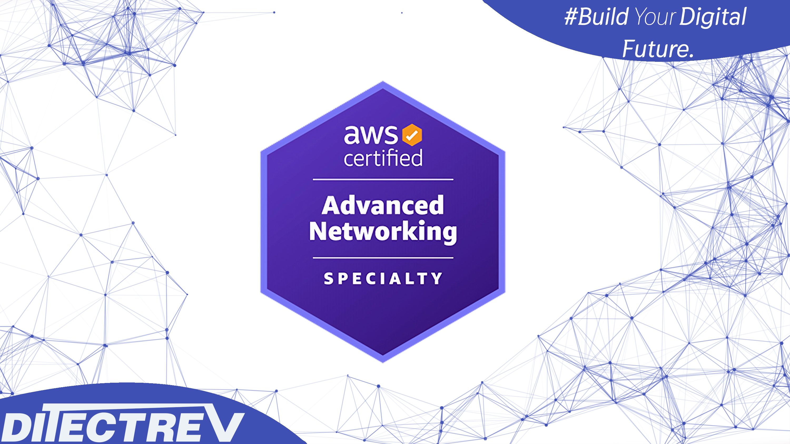

# ⬆️ Amazon Web Services Certified (AWS Certified) Advanced Networking Specialty (ANS-C01) Practice Tests Exams Questions & Answers

## Udemy & Etsy

❣️ Please support us by purchasing this course on Udemy in an interactive version with the [discounted link](https://www.udemy.com/course/aws-certified-advanced-networking-specialty-ans-c01-exams-g/?referralCode=95249F04A0CC6E73492D). If you're working for a company, you could most probably easily claim this expense during preparation for your exam. For us, it's to be, or not to be, in the game.

🛍️ Alternatively, you can buy the PDF with those questions on [Etsy](https://ditectrev.etsy.com/listing/1654633115).

## ✨ This course is unlike any Amazon Web Services Certified (AWS Certified) Advanced Networking Specialty (ANS-C01) course you will find online

✋ Join a live online community and a course taught by industry experts and pass the Amazon Web Services Certified (AWS Certified) Advanced Networking Specialty (ANS-C01) confidently. We aim to build an ecosystem of Information Technology (IT) certifications and online courses in cooperation with the technology industry. We believe it will give our students 100% confidence in the pacing market in an open-source environment. We are just at the beginning of our way, so it's even better for you to join now!

## ⌛️ Short and to the point; why should you take the course

1. Always happy to answer your questions on Udemy's Q&A's and outside :)
2. Failed? Please submit a screenshot of your exam result and request a refund (via our upcoming platform, not possible on Udemy); we'll always accept it.
3. Learn about topics, such as:
   - Amazon CloudFront;
   - Amazon CloudWatch;
   - Amazon Elastic Compute Cloud (Amazon EC2);
   - Amazon Route 53;
   - Amazon Simple Storage Service (Amazon S3);
   - Amazon Simple Queue Service (Amazon SQS);
   - AWS Certificate Manager (ACM);
   - AWS Direct Connect;
   - Application Load Balancer (ALB);
   - Border Gateway Protocol (BGP);
   - Domain Name System (DNS);
   - Network Address Translation (NAT);
   - Network Load Balancer (NLB);
   - Transmission Control Protocol (TCP);
   - Virtual Private Clouds (VPC);
   - Virtual Private Network (VPN);
   - **Much More!**
4. Questions are similar to the actual exam, without duplications (like in other courses ;-)).
5. The Practice Tests Exams simulate the actual exam's content, timing, and percentage required to pass the exam.
6. This course is **not** an Amazon Web Services Certified (AWS Certified) Advanced Networking Specialty (ANS-C01) Exam Dump. Some people use brain dumps or exam dumps, but that's absurd, which we don't practice.
7. 90 **unique** questions.

## ☝️ Course Updates

**[v1.0.0](../../releases/tag/v1.0.0): January 10, 2024.**

- Launch of the course.

**[v1.0.1](../../releases/tag/v1.0.1): January 18, 2024.**

- Fix all remaining typos with support of automated proofreading software.

## 🙋‍♀️ & 🙋‍♂️ Contribution

We are so thankful for every contribution, which makes sure we can deliver top-notch content. Whenever you find a missing resource, broken link in a [Table of Contents](#table-of-contents), the wrong answer, please submit an [issue](../../issues). Even better would be a [Pull Request (PR)](../../pulls).

## Who this course is for:

- 👨‍🎓 Students preparing for the Amazon Web Services Certified (AWS Certified) Advanced Networking Specialty (ANS-C01) Exam;
- 👨‍🎓 Amazon Web Services (AWS) Engineers;
- 👨‍🎓 Cloud Architects;
- 👨‍🎓 Cloud Engineers;
- 👨‍🎓 DevOps Engineers;
- 👨‍🎓 Enterprise Architects;
- 👨‍🎓 Infrastructure Engineers;
- 👨‍🎓 Network Engineers;
- 👨‍🎓 Security Engineers;
- 👨‍🎓 Site Reliability Engineers;
- 👨‍🎓 Software Developers/Engineers;
- 👨‍🎓 Solution Architects.

## Requirements

- 🤩 Excitement to learn!
- 0️⃣ Prior knowledge is required;
- ✅ You can pass the Amazon Web Services Certified (AWS Certified) Advanced Networking Specialty (ANS-C01) Exam solely based on our Practice Tests Exams.

## Table of Contents

| No. | Questions |
| --- | --------- |
| 1   | [A company is planning to create a service that requires encryption in transit. The traffic must not be decrypted between the client and the backend of the service. The company will implement the service by using the gRPC protocol over TCP port 443. The service will scale up to thousands of simultaneous connections. The backend of the service will be hosted on an Amazon Elastic Kubernetes Service (Amazon EKS) duster with the Kubernetes Cluster Autoscaler and the Horizontal Pod Autoscaler configured. The company needs to use mutual TLS for two-way authentication between the client and the backend. Which solution will meet these requirements?](#a-company-is-planning-to-create-a-service-that-requires-encryption-in-transit-the-traffic-must-not-be-decrypted-between-the-client-and-the-backend-of-the-service-the-company-will-implement-the-service-by-using-the-grpc-protocol-over-tcp-port-443-the-service-will-scale-up-to-thousands-of-simultaneous-connections-the-backend-of-the-service-will-be-hosted-on-an-amazon-elastic-kubernetes-service-amazon-eks-duster-with-the-kubernetes-cluster-autoscaler-and-the-horizontal-pod-autoscaler-configured-the-company-needs-to-use-mutual-tls-for-two-way-authentication-between-the-client-and-the-backend-which-solution-will-meet-these-requirements)
| 2   | [A company is deploying a new application in the AWS Cloud. The company wants a highly available web server that will sit behind an Elastic Load Balancer. The load balancer will route requests to multiple target groups based on the URL in the request. All traffic must use HTTPS. TLS processing must be offloaded to the load balancer. The web server must know the user's IP address so that the company can keep accurate logs for security purposes. Which solution will meet these requirements?](#a-company-is-deploying-a-new-application-in-the-aws-cloud-the-company-wants-a-highly-available-web-server-that-will-sit-behind-an-elastic-load-balancer-the-load-balancer-will-route-requests-to-multiple-target-groups-based-on-the-url-in-the-request-all-traffic-must-use-https-tls-processing-must-be-offloaded-to-the-load-balancer-the-web-server-must-know-the-users-ip-address-so-that-the-company-can-keep-accurate-logs-for-security-purposes-which-solution-will-meet-these-requirements)
| 3   | [A company has developed an application on AWS that will track inventory levels of vending machines and initiate the restocking process automatically. The company plans to integrate this application with vending machines and deploy the vending machines in several markets around the world. The application resides in a VPC in the us-east-1 Region. The application consists of an Amazon Elastic Container Service (Amazon ECS) cluster behind an Application Load Balancer (ALB). The communication from the vending machines to the application happens over HTTPS. The company is planning to use an AWS Global Accelerator accelerator and configure static IP addresses of the accelerator in the vending machines for application endpoint access. The application must be accessible only through the accelerator and not through a direct connection over the internet to the ALB endpoint. Which solution will meet these requirements?](#a-company-has-developed-an-application-on-aws-that-will-track-inventory-levels-of-vending-machines-and-initiate-the-restocking-process-automatically-the-company-plans-to-integrate-this-application-with-vending-machines-and-deploy-the-vending-machines-in-several-markets-around-the-world-the-application-resides-in-a-vpc-in-the-us-east-1-region-the-application-consists-of-an-amazon-elastic-container-service-amazon-ecs-cluster-behind-an-application-load-balancer-alb-the-communication-from-the-vending-machines-to-the-application-happens-over-https-the-company-is-planning-to-use-an-aws-global-accelerator-accelerator-and-configure-static-ip-addresses-of-the-accelerator-in-the-vending-machines-for-application-endpoint-access-the-application-must-be-accessible-only-through-the-accelerator-and-not-through-a-direct-connection-over-the-internet-to-the-alb-endpoint-which-solution-will-meet-these-requirements)
| 4   | [A global delivery company is modernizing its fleet management system. The company has several business units. Each business unit designs and maintains applications that are hosted in its own AWS account in separate application VPCs in the same AWS Region. Each business unit's applications are designed to get data from a central shared services VPC. The company wants the network connectivity architecture to provide granular security controls. The architecture also must be able to scale as more business units consume data from the central shared services VPC in the future. Which solution will meet these requirements in the MOST secure manner?](#a-global-delivery-company-is-modernizing-its-fleet-management-system-the-company-has-several-business-units-each-business-unit-designs-and-maintains-applications-that-are-hosted-in-its-own-aws-account-in-separate-application-vpcs-in-the-same-aws-region-each-business-units-applications-are-designed-to-get-data-from-a-central-shared-services-vpc-the-company-wants-the-network-connectivity-architecture-to-provide-granular-security-controls-the-architecture-also-must-be-able-to-scale-as-more-business-units-consume-data-from-the-central-shared-services-vpc-in-the-future-which-solution-will-meet-these-requirements-in-the-most-secure-manner)
| 5   | [A company uses a 4 Gbps AWS Direct Connect dedicated connection with a link aggregation group (LAG) bundle to connect to five VPCs that are deployed in the us-east-1 Region. Each VPC serves a different business unit and uses its own private VIF for connectivity to the on-premises environment. Users are reporting slowness when they access resources that are hosted on AWS. A network engineer finds that there are sudden increases in throughput and that the Direct Connect connection becomes saturated at the same time for about an hour each business day. The company wants to know which business unit is causing the sudden increase in throughput. The network engineer must find out this information and implement a solution to resolve the problem. Which solution will meet these requirements?](#a-company-uses-a-4-gbps-aws-direct-connect-dedicated-connection-with-a-link-aggregation-group-lag-bundle-to-connect-to-five-vpcs-that-are-deployed-in-the-us-east-1-region-each-vpc-serves-a-different-business-unit-and-uses-its-own-private-vif-for-connectivity-to-the-on-premises-environment-users-are-reporting-slowness-when-they-access-resources-that-are-hosted-on-aws-a-network-engineer-finds-that-there-are-sudden-increases-in-throughput-and-that-the-direct-connect-connection-becomes-saturated-at-the-same-time-for-about-an-hour-each-business-day-the-company-wants-to-know-which-business-unit-is-causing-the-sudden-increase-in-throughput-the-network-engineer-must-find-out-this-information-and-implement-a-solution-to-resolve-the-problem-which-solution-will-meet-these-requirements)
| 6   | [A software-as-a-service (SaaS) provider hosts its solution on Amazon EC2 instances within a VPC in the AWS Cloud. All of the provider's customers also have their environments in the AWS Cloud. A recent design meeting revealed that the customers have IP address overlap with the provider's AWS deployment. The customers have stated that they will not share their internal IP addresses and that they do not want to connect to the provider's SaaS service over the internet. Which combination of steps is part of a solution that meets these requirements? (Choose two.)](#a-software-as-a-service-saas-provider-hosts-its-solution-on-amazon-ec2-instances-within-a-vpc-in-the-aws-cloud-all-of-the-providers-customers-also-have-their-environments-in-the-aws-cloud-a-recent-design-meeting-revealed-that-the-customers-have-ip-address-overlap-with-the-providers-aws-deployment-the-customers-have-stated-that-they-will-not-share-their-internal-ip-addresses-and-that-they-do-not-want-to-connect-to-the-providers-saas-service-over-the-internet-which-combination-of-steps-is-part-of-a-solution-that-meets-these-requirements-choose-two)
| 7   | [A network engineer is designing the architecture for a healthcare company's workload that is moving to the AWS Cloud. All data to and from the on-premises environment must be encrypted in transit. All traffic also must be inspected in the cloud before the traffic is allowed to leave the cloud and travel to the on-premises environment or to the internet. The company will expose components of the workload to the internet so that patients can reserve appointments. The architecture must secure these components and protect them against DDoS attacks. The architecture also must provide protection against financial liability for services that scale out during a DDoS event. Which combination of steps should the network engineer take to meet all these requirements for the workload? (Choose three.)](#a-network-engineer-is-designing-the-architecture-for-a-healthcare-companys-workload-that-is-moving-to-the-aws-cloud-all-data-to-and-from-the-on-premises-environment-must-be-encrypted-in-transit-all-traffic-also-must-be-inspected-in-the-cloud-before-the-traffic-is-allowed-to-leave-the-cloud-and-travel-to-the-on-premises-environment-or-to-the-internet-the-company-will-expose-components-of-the-workload-to-the-internet-so-that-patients-can-reserve-appointments-the-architecture-must-secure-these-components-and-protect-them-against-ddos-attacks-the-architecture-also-must-provide-protection-against-financial-liability-for-services-that-scale-out-during-a-ddos-event-which-combination-of-steps-should-the-network-engineer-take-to-meet-all-these-requirements-for-the-workload-choose-three)
| 8   | [A retail company is running its service on AWS. The company's architecture includes Application Load Balancers (ALBs) in public subnets. The ALB target groups are configured to send traffic to backend Amazon EC2 instances in private subnets. These backend EC2 instances can call externally hosted services over the internet by using a NAT gateway. The company has noticed in its billing that NAT gateway usage has increased significantly. A network engineer needs to find out the source of this increased usage. Which options can the network engineer use to investigate the traffic through the NAT gateway? (Choose two.)](#a-retail-company-is-running-its-service-on-aws-the-companys-architecture-includes-application-load-balancers-albs-in-public-subnets-the-alb-target-groups-are-configured-to-send-traffic-to-backend-amazon-ec2-instances-in-private-subnets-these-backend-ec2-instances-can-call-externally-hosted-services-over-the-internet-by-using-a-nat-gateway-the-company-has-noticed-in-its-billing-that-nat-gateway-usage-has-increased-significantly-a-network-engineer-needs-to-find-out-the-source-of-this-increased-usage-which-options-can-the-network-engineer-use-to-investigate-the-traffic-through-the-nat-gateway-choose-two)
| 9   | [A banking company is successfully operating its public mobile banking stack on AWS. The mobile banking stack is deployed in a VPC that includes private subnets and public subnets. The company is using IPv4 networking and has not deployed or supported IPv6 in the environment. The company has decided to adopt a third-party service provider's API and must integrate the API with the existing environment. The service provider's API requires the use of IPv6. A network engineer must turn on IPv6 connectivity for the existing workload that is deployed in a private subnet. The company does not want to permit IPv6 traffic from the public internet and mandates that the company's servers must initiate all IPv6 connectivity. The network engineer turns on IPv6 in the VPC and in the private subnets. Which solution will meet these requirements?](#a-banking-company-is-successfully-operating-its-public-mobile-banking-stack-on-aws-the-mobile-banking-stack-is-deployed-in-a-vpc-that-includes-private-subnets-and-public-subnets-the-company-is-using-ipv4-networking-and-has-not-deployed-or-supported-ipv6-in-the-environment-the-company-has-decided-to-adopt-a-third-party-service-providers-api-and-must-integrate-the-api-with-the-existing-environment-the-service-providers-api-requires-the-use-of-ipv6-a-network-engineer-must-turn-on-ipv6-connectivity-for-the-existing-workload-that-is-deployed-in-a-private-subnet-the-company-does-not-want-to-permit-ipv6-traffic-from-the-public-internet-and-mandates-that-the-companys-servers-must-initiate-all-ipv6-connectivity-the-network-engineer-turns-on-ipv6-in-the-vpc-and-in-the-private-subnets-which-solution-will-meet-these-requirements)
| 10  | [A company has deployed an AWS Network Firewall firewall into a VPC. A network engineer needs to implement a solution to deliver Network Firewall flow logs to the company's Amazon OpenSearch Service (Amazon Elasticsearch Service) cluster in the shortest possible time. Which solution will meet these requirements?](#a-company-has-deployed-an-aws-network-firewall-firewall-into-a-vpc-a-network-engineer-needs-to-implement-a-solution-to-deliver-network-firewall-flow-logs-to-the-companys-amazon-opensearch-service-amazon-elasticsearch-service-cluster-in-the-shortest-possible-time-which-solution-will-meet-these-requirements)
| 11  | [A company is using custom DNS servers that run BIND for name resolution in its VPCs. The VPCs are deployed across multiple AWS accounts that are part of the same organization in AWS Organizations. All the VPCs are connected to a transit gateway. The BIND servers are running in a central VPC and are configured to forward all queries for an on-premises DNS domain to DNS servers that are hosted in an on-premises data center. To ensure that all the VPCs use the custom DNS servers, a network engineer has configured a VPC DHCP options set in all the VPCs that specifies the custom DNS servers to be used as domain name servers. Multiple development teams in the company want to use Amazon Elastic File System (Amazon EFS). A development team has created a new EFS file system but cannot mount the file system to one of its Amazon EC2 instances. The network engineer discovers that the EC2 instance cannot resolve the IP address for the EFS mount point fs-33444567d.efs.us-east-1. Amazonaws.com. The network engineer needs to implement a solution so that development teams throughout the organization can mount EFS file systems. Which combination of steps will meet these requirements? (Choose two.)](#a-company-is-using-custom-dns-servers-that-run-bind-for-name-resolution-in-its-vpcs-the-vpcs-are-deployed-across-multiple-aws-accounts-that-are-part-of-the-same-organization-in-aws-organizations-all-the-vpcs-are-connected-to-a-transit-gateway-the-bind-servers-are-running-in-a-central-vpc-and-are-configured-to-forward-all-queries-for-an-on-premises-dns-domain-to-dns-servers-that-are-hosted-in-an-on-premises-data-center-to-ensure-that-all-the-vpcs-use-the-custom-dns-servers-a-network-engineer-has-configured-a-vpc-dhcp-options-set-in-all-the-vpcs-that-specifies-the-custom-dns-servers-to-be-used-as-domain-name-serversmultiple-development-teams-in-the-company-want-to-use-amazon-elastic-file-system-amazon-efs-a-development-team-has-created-a-new-efs-file-system-but-cannot-mount-the-file-system-to-one-of-its-amazon-ec2-instances-the-network-engineer-discovers-that-the-ec2-instance-cannot-resolve-the-ip-address-for-the-efs-mount-point-fs-33444567defsus-east-1-amazonawscom-the-network-engineer-needs-to-implement-a-solution-so-that-development-teams-throughout-the-organization-can-mount-efs-file-systems-which-combination-of-steps-will-meet-these-requirements-choose-two)
| 12  | [An ecommerce company is hosting a web application on Amazon EC2 instances to handle continuously changing customer demand. The EC2 instances are part of an Auto Scaling group. The company wants to implement a solution to distribute traffic from customers to the EC2 instances. The company must encrypt all traffic at all stages between the customers and the application servers. No decryption at intermediate points is allowed. Which solution will meet these requirements?](#an-ecommerce-company-is-hosting-a-web-application-on-amazon-ec2-instances-to-handle-continuously-changing-customer-demand-the-ec2-instances-are-part-of-an-auto-scaling-group-the-company-wants-to-implement-a-solution-to-distribute-traffic-from-customers-to-the-ec2-instances-the-company-must-encrypt-all-traffic-at-all-stages-between-the-customers-and-the-application-servers-no-decryption-at-intermediate-points-is-allowed-which-solution-will-meet-these-requirements)
| 13  | [A company has two on-premises data center locations. There is a company-managed router at each data center. Each data center has a dedicated AWS Direct Connect connection to a Direct Connect gateway through a private virtual interface. The router for the first location is advertising 110 routes to the Direct Connect gateway by using BGP, and the router for the second location is advertising 60 routes to the Direct Connect gateway by using BGP. The Direct Connect gateway is attached to a company VPC through a virtual private gateway. A network engineer receives reports that resources in the VPC are not reachable from various locations in either data center. The network engineer checks the VPC route table and sees that the routes from the first data center location are not being populated into the route table. The network engineer must resolve this issue in the most operationally efficient manner. What should the network engineer do to meet these requirements?](#a-company-has-two-on-premises-data-center-locations-there-is-a-company-managed-router-at-each-data-center-each-data-center-has-a-dedicated-aws-direct-connect-connection-to-a-direct-connect-gateway-through-a-private-virtual-interface-the-router-for-the-first-location-is-advertising-110-routes-to-the-direct-connect-gateway-by-using-bgp-and-the-router-for-the-second-location-is-advertising-60-routes-to-the-direct-connect-gateway-by-using-bgp-the-direct-connect-gateway-is-attached-to-a-company-vpc-through-a-virtual-private-gateway-a-network-engineer-receives-reports-that-resources-in-the-vpc-are-not-reachable-from-various-locations-in-either-data-center-the-network-engineer-checks-the-vpc-route-table-and-sees-that-the-routes-from-the-first-data-center-location-are-not-being-populated-into-the-route-table-the-network-engineer-must-resolve-this-issue-in-the-most-operationally-efficient-manner-what-should-the-network-engineer-do-to-meet-these-requirements)
| 14  | [A company has expanded its network to the AWS Cloud by using a hybrid architecture with multiple AWS accounts. The company has set up a shared AWS account for the connection to its on-premises data centers and the company offices. The workloads consist of private web-based services for internal use. These services run in different AWS accounts. Office-based employees consume these services by using a DNS name in an on-premises DNS zone that is named example.internal. The process to register a new service that runs on AWS requires a manual and complicated change request to the internal DNS. The process involves many teams. The company wants to update the DNS registration process by giving the service creators access that will allow them to register their DNS records. A network engineer must design a solution that will achieve this goal. The solution must maximize cost-effectiveness and must require the least possible number of configuration changes. Which combination of steps should the network engineer take to meet these requirements? (Choose three.)](#a-company-has-expanded-its-network-to-the-aws-cloud-by-using-a-hybrid-architecture-with-multiple-aws-accounts-the-company-has-set-up-a-shared-aws-account-for-the-connection-to-its-on-premises-data-centers-and-the-company-offices-the-workloads-consist-of-private-web-based-services-for-internal-use-these-services-run-in-different-aws-accounts-office-based-employees-consume-these-services-by-using-a-dns-name-in-an-on-premises-dns-zone-that-is-named-exampleinternal-the-process-to-register-a-new-service-that-runs-on-aws-requires-a-manual-and-complicated-change-request-to-the-internal-dns-the-process-involves-many-teams-the-company-wants-to-update-the-dns-registration-process-by-giving-the-service-creators-access-that-will-allow-them-to-register-their-dns-records-a-network-engineer-must-design-a-solution-that-will-achieve-this-goal-the-solution-must-maximize-cost-effectiveness-and-must-require-the-least-possible-number-of-configuration-changes-which-combination-of-steps-should-the-network-engineer-take-to-meet-these-requirements-choose-three)
| 15  | [A company has multiple AWS accounts. Each account contains one or more VPCs. A new security guideline requires the inspection of all traffic between VPCs. The company has deployed a transit gateway that provides connectivity between all VPCs. The company also has deployed a shared services VPC with Amazon EC2 instances that include IDS services for stateful inspection. The EC2 instances are deployed across three Availability Zones. The company has set up VPC associations and routing on the transit gateway. The company has migrated a few test VPCs to the new solution for traffic inspection. Soon after the configuration of routing, the company receives reports of intermittent connections for traffic that crosses Availability Zones. What should a network engineer do to resolve this issue?](#a-company-has-multiple-aws-accounts-each-account-contains-one-or-more-vpcs-a-new-security-guideline-requires-the-inspection-of-all-traffic-between-vpcs-the-company-has-deployed-a-transit-gateway-that-provides-connectivity-between-all-vpcs-the-company-also-has-deployed-a-shared-services-vpc-with-amazon-ec2-instances-that-include-ids-services-for-stateful-inspection-the-ec2-instances-are-deployed-across-three-availability-zones-the-company-has-set-up-vpc-associations-and-routing-on-the-transit-gateway-the-company-has-migrated-a-few-test-vpcs-to-the-new-solution-for-traffic-inspection-soon-after-the-configuration-of-routing-the-company-receives-reports-of-intermittent-connections-for-traffic-that-crosses-availability-zones-what-should-a-network-engineer-do-to-resolve-this-issue)
| 16  | [A company is using a NAT gateway to allow internet connectivity for private subnets in a VPC in the us-west-2 Region. After a security audit, the company needs to remove the NAT gateway. In the private subnets, the company has resources that use the unified Amazon CloudWatch agent. A network engineer must create a solution to ensure that the unified CloudWatch agent continues to work after the removal of the NAT gateway. Which combination of steps should the network engineer take to meet these requirements? (Choose three.)](#a-company-is-using-a-nat-gateway-to-allow-internet-connectivity-for-private-subnets-in-a-vpc-in-the-us-west-2-region-after-a-security-audit-the-company-needs-to-remove-the-nat-gatewayin-the-private-subnets-the-company-has-resources-that-use-the-unified-amazon-cloudwatch-agent-a-network-engineer-must-create-a-solution-to-ensure-that-the-unified-cloudwatch-agent-continues-to-work-after-the-removal-of-the-nat-gateway-which-combination-of-steps-should-the-network-engineer-take-to-meet-these-requirements-choose-three)
| 17  | [An international company provides early warning about tsunamis. The company plans to use IoT devices to monitor sea waves around the world. The data that is collected by the IoT devices must reach the company's infrastructure on AWS as quickly as possible. The company is using three operation centers around the world. Each operation center is connected to AWS through Its own AWS Direct Connect connection. Each operation center is connected to the internet through at least two upstream internet service providers. The company has its own provider-independent (PI) address space. The IoT devices use TCP protocols for reliable transmission of the data they collect. The IoT devices have both landline and mobile internet connectivity. The infrastructure and the solution will be deployed in multiple AWS Regions. The company will use Amazon Route 53 for DNS services. A network engineer needs to design connectivity between the IoT devices and the services that run in the AWS Cloud. Which solution will meet these requirements with the HIGHEST availability?](#an-international-company-provides-early-warning-about-tsunamis-the-company-plans-to-use-iot-devices-to-monitor-sea-waves-around-the-world-the-data-that-is-collected-by-the-iot-devices-must-reach-the-companys-infrastructure-on-aws-as-quickly-as-possible-the-company-is-using-three-operation-centers-around-the-world-each-operation-center-is-connected-to-aws-through-its-own-aws-direct-connect-connection-each-operation-center-is-connected-to-the-internet-through-at-least-two-upstream-internet-service-providers-the-company-has-its-own-provider-independent-pi-address-space-the-iot-devices-use-tcp-protocols-for-reliable-transmission-of-the-data-they-collect-the-iot-devices-have-both-landline-and-mobile-internet-connectivity-the-infrastructure-and-the-solution-will-be-deployed-in-multiple-aws-regions-the-company-will-use-amazon-route-53-for-dns-services-a-network-engineer-needs-to-design-connectivity-between-the-iot-devices-and-the-services-that-run-in-the-aws-cloud-which-solution-will-meet-these-requirements-with-the-highest-availability)
| 18  | [A company is planning a migration of its critical workloads from an on-premises data center to Amazon EC2 instances. The plan includes a new 10 Gbps AWS Direct Connect dedicated connection from the on-premises data center to a VPC that is attached to a transit gateway. The migration must occur over encrypted paths between the on-premises data center and the AWS Cloud. Which solution will meet these requirements while providing the HIGHEST throughput?](#a-company-is-planning-a-migration-of-its-critical-workloads-from-an-on-premises-data-center-to-amazon-ec2-instances-the-plan-includes-a-new-10-gbps-aws-direct-connect-dedicated-connection-from-the-on-premises-data-center-to-a-vpc-that-is-attached-to-a-transit-gateway-the-migration-must-occur-over-encrypted-paths-between-the-on-premises-data-center-and-the-aws-cloud-which-solution-will-meet-these-requirements-while-providing-the-highest-throughput)
| 19  | [A network engineer must develop an AWS CloudFormation template that can create a virtual private gateway, a customer gateway, a VPN connection, and static routes in a route table. During testing of the template, the network engineer notes that the CloudFormation template has encountered an error and is rolling back. What should the network engineer do to resolve the error?](#a-network-engineer-must-develop-an-aws-cloudformation-template-that-can-create-a-virtual-private-gateway-a-customer-gateway-a-vpn-connection-and-static-routes-in-a-route-table-during-testing-of-the-template-the-network-engineer-notes-that-the-cloudformation-template-has-encountered-an-error-and-is-rolling-back-what-should-the-network-engineer-do-to-resolve-the-error)
| 20  | [A company operates its IT services through a multi-site hybrid infrastructure. The company deploys resources on AWS in the us-east-1 Region and in the eu-west-2 Region. The company also deploys resources in its own data centers that are located in the United States (US) and in the United Kingdom (UK). In both AWS Regions, the company uses a transit gateway to connect 15 VPCs to each other. The company has created a transit gateway peering connection between the two transit gateways. The VPC CIDR blocks do not overlap with each other or with IP addresses used within the data centers. The VPC CIDR prefixes can also be aggregated either on a Regional level or for the company's entire AWS environment. The data centers are connected to each other by a private WAN connection. IP routing information is exchanged dynamically through Interior BGP (iBGP) sessions. The data centers maintain connectivity to AWS through one AWS Direct Connect connection in the US and one Direct Connect connection in the UK. Each Direct Connect connection is terminated on a Direct Connect gateway and is associated with a local transit gateway through a transit VIF. Traffic follows the shortest geographical path from source to destination. For example, packets from the UK data center that are targeted to resources in eu-west-2 travel across the local Direct Connect connection. In cases of cross-Region data transfers, such as from the UK data center to VPCs in us-east-1, the private WAN connection must be used to minimize costs on AWS. A network engineer has configured each transit gateway association on the Direct Connect gateway to advertise VPC-specific CIDR IP prefixes only from the local Region. The routes toward the other Region must be learned through BGP from the routers in the other data center in the original, non-aggregated form. The company recently experienced a problem with cross-Region data transfers because of issues with its private WAN connection. The network engineer needs to modify the routing setup to prevent similar interruptions in the future. The solution cannot modify the original traffic routing goal when the network is operating normally. Which modifications will meet these requirements? (Choose two.)](#a-company-operates-its-it-services-through-a-multi-site-hybrid-infrastructure-the-company-deploys-resources-on-aws-in-the-us-east-1-region-and-in-the-eu-west-2-region-the-company-also-deploys-resources-in-its-own-data-centers-that-are-located-in-the-united-states-us-and-in-the-united-kingdom-uk-in-both-aws-regions-the-company-uses-a-transit-gateway-to-connect-15-vpcs-to-each-other-the-company-has-created-a-transit-gateway-peering-connection-between-the-two-transit-gateways-the-vpc-cidr-blocks-do-not-overlap-with-each-other-or-with-ip-addresses-used-within-the-data-centers-the-vpc-cidr-prefixes-can-also-be-aggregated-either-on-a-regional-level-or-for-the-companys-entire-aws-environment-the-data-centers-are-connected-to-each-other-by-a-private-wan-connection-ip-routing-information-is-exchanged-dynamically-through-interior-bgp-ibgp-sessions-the-data-centers-maintain-connectivity-to-aws-through-one-aws-direct-connect-connection-in-the-us-and-one-direct-connect-connection-in-the-uk-each-direct-connect-connection-is-terminated-on-a-direct-connect-gateway-and-is-associated-with-a-local-transit-gateway-through-a-transit-vif-traffic-follows-the-shortest-geographical-path-from-source-to-destination-for-example-packets-from-the-uk-data-center-that-are-targeted-to-resources-in-eu-west-2-travel-across-the-local-direct-connect-connection-in-cases-of-cross-region-data-transfers-such-as-from-the-uk-data-center-to-vpcs-in-us-east-1-the-private-wan-connection-must-be-used-to-minimize-costs-on-aws-a-network-engineer-has-configured-each-transit-gateway-association-on-the-direct-connect-gateway-to-advertise-vpc-specific-cidr-ip-prefixes-only-from-the-local-region-the-routes-toward-the-other-region-must-be-learned-through-bgp-from-the-routers-in-the-other-data-center-in-the-original-non-aggregated-form-the-company-recently-experienced-a-problem-with-cross-region-data-transfers-because-of-issues-with-its-private-wan-connection-the-network-engineer-needs-to-modify-the-routing-setup-to-prevent-similar-interruptions-in-the-future-the-solution-cannot-modify-the-original-traffic-routing-goal-when-the-network-is-operating-normally-which-modifications-will-meet-these-requirements-choose-two)
| 21  | [A company's network engineer needs to design a new solution to help troubleshoot and detect network anomalies. The network engineer has configured Traffic Mirroring. However, the mirrored traffic is overwhelming the Amazon EC2 instance that is the traffic mirror target. The EC2 instance hosts tools that the company's security team uses to analyze the traffic. The network engineer needs to design a highly available solution that can scale to meet the demand of the mirrored traffic. Which solution will meet these requirements?](#a-companys-network-engineer-needs-to-design-a-new-solution-to-help-troubleshoot-and-detect-network-anomalies-the-network-engineer-has-configured-traffic-mirroring-however-the-mirrored-traffic-is-overwhelming-the-amazon-ec2-instance-that-is-the-traffic-mirror-target-the-ec2-instance-hosts-tools-that-the-companys-security-team-uses-to-analyze-the-traffic-the-network-engineer-needs-to-design-a-highly-available-solution-that-can-scale-to-meet-the-demand-of-the-mirrored-traffic-which-solution-will-meet-these-requirements)
| 22  | [A company uses a hybrid architecture and has an AWS Direct Connect connection between its on-premises data center and AWS. The company has production applications that run in the on-premises data center. The company also has production applications that run in a VPC. The applications that run in the on-premises data center need to communicate with the applications that run in the VPC. The company is using corp.example.com as the domain name for the on-premises resources and is using an Amazon Route 53 private hosted zone for aws.example.com to host the VPC resources. The company is using an open-source recursive DNS resolver in a VPC subnet and is using a DNS resolver in the on-premises data center. The company's on-premises DNS resolver has a forwarder that directs requests for the aws.example.com domain name to the DNS resolver in the VPC. The DNS resolver in the VPC has a forwarder that directs requests for the corp.example.com domain name to the DNS resolver in the on-premises data center. The company has deckled to replace the open-source recursive DNS resolver with Amazon Route 53 Resolver endpoints. Which combination of steps should a network engineer take to make this replacement? (Choose three.)](#a-company-uses-a-hybrid-architecture-and-has-an-aws-direct-connect-connection-between-its-on-premises-data-center-and-aws-the-company-has-production-applications-that-run-in-the-on-premises-data-center-the-company-also-has-production-applications-that-run-in-a-vpc-the-applications-that-run-in-the-on-premises-data-center-need-to-communicate-with-the-applications-that-run-in-the-vpc-the-company-is-using-corpexamplecom-as-the-domain-name-for-the-on-premises-resources-and-is-using-an-amazon-route-53-private-hosted-zone-for-awsexamplecom-to-host-the-vpc-resources-the-company-is-using-an-open-source-recursive-dns-resolver-in-a-vpc-subnet-and-is-using-a-dns-resolver-in-the-on-premises-data-center-the-companys-on-premises-dns-resolver-has-a-forwarder-that-directs-requests-for-the-awsexamplecom-domain-name-to-the-dns-resolver-in-the-vpc-the-dns-resolver-in-the-vpc-has-a-forwarder-that-directs-requests-for-the-corpexamplecom-domain-name-to-the-dns-resolver-in-the-on-premises-data-center-the-company-has-deckled-to-replace-the-open-source-recursive-dns-resolver-with-amazon-route-53-resolver-endpoints-which-combination-of-steps-should-a-network-engineer-take-to-make-this-replacement-choose-three)
| 23  | [A government contractor is designing a multi-account environment with multiple VPCs for a customer. A network security policy requires all traffic between any two VPCs to be transparently inspected by a third-party appliance. The customer wants a solution that features AWS Transit Gateway. The setup must be highly available across multiple Availability Zones, and the solution needs to support automated failover. Furthermore, asymmetric routing is not supported by the inspection appliances. Which combination of steps is part of a solution that meets these requirements? (Choose two.)](#a-government-contractor-is-designing-a-multi-account-environment-with-multiple-vpcs-for-a-customer-a-network-security-policy-requires-all-traffic-between-any-two-vpcs-to-be-transparently-inspected-by-a-third-party-appliance-the-customer-wants-a-solution-that-features-aws-transit-gateway-the-setup-must-be-highly-available-across-multiple-availability-zones-and-the-solution-needs-to-support-automated-failover-furthermore-asymmetric-routing-is-not-supported-by-the-inspection-appliances-which-combination-of-steps-is-part-of-a-solution-that-meets-these-requirements-choose-two)
| 24  | [A company has deployed Amazon EC2 instances in private subnets in a VPC. The EC2 instances must initiate any requests that leave the VPC, including requests to the company's on-premises data center over an AWS Direct Connect connection. No resources outside the VPC can be allowed to open communications directly to the EC2 instances. The on-premises data center's customer gateway is configured with a stateful firewall device that filters for incoming and outgoing requests to and from multiple VPCs. In addition, the company wants to use a single IP match rule to allow all the communications from the EC2 instances to its data center from a single IP address. Which solution will meet these requirements with the LEAST amount of operational overhead?](#a-company-has-deployed-amazon-ec2-instances-in-private-subnets-in-a-vpc-the-ec2-instances-must-initiate-any-requests-that-leave-the-vpc-including-requests-to-the-companys-on-premises-data-center-over-an-aws-direct-connect-connection-no-resources-outside-the-vpc-can-be-allowed-to-open-communications-directly-to-the-ec2-instances-the-on-premises-data-centers-customer-gateway-is-configured-with-a-stateful-firewall-device-that-filters-for-incoming-and-outgoing-requests-to-and-from-multiple-vpcs-in-addition-the-company-wants-to-use-a-single-ip-match-rule-to-allow-all-the-communications-from-the-ec2-instances-to-its-data-center-from-a-single-ip-address-which-solution-will-meet-these-requirements-with-the-least-amount-of-operational-overhead)
| 25  | [A global company operates all its non-production environments out of three AWS Regions: eu-west-1, us-east-1, and us-west-1. The company hosts all its production workloads in two on-premises data centers. The company has 60 AWS accounts and each account has two VPCs in each Region. Each VPC has a virtual private gateway where two VPN connections terminate for resilient connectivity to the data centers. The company has 360 VPN tunnels to each data center, resulting in high management overhead. The total VPN throughput for each Region is 500 Mbps. The company wants to migrate the production environments to AWS. The company needs a solution that will simplify the network architecture and allow for future growth. The production environments will generate an additional 2 Gbps of traffic per Region back to the data centers. This traffic will increase over time. Which solution will meet these requirements?](#a-global-company-operates-all-its-non-production-environments-out-of-three-aws-regions-eu-west-1-us-east-1-and-us-west-1-the-company-hosts-all-its-production-workloads-in-two-on-premises-data-centers-the-company-has-60-aws-accounts-and-each-account-has-two-vpcs-in-each-region-each-vpc-has-a-virtual-private-gateway-where-two-vpn-connections-terminate-for-resilient-connectivity-to-the-data-centers-the-company-has-360-vpn-tunnels-to-each-data-center-resulting-in-high-management-overhead-the-total-vpn-throughput-for-each-region-is-500-mbps-the-company-wants-to-migrate-the-production-environments-to-aws-the-company-needs-a-solution-that-will-simplify-the-network-architecture-and-allow-for-future-growth-the-production-environments-will-generate-an-additional-2-gbps-of-traffic-per-region-back-to-the-data-centers-this-traffic-will-increase-over-time-which-solution-will-meet-these-requirements)
| 26  | [A company is building its website on AWS in a single VPC. The VPC has public subnets and private subnets in two Availability Zones. The website has static content such as images. The company is using Amazon S3 to store the content. The company has deployed a fleet of Amazon EC2 instances as web servers in a private subnet. The EC2 instances are in an Auto Scaling group behind an Application Load Balancer. The EC2 instances will serve traffic, and they must pull content from an S3 bucket to render the webpages. The company is using AWS Direct Connect with a public VIF for on-premises connectivity to the S3 bucket. A network engineer notices that traffic between the EC2 instances and Amazon S3 is routing through a NAT gateway. As traffic increases, the company's costs are increasing. The network engineer needs to change the connectivity to reduce the NAT gateway costs that result from the traffic between the EC2 instances and Amazon S3. Which solution will meet these requirements?](#a-company-is-building-its-website-on-aws-in-a-single-vpc-the-vpc-has-public-subnets-and-private-subnets-in-two-availability-zones-the-website-has-static-content-such-as-images-the-company-is-using-amazon-s3-to-store-the-content-the-company-has-deployed-a-fleet-of-amazon-ec2-instances-as-web-servers-in-a-private-subnet-the-ec2-instances-are-in-an-auto-scaling-group-behind-an-application-load-balancer-the-ec2-instances-will-serve-traffic-and-they-must-pull-content-from-an-s3-bucket-to-render-the-webpages-the-company-is-using-aws-direct-connect-with-a-public-vif-for-on-premises-connectivity-to-the-s3-bucket-a-network-engineer-notices-that-traffic-between-the-ec2-instances-and-amazon-s3-is-routing-through-a-nat-gateway-as-traffic-increases-the-companys-costs-are-increasing-the-network-engineer-needs-to-change-the-connectivity-to-reduce-the-nat-gateway-costs-that-result-from-the-traffic-between-the-ec2-instances-and-amazon-s3-which-solution-will-meet-these-requirements)
| 27  | [A company wants to improve visibility into its AWS environment. The AWS environment consists of multiple VPCs that are connected to a transit gateway. The transit gateway connects to an on-premises data center through an AWS Direct Connect gateway and a pair of redundant Direct Connect connections that use transit VIFs. The company must receive notification each time a new route is advertised to AWS from on premises over Direct Connect. What should a network engineer do to meet these requirements?](#a-company-wants-to-improve-visibility-into-its-aws-environment-the-aws-environment-consists-of-multiple-vpcs-that-are-connected-to-a-transit-gateway-the-transit-gateway-connects-to-an-on-premises-data-center-through-an-aws-direct-connect-gateway-and-a-pair-of-redundant-direct-connect-connections-that-use-transit-vifs-the-company-must-receive-notification-each-time-a-new-route-is-advertised-to-aws-from-on-premises-over-direct-connect-what-should-a-network-engineer-do-to-meet-these-requirements)
| 28  | [A software company offers a software-as-a-service (SaaS) accounting application that is hosted in the AWS Cloud The application requires connectivity to the company's on-premises network. The company has two redundant 10 GB AWS Direct Connect connections between AWS and its on-premises network to accommodate the growing demand for the application. The company already has encryption between its on-premises network and the colocation. The company needs to encrypt traffic between AWS and the edge routers in the colocation within the next few months. The company must maintain its current bandwidth. What should a network engineer do to meet these requirements with the LEAST operational overhead?](#a-software-company-offers-a-software-as-a-service-saas-accounting-application-that-is-hosted-in-the-aws-cloud-the-application-requires-connectivity-to-the-companys-on-premises-network-the-company-has-two-redundant-10-gb-aws-direct-connect-connections-between-aws-and-its-on-premises-network-to-accommodate-the-growing-demand-for-the-application-the-company-already-has-encryption-between-its-on-premises-network-and-the-colocation-the-company-needs-to-encrypt-traffic-between-aws-and-the-edge-routers-in-the-colocation-within-the-next-few-months-the-company-must-maintain-its-current-bandwidth-what-should-a-network-engineer-do-to-meet-these-requirements-with-the-least-operational-overhead)
| 29  | [A company hosts an application on Amazon EC2 instances behind an Application Load Balancer (ALB). The company recently experienced a network security breach. A network engineer must collect and analyze logs that include the client IP address, target IP address, target port, and user agent of each user that accesses the application. What is the MOST operationally efficient solution that meets these requirements?](#a-company-hosts-an-application-on-amazon-ec2-instances-behind-an-application-load-balancer-alb-the-company-recently-experienced-a-network-security-breach-a-network-engineer-must-collect-and-analyze-logs-that-include-the-client-ip-address-target-ip-address-target-port-and-user-agent-of-each-user-that-accesses-the-application-what-is-the-most-operationally-efficient-solution-that-meets-these-requirements)
| 30  | [A media company is implementing a news website for a global audience. The website uses Amazon CloudFront as its content delivery network. The backend runs on Amazon EC2 Windows instances behind an Application Load Balancer (ALB). The instances are part of an Auto Scaling group. The company's customers access the website by using service example com as the CloudFront custom domain name. The CloudFront origin points to an ALB that uses service-alb.example.com as the domain name. The company's security policy requires the traffic to be encrypted in transit at all times between the users and the backend. Which combination of changes must the company make to meet this security requirement? (Choose three.)](#a-media-company-is-implementing-a-news-website-for-a-global-audience-the-website-uses-amazon-cloudfront-as-its-content-delivery-network-the-backend-runs-on-amazon-ec2-windows-instances-behind-an-application-load-balancer-alb-the-instances-are-part-of-an-auto-scaling-group-the-companys-customers-access-the-website-by-using-service-example-com-as-the-cloudfront-custom-domain-name-the-cloudfront-origin-points-to-an-alb-that-uses-service-albexamplecom-as-the-domain-name-the-companys-security-policy-requires-the-traffic-to-be-encrypted-in-transit-at-all-times-between-the-users-and-the-backend-which-combination-of-changes-must-the-company-make-to-meet-this-security-requirement-choose-three)
| 31  | [A company is hosting an application on Amazon EC2 instances behind a Network Load Balancer (NLB). A solutions architect added EC2 instances in a second Availability Zone to improve the availability of the application. The solutions architect added the instances to the NLB target group. The company's operations team notices that traffic is being routed only to the instances in the first Availability Zone. What is the MOST operationally efficient solution to resolve this issue?](#a-company-is-hosting-an-application-on-amazon-ec2-instances-behind-a-network-load-balancer-nlb-a-solutions-architect-added-ec2-instances-in-a-second-availability-zone-to-improve-the-availability-of-the-application-the-solutions-architect-added-the-instances-to-the-nlb-target-group-the-companys-operations-team-notices-that-traffic-is-being-routed-only-to-the-instances-in-the-first-availability-zone-what-is-the-most-operationally-efficient-solution-to-resolve-this-issue)
| 32  | [A network engineer needs to set up an Amazon EC2 Auto Scaling group to run a Linux-based network appliance in a highly available architecture. The network engineer is configuring the new launch template for the Auto Scaling group. In addition to the primary network interface the network appliance requires a second network interface that will be used exclusively by the application to exchange traffic with hosts over the internet. The company has set up a Bring Your Own IP (BYOIP) pool that includes an Elastic IP address that should be used as the public IP address for the second network interface. How can the network engineer implement the required architecture?](#a-network-engineer-needs-to-set-up-an-amazon-ec2-auto-scaling-group-to-run-a-linux-based-network-appliance-in-a-highly-available-architecture-the-network-engineer-is-configuring-the-new-launch-template-for-the-auto-scaling-group-in-addition-to-the-primary-network-interface-the-network-appliance-requires-a-second-network-interface-that-will-be-used-exclusively-by-the-application-to-exchange-traffic-with-hosts-over-the-internet-the-company-has-set-up-a-bring-your-own-ip-byoip-pool-that-includes-an-elastic-ip-address-that-should-be-used-as-the-public-ip-address-for-the-second-network-interface-how-can-the-network-engineer-implement-the-required-architecture)
| 33  | [A company delivers applications over the internet. An Amazon Route 53 public hosted zone is the authoritative DNS service for the company and its internet applications, all of which are offered from the same domain name. A network engineer is working on a new version of one of the applications. All the application's components are hosted in the AWS Cloud. The application has a three-tier design. The front end is delivered through Amazon EC2 instances that are deployed in public subnets with Elastic IP addresses assigned. The backend components are deployed in private subnets from RFC1918. Components of the application need to be able to access other components of the application within the application's VPC by using the same host names as the host names that are used over the public internet. The network engineer also needs to accommodate future DNS changes, such as the introduction of new host names or the retirement of DNS entries. Which combination of steps will meet these requirements? (Choose three.)](#a-company-delivers-applications-over-the-internet-an-amazon-route-53-public-hosted-zone-is-the-authoritative-dns-service-for-the-company-and-its-internet-applications-all-of-which-are-offered-from-the-same-domain-name-a-network-engineer-is-working-on-a-new-version-of-one-of-the-applications-all-the-applications-components-are-hosted-in-the-aws-cloud-the-application-has-a-three-tier-design-the-front-end-is-delivered-through-amazon-ec2-instances-that-are-deployed-in-public-subnets-with-elastic-ip-addresses-assigned-the-backend-components-are-deployed-in-private-subnets-from-rfc1918components-of-the-application-need-to-be-able-to-access-other-components-of-the-application-within-the-applications-vpc-by-using-the-same-host-names-as-the-host-names-that-are-used-over-the-public-internet-the-network-engineer-also-needs-to-accommodate-future-dns-changes-such-as-the-introduction-of-new-host-names-or-the-retirement-of-dns-entries-which-combination-of-steps-will-meet-these-requirements-choose-three)
| 34  | [A company is deploying an application. The application is implemented in a series of containers in an Amazon Elastic Container Service (Amazon ECS) cluster. The company will use the Fargate launch type for its tasks. The containers will run workloads that require connectivity initiated over an SSL connection. Traffic must be able to flow to the application from other AWS accounts over private connectivity. The application must scale in a manageable way as more consumers use the application. Which solution will meet these requirements?](#a-company-is-deploying-an-application-the-application-is-implemented-in-a-series-of-containers-in-an-amazon-elastic-container-service-amazon-ecs-cluster-the-company-will-use-the-fargate-launch-type-for-its-tasks-the-containers-will-run-workloads-that-require-connectivity-initiated-over-an-ssl-connection-traffic-must-be-able-to-flow-to-the-application-from-other-aws-accounts-over-private-connectivity-the-application-must-scale-in-a-manageable-way-as-more-consumers-use-the-application-which-solution-will-meet-these-requirements)
| 35  | [A company's development team has created a new product recommendation web service. The web service is hosted in a VPC with a CIDR block of 192.168.224.0/19. The company has deployed the web service on Amazon EC2 instances and has configured an Auto Scaling group as the target of a Network Load Balancer (NLB). The company wants to perform testing to determine whether users who receive product recommendations spend more money than users who do not receive product recommendations. The company has a big sales event in 5 days and needs to integrate its existing production environment with the recommendation engine by then. The existing production environment is hosted in a VPC with a CIDR block of 192.168.128 0/17. A network engineer must integrate the systems by designing a solution that results in the least possible disruption to the existing environments. Which solution will meet these requirements?](#a-companys-development-team-has-created-a-new-product-recommendation-web-service-the-web-service-is-hosted-in-a-vpc-with-a-cidr-block-of-192168224019-the-company-has-deployed-the-web-service-on-amazon-ec2-instances-and-has-configured-an-auto-scaling-group-as-the-target-of-a-network-load-balancer-nlb-the-company-wants-to-perform-testing-to-determine-whether-users-who-receive-product-recommendations-spend-more-money-than-users-who-do-not-receive-product-recommendations-the-company-has-a-big-sales-event-in-5-days-and-needs-to-integrate-its-existing-production-environment-with-the-recommendation-engine-by-then-the-existing-production-environment-is-hosted-in-a-vpc-with-a-cidr-block-of-192168128-017-a-network-engineer-must-integrate-the-systems-by-designing-a-solution-that-results-in-the-least-possible-disruption-to-the-existing-environments-which-solution-will-meet-these-requirements)
| 36  | [A network engineer needs to update a company's hybrid network to support IPv6 for the upcoming release of a new application. The application is hosted in a VPC in the AWS Cloud. The company's current AWS infrastructure includes VPCs that are connected by a transit gateway. The transit gateway is connected to the on-premises network by AWS Direct Connect and AWS Site-to-Site VPN. The company's on-premises devices have been updated to support the new IPv6 requirements. The company has enabled IPv6 for the existing VPC by assigning a new IPv6 CIDR block to the VPC and by assigning IPv6 to the subnets for dual-stack support. The company has launched new Amazon EC2 instances for the new application in the updated subnets. When updating the hybrid network to support IPv6 the network engineer must avoid making any changes to the current infrastructure. The network engineer also must block direct access to the instances' new IPv6 addresses from the internet. However, the network engineer must allow outbound internet access from the instances. What is the MOST operationally efficient solution that meets these requirements?](#a-network-engineer-needs-to-update-a-companys-hybrid-network-to-support-ipv6-for-the-upcoming-release-of-a-new-application-the-application-is-hosted-in-a-vpc-in-the-aws-cloud-the-companys-current-aws-infrastructure-includes-vpcs-that-are-connected-by-a-transit-gateway-the-transit-gateway-is-connected-to-the-on-premises-network-by-aws-direct-connect-and-aws-site-to-site-vpn-the-companys-on-premises-devices-have-been-updated-to-support-the-new-ipv6-requirements-the-company-has-enabled-ipv6-for-the-existing-vpc-by-assigning-a-new-ipv6-cidr-block-to-the-vpc-and-by-assigning-ipv6-to-the-subnets-for-dual-stack-support-the-company-has-launched-new-amazon-ec2-instances-for-the-new-application-in-the-updated-subnets-when-updating-the-hybrid-network-to-support-ipv6-the-network-engineer-must-avoid-making-any-changes-to-the-current-infrastructure-the-network-engineer-also-must-block-direct-access-to-the-instances-new-ipv6-addresses-from-the-internet-however-the-network-engineer-must-allow-outbound-internet-access-from-the-instances-what-is-the-most-operationally-efficient-solution-that-meets-these-requirements)
| 37  | [A network engineer must provide additional safeguards to protect encrypted data at Application Load Balancers (ALBs) through the use of a unique random session key. What should the network engineer do to meet this requirement?](#a-network-engineer-must-provide-additional-safeguards-to-protect-encrypted-data-at-application-load-balancers-albs-through-the-use-of-a-unique-random-session-key-what-should-the-network-engineer-do-to-meet-this-requirement)
| 38  | [A company has deployed a software-defined WAN (SD-WAN) solution to interconnect all of its offices. The company is migrating workloads to AWS and needs to extend its SD-WAN solution to support connectivity to these workloads. A network engineer plans to deploy AWS Transit Gateway Connect and two SD-WAN virtual appliances to provide this connectivity. According to company policies, only a single SD-WAN virtual appliance can handle traffic from AWS workloads at a given time. How should the network engineer configure routing to meet these requirements?](#a-company-has-deployed-a-software-defined-wan-sd-wan-solution-to-interconnect-all-of-its-offices-the-company-is-migrating-workloads-to-aws-and-needs-to-extend-its-sd-wan-solution-to-support-connectivity-to-these-workloads-a-network-engineer-plans-to-deploy-aws-transit-gateway-connect-and-two-sd-wan-virtual-appliances-to-provide-this-connectivity-according-to-company-policies-only-a-single-sd-wan-virtual-appliance-can-handle-traffic-from-aws-workloads-at-a-given-time-how-should-the-network-engineer-configure-routing-to-meet-these-requirements)
| 39  | [A company is planning to deploy many software-defined WAN (SD-WAN) sites. The company is using AWS Transit Gateway and has deployed a transit gateway in the required AWS Region. A network engineer needs to deploy the SD-WAN hub virtual appliance into a VPC that is connected to the transit gateway. The solution must support at least 5 Gbps of throughput from the SD-WAN hub virtual appliance to other VPCs that are attached to the transit gateway. Which solution will meet these requirements?](#a-company-is-planning-to-deploy-many-software-defined-wan-sd-wan-sites-the-company-is-using-aws-transit-gateway-and-has-deployed-a-transit-gateway-in-the-required-aws-region-a-network-engineer-needs-to-deploy-the-sd-wan-hub-virtual-appliance-into-a-vpc-that-is-connected-to-the-transit-gateway-the-solution-must-support-at-least-5-gbps-of-throughput-from-the-sd-wan-hub-virtual-appliance-to-other-vpcs-that-are-attached-to-the-transit-gateway-which-solution-will-meet-these-requirements)
| 40  | [A company is deploying a new application on AWS. The application uses dynamic multicasting. The company has five VPCs that are all attached to a transit gateway Amazon EC2 instances in each VPC need to be able to register dynamically to receive a multicast transmission. How should a network engineer configure the AWS resources to meet these requirements?](#a-company-is-deploying-a-new-application-on-aws-the-application-uses-dynamic-multicasting-the-company-has-five-vpcs-that-are-all-attached-to-a-transit-gateway-amazon-ec2-instances-in-each-vpc-need-to-be-able-to-register-dynamically-to-receive-a-multicast-transmission-how-should-a-network-engineer-configure-the-aws-resources-to-meet-these-requirements)
| 41  | [A company is creating new features for its ecommerce website. These features will use several microservices that are accessed through different paths. The microservices will run on Amazon Elastic Container Service (Amazon ECS). The company requires the use of HTTPS for all of its public websites. The application requires the customer's source IP addresses. A network engineer must implement a load balancing strategy that meets these requirements. Which combination of actions should the network engineer take to accomplish this goal? (Choose two.)](#a-company-is-creating-new-features-for-its-ecommerce-website-these-features-will-use-several-microservices-that-are-accessed-through-different-paths-the-microservices-will-run-on-amazon-elastic-container-service-amazon-ecs-the-company-requires-the-use-of-https-for-all-of-its-public-websites-the-application-requires-the-customers-source-ip-addresses-a-network-engineer-must-implement-a-load-balancing-strategy-that-meets-these-requirements-which-combination-of-actions-should-the-network-engineer-take-to-accomplish-this-goal-choose-two)
| 42 | [A company is migrating its containerized application to AWS. For the architecture the company will have an ingress VPC with a Network Load Balancer (NLB) to distribute the traffic to front-end pods in an Amazon Elastic Kubernetes Service (Amazon EKS) cluster. The front end of the application will determine which user is requesting access and will send traffic to 1 of 10 services VPCs. Each services VPC will include an NLB that distributes traffic to the services pods in an EKS cluster. The company is concerned about overall cost. User traffic will be responsible for more than 10 TB of data transfer from the ingress VPC to services VPCs every month. A network engineer needs to recommend how to design the communication between the VPCs. Which solution will meet these requirements at the LOWEST cost?](#a-company-is-migrating-its-containerized-application-to-aws-for-the-architecture-the-company-will-have-an-ingress-vpc-with-a-network-load-balancer-nlb-to-distribute-the-traffic-to-front-end-pods-in-an-amazon-elastic-kubernetes-service-amazon-eks-cluster-the-front-end-of-the-application-will-determine-which-user-is-requesting-access-and-will-send-traffic-to-1-of-10-services-vpcs-each-services-vpc-will-include-an-nlb-that-distributes-traffic-to-the-services-pods-in-an-eks-cluster-the-company-is-concerned-about-overall-cost-user-traffic-will-be-responsible-for-more-than-10-tb-of-data-transfer-from-the-ingress-vpc-to-services-vpcs-every-month-a-network-engineer-needs-to-recommend-how-to-design-the-communication-between-the-vpcs-which-solution-will-meet-these-requirements-at-the-lowest-cost)
| 43  | [A company has stateful security appliances that are deployed to multiple Availability Zones in a centralized shared services VPC. The AWS environment includes a transit gateway that is attached to application VPCs and the shared services VPC. The application VPCs have workloads that are deployed in private subnets across multiple Availability Zones. The stateful appliances in the shared services VPC inspect all east west (VPC-to-VPC) traffic. Users report that inter-VPC traffic to different Availability Zones is dropping. A network engineer verified this claim by issuing Internet Control Message Protocol (ICMP) pings between workloads in different Availability Zones across the application VPCs. The network engineer has ruled out security groups, stateful device configurations and network ACLs as the cause of the dropped traffic. What is causing the traffic to drop?](#a-company-has-stateful-security-appliances-that-are-deployed-to-multiple-availability-zones-in-a-centralized-shared-services-vpc-the-aws-environment-includes-a-transit-gateway-that-is-attached-to-application-vpcs-and-the-shared-services-vpc-the-application-vpcs-have-workloads-that-are-deployed-in-private-subnets-across-multiple-availability-zones-the-stateful-appliances-in-the-shared-services-vpc-inspect-all-east-west-vpc-to-vpc-trafficusers-report-that-inter-vpc-traffic-to-different-availability-zones-is-dropping-a-network-engineer-verified-this-claim-by-issuing-internet-control-message-protocol-icmp-pings-between-workloads-in-different-availability-zones-across-the-application-vpcs-the-network-engineer-has-ruled-out-security-groups-stateful-device-configurations-and-network-acls-as-the-cause-of-the-dropped-traffic-what-is-causing-the-traffic-to-drop)
| 44  | [A company has hundreds of Amazon EC2 instances that are running in two production VPCs across all Availability Zones in the us-east-1 Region. The production VPCs are named VPC A and VPC B. A new security regulation requires all traffic between production VPCs to be inspected before the traffic is routed to its final destination. The company deploys a new shared VPC that contains a stateful firewall appliance and a transit gateway with a VPC attachment across all VPCs to route traffic between VPC A and VPC B through the firewall appliance for inspection. During testing, the company notices that the transit gateway is dropping the traffic whenever the traffic is between two Availability Zones. What should a network engineer do to fix this issue with the LEAST management overhead?](#a-company-has-hundreds-of-amazon-ec2-instances-that-are-running-in-two-production-vpcs-across-all-availability-zones-in-the-us-east-1-region-the-production-vpcs-are-named-vpc-a-and-vpc-b-a-new-security-regulation-requires-all-traffic-between-production-vpcs-to-be-inspected-before-the-traffic-is-routed-to-its-final-destination-the-company-deploys-a-new-shared-vpc-that-contains-a-stateful-firewall-appliance-and-a-transit-gateway-with-a-vpc-attachment-across-all-vpcs-to-route-traffic-between-vpc-a-and-vpc-b-through-the-firewall-appliance-for-inspection-during-testing-the-company-notices-that-the-transit-gateway-is-dropping-the-traffic-whenever-the-traffic-is-between-two-availability-zones-what-should-a-network-engineer-do-to-fix-this-issue-with-the-least-management-overhead)
| 45  | [A company has deployed a critical application on a fleet of Amazon EC2 instances behind an Application Load Balancer. The application must always be reachable on port 443 from the public internet. The application recently had an outage that resulted from an incorrect change to the EC2 security group. A network engineer needs to automate a way to verify the network connectivity between the public internet and the EC2 instances whenever a change is made to the security group. The solution also must notify the network engineer when the change affects the connection. Which solution will meet these requirements?](#a-company-has-deployed-a-critical-application-on-a-fleet-of-amazon-ec2-instances-behind-an-application-load-balancer-the-application-must-always-be-reachable-on-port-443-from-the-public-internet-the-application-recently-had-an-outage-that-resulted-from-an-incorrect-change-to-the-ec2-security-group-a-network-engineer-needs-to-automate-a-way-to-verify-the-network-connectivity-between-the-public-internet-and-the-ec2-instances-whenever-a-change-is-made-to-the-security-group-the-solution-also-must-notify-the-network-engineer-when-the-change-affects-the-connection-which-solution-will-meet-these-requirements)
| 46  | [A security team is performing an audit of a company's AWS deployment. The security team is concerned that two applications might be accessing resources that should be blocked by network ACLs and security groups. The applications are deployed across two Amazon Elastic Kubernetes Service (Amazon EKS) clusters that use the Amazon VPC Container Network Interface (CNI) plugin for Kubernetes. The clusters are in separate subnets within the same VPC and have a Cluster Autoscaler configured. The security team needs to determine which POD IP addresses are communicating with which services throughout the VPC. The security team wants to limit the number of flow logs and wants to examine the traffic from only the two applications. Which solution will meet these requirements with the LEAST operational overhead?](#a-security-team-is-performing-an-audit-of-a-companys-aws-deployment-the-security-team-is-concerned-that-two-applications-might-be-accessing-resources-that-should-be-blocked-by-network-acls-and-security-groups-the-applications-are-deployed-across-two-amazon-elastic-kubernetes-service-amazon-eks-clusters-that-use-the-amazon-vpc-container-network-interface-cni-plugin-for-kubernetes-the-clusters-are-in-separate-subnets-within-the-same-vpc-and-have-a-cluster-autoscaler-configured-the-security-team-needs-to-determine-which-pod-ip-addresses-are-communicating-with-which-services-throughout-the-vpc-the-security-team-wants-to-limit-the-number-of-flow-logs-and-wants-to-examine-the-traffic-from-only-the-two-applications-which-solution-will-meet-these-requirements-with-the-least-operational-overhead)
| 47  | [A data analytics company has a 100-node high performance computing (HPC) cluster. The HPC cluster is for parallel data processing and is hosted in a VPC in the AWS Cloud. As part of the data processing workflow, the HPC cluster needs to perform several DNS queries to resolve and connect to Amazon RDS databases, Amazon S3 buckets, and on-premises data stores that are accessible through AWS Direct Connect. The HPC cluster can increase in size by five to seven times during the company's peak event at the end of the year. The company is using two Amazon EC2 instances as primary DNS servers for the VPC. The EC2 instances are configured to forward queries to the default VPC resolver for Amazon Route 53 hosted domains and to the on-premises DNS servers for other on-premises hosted domain names. The company notices job failures and finds that DNS queries from the HPC cluster nodes failed when the nodes tried to resolve RDS and S3 bucket endpoints. Which architectural change should a network engineer implement to provide the DNS service in the MOST scalable way?](#a-data-analytics-company-has-a-100-node-high-performance-computing-hpc-cluster-the-hpc-cluster-is-for-parallel-data-processing-and-is-hosted-in-a-vpc-in-the-aws-cloud-as-part-of-the-data-processing-workflow-the-hpc-cluster-needs-to-perform-several-dns-queries-to-resolve-and-connect-to-amazon-rds-databases-amazon-s3-buckets-and-on-premises-data-stores-that-are-accessible-through-aws-direct-connect-the-hpc-cluster-can-increase-in-size-by-five-to-seven-times-during-the-companys-peak-event-at-the-end-of-the-year-the-company-is-using-two-amazon-ec2-instances-as-primary-dns-servers-for-the-vpc-the-ec2-instances-are-configured-to-forward-queries-to-the-default-vpc-resolver-for-amazon-route-53-hosted-domains-and-to-the-on-premises-dns-servers-for-other-on-premises-hosted-domain-names-the-company-notices-job-failures-and-finds-that-dns-queries-from-the-hpc-cluster-nodes-failed-when-the-nodes-tried-to-resolve-rds-and-s3-bucket-endpoints-which-architectural-change-should-a-network-engineer-implement-to-provide-the-dns-service-in-the-most-scalable-way)
| 48  | [A company's network engineer is designing an active-passive connection to AWS from two on-premises data centers. The company has set up AWS Direct Connect connections between the on-premises data centers and AWS. From each location, the company is using a transit VIF that connects to a Direct Connect gateway that is associated with a transit gateway. The network engineer must ensure that traffic from AWS to the data centers is routed first to the primary data center. The traffic should be routed to the failover data center only in the case of an outage. Which solution will meet these requirements?](#a-companys-network-engineer-is-designing-an-active-passive-connection-to-aws-from-two-on-premises-data-centers-the-company-has-set-up-aws-direct-connect-connections-between-the-on-premises-data-centers-and-aws-from-each-location-the-company-is-using-a-transit-vif-that-connects-to-a-direct-connect-gateway-that-is-associated-with-a-transit-gateway%C2%A0the-network-engineer-must-ensure-that-traffic-from-aws-to-the-data-centers-is-routed-first-to-the-primary-data-center-the-traffic-should-be-routed-to-the-failover-data-center-only-in-the-case-of-an-outage-which-solution-will-meet-these-requirements)
| 49  | [A real estate company is building an internal application so that real estate agents can upload photos and videos of various properties. The application will store these photos and videos in an Amazon S3 bucket as objects and will use Amazon DynamoDB to store corresponding metadata. The S3 bucket will be configured to publish all PUT events for new object uploads to an Amazon Simple Queue Service (Amazon SQS) queue. A compute cluster of Amazon EC2 instances will poll the SQS queue to find out about newly uploaded objects. The cluster will retrieve new objects, perform proprietary image and video recognition and classification update metadata in DynamoDB and replace the objects with new watermarked objects. The company does not want public IP addresses on the EC2 instances. Which networking design solution will meet these requirements MOST cost-effectively as application usage increases?](#a-real-estate-company-is-building-an-internal-application-so-that-real-estate-agents-can-upload-photos-and-videos-of-various-properties-the-application-will-store-these-photos-and-videos-in-an-amazon-s3-bucket-as-objects-and-will-use-amazon-dynamodb-to-store-corresponding-metadata-the-s3-bucket-will-be-configured-to-publish-all-put-events-for-new-object-uploads-to-an-amazon-simple-queue-service-amazon-sqs-queue-a-compute-cluster-of-amazon-ec2-instances-will-poll-the-sqs-queue-to-find-out-about-newly-uploaded-objects-the-cluster-will-retrieve-new-objects-perform-proprietary-image-and-video-recognition-and-classification-update-metadata-in-dynamodb-and-replace-the-objects-with-new-watermarked-objects-the-company-does-not-want-public-ip-addresses-on-the-ec2-instances-which-networking-design-solution-will-meet-these-requirements-most-cost-effectively-as-application-usage-increases)
| 50  | [A company has an AWS Direct Connect connection between its on-premises data center in the United States (US) and workloads in the us-east-1 Region. The connection uses a transit VIF to connect the data center to a transit gateway in us-east-1. The company is opening a new office in Europe with a new on-premises data center in England. A Direct Connect connection will connect the new data center with some workloads that are running in a single VPC in the eu-west-2 Region. The company needs to connect the US data center and us-east-1 with the Europe data center and eu-west-2. A network engineer must establish full connectivity between the data centers and Regions with the lowest possible latency. How should the network engineer design the network architecture to meet these requirements?](#a-company-has-an-aws-direct-connect-connection-between-its-on-premises-data-center-in-the-united-states-us-and-workloads-in-the-us-east-1-region-the-connection-uses-a-transit-vif-to-connect-the-data-center-to-a-transit-gateway-in-us-east-1-the-company-is-opening-a-new-office-in-europe-with-a-new-on-premises-data-center-in-england-a-direct-connect-connection-will-connect-the-new-data-center-with-some-workloads-that-are-running-in-a-single-vpc-in-the-eu-west-2-region-the-company-needs-to-connect-the-us-data-center-and-us-east-1-with-the-europe-data-center-and-eu-west-2-a-network-engineer-must-establish-full-connectivity-between-the-data-centers-and-regions-with-the-lowest-possible-latency-how-should-the-network-engineer-design-the-network-architecture-to-meet-these-requirements)
| 51  | [A network engineer has deployed an Amazon EC2 instance in a private subnet in a VPC. The VPC has no public subnet. The EC2 instance hosts application code that sends messages to an Amazon Simple Queue Service (Amazon SQS) queue. The subnet has the default network ACL with no modification applied. The EC2 instance has the default security group with no modification applied. The SQS queue is not receiving messages. Which of the following are possible causes of this problem? (Choose two.)](#a-network-engineer-has-deployed-an-amazon-ec2-instance-in-a-private-subnet-in-a-vpc-the-vpc-has-no-public-subnet-the-ec2-instance-hosts-application-code-that-sends-messages-to-an-amazon-simple-queue-service-amazon-sqs-queue-the-subnet-has-the-default-network-acl-with-no-modification-applied-the-ec2-instance-has-the-default-security-group-with-no-modification-applied-the-sqs-queue-is-not-receiving-messages-which-of-the-following-are-possible-causes-of-this-problem-choose-two)
| 52  | [A network engineer needs to standardize a company's approach to centralizing and managing interface VPC endpoints for private communication with AWS services. The company uses AWS Transit Gateway for inter-VPC connectivity between AWS accounts through a hub-and-spoke model. The company's network services team must manage all Amazon Route 53 zones and interface endpoints within a shared services AWS account. The company wants to use this centralized model to provide AWS resources with access to AWS Key Management Service (AWS KMS) without sending traffic over the public internet. What should the network engineer do to meet these requirements?](#a-network-engineer-needs-to-standardize-a-companys-approach-to-centralizing-and-managing-interface-vpc-endpoints-for-private-communication-with-aws-services-the-company-uses-aws-transit-gateway-for-inter-vpc-connectivity-between-aws-accounts-through-a-hub-and-spoke-model-the-companys-network-services-team-must-manage-all-amazon-route-53-zones-and-interface-endpoints-within-a-shared-services-aws-account-the-company-wants-to-use-this-centralized-model-to-provide-aws-resources-with-access-to-aws-key-management-service-aws-kms-without-sending-traffic-over-the-public-internet-what-should-the-network-engineer-do-to-meet-these-requirements)
| 53  | [A development team is building a new web application in the AWS Cloud. The main company domain, example.com, is currently hosted in an Amazon Route 53 public hosted zone in one of the company's production AWS accounts. The developers want to test the web application in the company's staging AWS account by using publicly resolvable subdomains under the example.com domain with the ability to create and delete DNS records as needed. Developers have full access to Route 53 hosted zones within the staging account, but they are prohibited from accessing resources in any of the production AWS accounts. Which combination of steps should a network engineer take to allow the developers to create records under the example com domain? (Choose two.)](#a-development-team-is-building-a-new-web-application-in-the-aws-cloud-the-main-company-domain-examplecom-is-currently-hosted-in-an-amazon-route-53-public-hosted-zone-in-one-of-the-companys-production-aws-accounts-the-developers-want-to-test-the-web-application-in-the-companys-staging-aws-account-by-using-publicly-resolvable-subdomains-under-the-examplecom-domain-with-the-ability-to-create-and-delete-dns-records-as-needed-developers-have-full-access-to-route-53-hosted-zones-within-the-staging-account-but-they-are-prohibited-from-accessing-resources-in-any-of-the-production-aws-accounts-which-combination-of-steps-should-a-network-engineer-take-to-allow-the-developers-to-create-records-under-the-example-com-domain-choose-two)
| 54  | [A company plans to deploy a two-tier web application to a new VPC in a single AWS Region. The company has configured the VPC with an internet gateway and four subnets. Two of the subnets are public and have default routes that point to the internet gateway. Two of the subnets are private and share a route table that does not have a default route. The application will run on a set of Amazon EC2 instances that will be deployed behind an external Application Load Balancer. The EC2 instances must not be directly accessible from the internet. The application will use an Amazon S3 bucket in the same Region to store data. The application will invoke S3 GET API operations and S3 PUT API operations from the EC2 instances. A network engineer must design a VPC architecture that minimizes data transfer cost. Which solution will meet these requirements?](#a-company-plans-to-deploy-a-two-tier-web-application-to-a-new-vpc-in-a-single-aws-region-the-company-has-configured-the-vpc-with-an-internet-gateway-and-four-subnets-two-of-the-subnets-are-public-and-have-default-routes-that-point-to-the-internet-gateway-two-of-the-subnets-are-private-and-share-a-route-table-that-does-not-have-a-default-route-the-application-will-run-on-a-set-of-amazon-ec2-instances-that-will-be-deployed-behind-an-external-application-load-balancer-the-ec2-instances-must-not-be-directly-accessible-from-the-internet-the-application-will-use-an-amazon-s3-bucket-in-the-same-region-to-store-data-the-application-will-invoke-s3-get-api-operations-and-s3-put-api-operations-from-the-ec2-instances-a-network-engineer-must-design-a-vpc-architecture-that-minimizes-data-transfer-cost-which-solution-will-meet-these-requirements)
| 55  | [A company has two AWS accounts one for Production and one for Connectivity. A network engineer needs to connect the Production account VPC to a transit gateway in the Connectivity account. The feature to auto accept shared attachments is not enabled on the transit gateway. Which set of steps should the network engineer follow in each AWS account to meet these requirements?](#a-company-has-two-aws-accounts-one-for-production-and-one-for-connectivity-a-network-engineer-needs-to-connect-the-production-account-vpc-to-a-transit-gateway-in-the-connectivity-account-the-feature-to-auto-accept-shared-attachments-is-not-enabled-on-the-transit-gateway-which-set-of-steps-should-the-network-engineer-follow-in-each-aws-account-to-meet-these-requirements)
| 56  | [A company is running multiple workloads on Amazon EC2 instances in public subnets. In a recent incident, an attacker exploited an application vulnerability on one of the EC2 instances to gain access to the instance. The company fixed the application and launched a replacement EC2 instance that contains the updated application. The attacker used the compromised application to spread malware over the internet. The company became aware of the compromise through a notification from AWS. The company needs the ability to identify when an application that is deployed on an EC2 instance is spreading malware. Which solution will meet this requirement with the LEAST operational effort?](#a-company-is-running-multiple-workloads-on-amazon-ec2-instances-in-public-subnets-in-a-recent-incident-an-attacker-exploited-an-application-vulnerability-on-one-of-the-ec2-instances-to-gain-access-to-the-instance-the-company-fixed-the-application-and-launched-a-replacement-ec2-instance-that-contains-the-updated-application-the-attacker-used-the-compromised-application-to-spread-malware-over-the-internet-the-company-became-aware-of-the-compromise-through-a-notification-from-aws-the-company-needs-the-ability-to-identify-when-an-application-that-is-deployed-on-an-ec2-instance-is-spreading-malware-which-solution-will-meet-this-requirement-with-the-least-operational-effort)
| 57  | [A company deploys a new web application on Amazon EC2 instances. The application runs in private subnets in three Availability Zones behind an Application Load Balancer (ALB). Security auditors require encryption of all connections. The company uses Amazon Route 53 for DNS and uses AWS Certificate Manager (ACM) to automate SSL/TLS certificate provisioning. SSL/TLS connections are terminated on the ALB. The company tests the application with a single EC2 instance and does not observe any problems. However, after production deployment, users report that they can log in but that they cannot use the application. Every new web request restarts the login process. What should a network engineer do to resolve this issue?](#a-company-deploys-a-new-web-application-on-amazon-ec2-instances-the-application-runs-in-private-subnets-in-three-availability-zones-behind-an-application-load-balancer-alb-security-auditors-require-encryption-of-all-connections-the-company-uses-amazon-route-53-for-dns-and-uses-aws-certificate-manager-acm-to-automate-ssltls-certificate-provisioning-ssltls-connections-are-terminated-on-the-alb-the-company-tests-the-application-with-a-single-ec2-instance-and-does-not-observe-any-problems-however-after-production-deployment-users-report-that-they-can-log-in-but-that-they-cannot-use-the-application-every-new-web-request-restarts-the-login-process-what-should-a-network-engineer-do-to-resolve-this-issue)
| 58  | [A company recently migrated its Amazon EC2 instances to VPC private subnets to satisfy a security compliance requirement. The EC2 instances now use a NAT gateway for internet access. After the migration, some long-running database queries from private EC2 instances to a publicly accessible third-party database no longer receive responses. The database query logs reveal that the queries successfully completed after 7 minutes but that the client EC2 instances never received the response. Which configuration change should a network engineer implement to resolve this issue?](#a-company-recently-migrated-its-amazon-ec2-instances-to-vpc-private-subnets-to-satisfy-a-security-compliance-requirement-the-ec2-instances-now-use-a-nat-gateway-for-internet-access-after-the-migration-some-long-running-database-queries-from-private-ec2-instances-to-a-publicly-accessible-third-party-database-no-longer-receive-responses-the-database-query-logs-reveal-that-the-queries-successfully-completed-after-7-minutes-but-that-the-client-ec2-instances-never-received-the-response-which-configuration-change-should-a-network-engineer-implement-to-resolve-this-issue)
| 59  | [A company is using Amazon Route 53 Resolver for its hybrid DNS infrastructure. The company is using Route 53 Resolver forwarding rules for authoritative domains that are hosted on on-premises DNS servers. The company achieves hybrid network connectivity by using an AWS Site-to-Site VPNconnection. A new governance policy requires logging for DNS traffic that originates in the AWS Cloud. The policy also requires the company to query DNS traffic to identify the source IP address of the resources that the query originated from, along with the DNS name that was requested. Which solution will meet these requirements?](#a-company-is-using-amazon-route-53-resolver-for-its-hybrid-dns-infrastructure-the-company-is-using-route-53-resolver-forwarding-rules-for-authoritative-domains-that-are-hosted-on-on-premises-dns-servers-the-company-achieves-hybrid-network-connectivity-by-using-an-aws-site-to-site-vpnconnection-a-new-governance-policy-requires-logging-for-dns-traffic-that-originates-in-the-aws-cloud-the-policy-also-requires-the-company-to-query-dns-traffic-to-identify-the-source-ip-address-of-the-resources-that-the-query-originated-from-along-with-the-dns-name-that-was-requested-which-solution-will-meet-these-requirements)
| 60  | [A company uses AWS Direct Connect to connect its corporate network to multiple VPCs in the same AWS account and the same AWS Region. Each VPC uses its own private VIF and its own virtual LAN on the Direct Connect connection. The company has grown and will soon surpass the limit of VPCs and private VIFs for each connection. What is the MOST scalable way to add VPCs with on-premises connectivity?](#a-company-uses-aws-direct-connect-to-connect-its-corporate-network-to-multiple-vpcs-in-the-same-aws-account-and-the-same-aws-region-each-vpc-uses-its-own-private-vif-and-its-own-virtual-lan-on-the-direct-connect-connection-the-company-has-grown-and-will-soon-surpass-the-limit-of-vpcs-and-private-vifs-for-each-connection-what-is-the-most-scalable-way-to-add-vpcs-with-on-premises-connectivity)
| 61  | [A network engineer is designing a hybrid architecture that uses a 1 Gbps AWS Direct Connect connection between the company's data center and two AWS Regions: us-east-1 and eu-west-1. The VPCs in us-east-1 are connected by a transit gateway and need to access several on-premises databases. According to company policy, only one VPC in eu-west-1 can be connected to one on-premises server. The on-premises network segments the traffic between the databases and the server. How should the network engineer set up the Direct Connect connection to meet these requirements?](#a-network-engineer-is-designing-a-hybrid-architecture-that-uses-a-1-gbps-aws-direct-connect-connection-between-the-companys-data-center-and-two-aws-regions-us-east-1-and-eu-west-1-the-vpcs-in-us-east-1-are-connected-by-a-transit-gateway-and-need-to-access-several-on-premises-databases-according-to-company-policy-only-one-vpc-in-eu-west-1-can-be-connected-to-one-on-premises-server-the-on-premises-network-segments-the-traffic-between-the-databases-and-the-server-how-should-the-network-engineer-set-up-the-direct-connect-connection-to-meet-these-requirements)
| 62  | [A company has deployed an application in a VPC that uses a NAT gateway for outbound traffic to the internet. A network engineer notices a large quantity of suspicious network traffic that is traveling from the VPC over the internet to IP addresses that are included on a deny list. The network engineer must implement a solution to determine which AWS resources are generating the suspicious traffic. The solution must minimize cost and administrative overhead. Which solution will meet these requirements?](#a-company-has-deployed-an-application-in-a-vpc-that-uses-a-nat-gateway-for-outbound-traffic-to-the-internet-a-network-engineer-notices-a-large-quantity-of-suspicious-network-traffic-that-is-traveling-from-the-vpc-over-the-internet-to-ip-addresses-that-are-included-on-a-deny-list-the-network-engineer-must-implement-a-solution-to-determine-which-aws-resources-are-generating-the-suspicious-traffic-the-solution-must-minimize-cost-and-administrative-overhead-which-solution-will-meet-these-requirements)
| 63  | [A company has its production VPC (VPC-A) in the eu-west-1 Region in Account 1. VPC-A is attached to a transit gateway (TGW-A) that is connected to an on-premises data center in Dublin, Ireland, by an AWS Direct Connect transit VIF that is configured for an AWS Direct Connect gateway. The company also has a staging VPC (VPC-B) that is attached to another transit gateway (TGW-B) in the eu-west-2 Region in Account 2. A network engineer must implement connectivity between VPC-B and the on-premises data center in Dublin. Which solutions will meet these requirements? (Choose two.)](#a-company-has-its-production-vpc-vpc-a-in-the-eu-west-1-region-in-account-1-vpc-a-is-attached-to-a-transit-gateway-tgw-a-that-is-connected-to-an-on-premises-data-center-in-dublin-ireland-by-an-aws-direct-connect-transit-vif-that-is-configured-for-an-aws-direct-connect-gateway-the-company-also-has-a-staging-vpc-vpc-b-that-is-attached-to-another-transit-gateway-tgw-b-in-the-eu-west-2-region-in-account-2-a-network-engineer-must-implement-connectivity-between-vpc-b-and-the-on-premises-data-center-in-dublin-which-solutions-will-meet-these-requirements-choose-two)
| 64  | [A company's network engineer is designing a hybrid DNS solution for an AWS Cloud workload. Individual teams want to manage their own DNS hostnames for their applications in their development environment. The solution must integrate the application-specific hostnames with the centrally managed DNS hostnames from the on-premises network and must provide bidirectional name resolution. The solution also must minimize management overhead. Which combination of steps should the network engineer take to meet these requirements? (Choose three.)](#a-companys-network-engineer-is-designing-a-hybrid-dns-solution-for-an-aws-cloud-workload-individual-teams-want-to-manage-their-own-dns-hostnames-for-their-applications-in-their-development-environment-the-solution-must-integrate-the-application-specific-hostnames-with-the-centrally-managed-dns-hostnames-from-the-on-premises-network-and-must-provide-bidirectional-name-resolution-the-solution-also-must-minimize-management-overhead-which-combination-of-steps-should-the-network-engineer-take-to-meet-these-requirements-choose-three)
| 65  | [A company hosts a web application on Amazon EC2 instances behind an Application Load Balancer (ALB). The ALB is the origin in an Amazon CloudFront distribution. The company wants to implement a custom authentication system that will provide a token for its authenticated customers. The web application must ensure that the GET/POST requests come from authenticated customers before it delivers the content. A network engineer must design a solution that gives the web application the ability to identify authorized customers. What is the MOST operationally efficient solution that meets these requirements?](#a-company-hosts-a-web-application-on-amazon-ec2-instances-behind-an-application-load-balancer-alb-the-alb-is-the-origin-in-an-amazon-cloudfront-distribution-the-company-wants-to-implement-a-custom-authentication-system-that-will-provide-a-token-for-its-authenticated-customers-the-web-application-must-ensure-that-the-getpost-requests-come-from-authenticated-customers-before-it-delivers-the-content-a-network-engineer-must-design-a-solution-that-gives-the-web-application-the-ability-to-identify-authorized-customers-what-is-the-most-operationally-efficient-solution-that-meets-these-requirements)
| 66  | [A company has created three VPCs: a production VPC, a nonproduction VPC, and a shared services VPC. The production VPC and the nonproduction VPC must each have communication with the shared services VPC. There must be no communication between the production VPC and the nonproduction VPC. A transit gateway is deployed to facilitate communication between VPCs. Which route table configurations on the transit gateway will meet these requirements?](#a-company-has-created-three-vpcs-a-production-vpc-a-nonproduction-vpc-and-a-shared-services-vpc-the-production-vpc-and-the-nonproduction-vpc-must-each-have-communication-with-the-shared-services-vpc-there-must-be-no-communication-between-the-production-vpc-and-the-nonproduction-vpc-a-transit-gateway-is-deployed-to-facilitate-communication-between-vpcs-which-route-table-configurations-on-the-transit-gateway-will-meet-these-requirements)
| 67  | [A company is using an AWS Site-to-Site VPN connection from the company's on-premises data center to a virtual private gateway in the AWS Cloud Because of congestion, the company is experiencing availability and performance issues as traffic travels across the internet before the traffic reaches AWS. A network engineer must reduce these issues for the connection as quickly as possible with minimum administration effort. Which solution will meet these requirements?](#a-company-is-using-an-aws-site-to-site-vpn-connection-from-the-companys-on-premises-data-center-to-a-virtual-private-gateway-in-the-aws-cloud-because-of-congestion-the-company-is-experiencing-availability-and-performance-issues-as-traffic-travels-across-the-internet-before-the-traffic-reaches-aws-a-network-engineer-must-reduce-these-issues-for-the-connection-as-quickly-as-possible-with-minimum-administration-effort-which-solution-will-meet-these-requirements)
| 68  | [An Australian ecommerce company hosts all of its services in the AWS Cloud and wants to expand its customer base to the United States (US). The company is targeting the western US for the expansion. The company's existing AWS architecture consists of four AWS accounts with multiple VPCs deployed in the ap-southeast-2 Region. All VPCs are attached to a transit gateway in ap-southeast-2. There are dedicated VPCs for each application service. The company also has VPCs for centralized security features such as proxies, firewalls, and logging. The company plans to duplicate the infrastructure from ap-southeast-2 to the us-west-1 Region. A network engineer must establish connectivity between the various applications in the two Regions. The solution must maximize bandwidth, minimize latency and minimize operational overhead. Which solution will meet these requirements?](#an-australian-ecommerce-company-hosts-all-of-its-services-in-the-aws-cloud-and-wants-to-expand-its-customer-base-to-the-united-states-us-the-company-is-targeting-the-western-us-for-the-expansion-the-companys-existing-aws-architecture-consists-of-four-aws-accounts-with-multiple-vpcs-deployed-in-the-ap-southeast-2-region-all-vpcs-are-attached-to-a-transit-gateway-in-ap-southeast-2-there-are-dedicated-vpcs-for-each-application-service-the-company-also-has-vpcs-for-centralized-security-features-such-as-proxies-firewalls-and-logging-the-company-plans-to-duplicate-the-infrastructure-from-ap-southeast-2-to-the-us-west-1-region-a-network-engineer-must-establish-connectivity-between-the-various-applications-in-the-two-regions-the-solution-must-maximize-bandwidth-minimize-latency-and-minimize-operational-overhead-which-solution-will-meet-these-requirements)
| 69  | [An IoT company sells hardware sensor modules that periodically send out temperature, humidity, pressure, and location data through the MQTT messaging protocol. The hardware sensor modules send this data to the company's on-premises MQTT brokers that run on Linux servers behind a load balancer. The hardware sensor modules have been hardcoded with public IP addresses to reach the brokers. The company is growing and is acquiring customers across the world. The existing solution can no longer scale and is introducing additional latency because of the company's global presence. As a result, the company decides to migrate its entire infrastructure from on premises to the AWS Cloud. The company needs to migrate without reconfiguring the hardware sensor modules that are already deployed across the world. The solution also must minimize latency. The company migrates the MQTT brokers to run on Amazon EC2 instances. What should the company do next to meet these requirements?](#an-iot-company-sells-hardware-sensor-modules-that-periodically-send-out-temperature-humidity-pressure-and-location-data-through-the-mqtt-messaging-protocol-the-hardware-sensor-modules-send-this-data-to-the-companys-on-premises-mqtt-brokers-that-run-on-linux-servers-behind-a-load-balancer-the-hardware-sensor-modules-have-been-hardcoded-with-public-ip-addresses-to-reach-the-brokers-the-company-is-growing-and-is-acquiring-customers-across-the-world-the-existing-solution-can-no-longer-scale-and-is-introducing-additional-latency-because-of-the-companys-global-presence-as-a-result-the-company-decides-to-migrate-its-entire-infrastructure-from-on-premises-to-the-aws-cloud-the-company-needs-to-migrate-without-reconfiguring-the-hardware-sensor-modules-that-are-already-deployed-across-the-world-the-solution-also-must-minimize-latency-the-company-migrates-the-mqtt-brokers-to-run-on-amazon-ec2-instances-what-should-the-company-do-next-to-meet-these-requirements)
| 70  | [A company has deployed a web application on AWS. The web application uses an Application Load Balancer (ALB) across multiple Availability Zones. The targets of the ALB are AWS Lambda functions. The web application also uses Amazon CloudWatch metrics for monitoring. Users report that parts of the web application are not loading properly. A network engineer needs to troubleshoot the problem. The network engineer enables access logging for the ALB. What should the network engineer do next to determine which errors the ALB is receiving?](#a-company-has-deployed-a-web-application-on-aws-the-web-application-uses-an-application-load-balancer-alb-across-multiple-availability-zones-the-targets-of-the-alb-are-aws-lambda-functions-the-web-application-also-uses-amazon-cloudwatch-metrics-for-monitoringusers-report-that-parts-of-the-web-application-are-not-loading-properly-a-network-engineer-needs-to-troubleshoot-the-problem-the-network-engineer-enables-access-logging-for-the-alb-what-should-the-network-engineer-do-next-to-determine-which-errors-the-alb-is-receiving)
| 71  | [A company is planning to use Amazon S3 to archive financial data. The data is currently stored in an on-premises data center. The company uses AWS Direct Connect with a Direct Connect gateway and a transit gateway to connect to the on-premises data center. The data cannot be transported over the public internet and must be encrypted in transit. Which solution will meet these requirements?](#a-company-is-planning-to-use-amazon-s3-to-archive-financial-data-the-data-is-currently-stored-in-an-on-premises-data-center-the-company-uses-aws-direct-connect-with-a-direct-connect-gateway-and-a-transit-gateway-to-connect-to-the-on-premises-data-center-the-data-cannot-be-transported-over-the-public-internet-and-must-be-encrypted-in-transit-which-solution-will-meet-these-requirements)
| 72  | [A company is using Amazon Route 53 Resolver DNS Firewall in a VPC to block all domains except domains that are on an approved list. The company is concerned that if DNS Firewall is unresponsive, resources in the VPC might be affected if the network cannot resolve any DNS queries. To maintain application service level agreements, the company needs DNS queries to continue to resolve even if Route 53 Resolver does not receive a response from DNS Firewall. Which change should a network engineer implement to meet these requirements?](#a-company-is-using-amazon-route-53-resolver-dns-firewall-in-a-vpc-to-block-all-domains-except-domains-that-are-on-an-approved-list-the-company-is-concerned-that-if-dns-firewall-is-unresponsive-resources-in-the-vpc-might-be-affected-if-the-network-cannot-resolve-any-dns-queries-to-maintain-application-service-level-agreements-the-company-needs-dns-queries-to-continue-to-resolve-even-if-route-53-resolver-does-not-receive-a-response-from-dns-firewall-which-change-should-a-network-engineer-implement-to-meet-these-requirements)
| 73  | [A company is migrating an existing application to a new AWS account. The company will deploy the application in a single AWS Region by using one VPC and multiple Availability Zones. The application will run on Amazon EC2 instances. Each Availability Zone will have several EC2 instances. The EC2 instances will be deployed in private subnets. The company's clients will connect to the application by using a web browser with the HTTPS protocol. Inbound connections must be distributed across the Availability Zones and EC2 instances. All connections from the same client session must be connected to the same EC2 instance. The company must provide end-to-end encryption for all connections between the clients and the application by using the application SSL certificate. Which solution will meet these requirements?](#a-company-is-migrating-an-existing-application-to-a-new-aws-account-the-company-will-deploy-the-application-in-a-single-aws-region-by-using-one-vpc-and-multiple-availability-zones-the-application-will-run-on-amazon-ec2-instances-each-availability-zone-will-have-several-ec2-instances-the-ec2-instances-will-be-deployed-in-private-subnets-the-companys-clients-will-connect-to-the-application-by-using-a-web-browser-with-the-https-protocol-inbound-connections-must-be-distributed-across-the-availability-zones-and-ec2-instances-all-connections-from-the-same-client-session-must-be-connected-to-the-same-ec2-instance-the-company-must-provide-end-to-end-encryption-for-all-connections-between-the-clients-and-the-application-by-using-the-application-ssl-certificate-which-solution-will-meet-these-requirements)
| 74  | [A company is developing an application in which IoT devices will report measurements to the AWS Cloud. The application will have millions of end users. The company observes that the IoT devices cannot support DNS resolution. The company needs to implement an Amazon EC2 Auto Scaling solution so that the IoT devices can connect to an application endpoint without using DNS. Which solution will meet these requirements MOST cost-effectively?](#a-company-is-developing-an-application-in-which-iot-devices-will-report-measurements-to-the-aws-cloud-the-application-will-have-millions-of-end-users-the-company-observes-that-the-iot-devices-cannot-support-dns-resolution-the-company-needs-to-implement-an-amazon-ec2-auto-scaling-solution-so-that-the-iot-devices-can-connect-to-an-application-endpoint-without-using-dns-which-solution-will-meet-these-requirements-most-cost-effectively)
| 75  | [A company has deployed a new web application on Amazon EC2 instances behind an Application Load Balancer (ALB). The instances are in an Amazon EC2 Auto Scaling group. Enterprise customers from around the world will use the application. Employees of these enterprise customers will connect to the application over HTTPS from office locations. The company must configure firewalls to allow outbound traffic to only approved IP addresses. The employees of the enterprise customers must be able to access the application with the least amount of latency. Which change should a network engineer make in the infrastructure to meet these requirements?](#a-company-has-deployed-a-new-web-application-on-amazon-ec2-instances-behind-an-application-load-balancer-alb-the-instances-are-in-an-amazon-ec2-auto-scaling-group-enterprise-customers-from-around-the-world-will-use-the-application-employees-of-these-enterprise-customers-will-connect-to-the-application-over-https-from-office-locations-the-company-must-configure-firewalls-to-allow-outbound-traffic-to-only-approved-ip-addresses-the-employees-of-the-enterprise-customers-must-be-able-to-access-the-application-with-the-least-amount-of-latency-which-change-should-a-network-engineer-make-in-the-infrastructure-to-meet-these-requirements)
| 76  | [A company has hundreds of VPCs on AWS. All the VPCs access the public endpoints of Amazon S3 and AWS Systems Manager through NAT gateways. All the traffic from the VPCs to Amazon S3 and Systems Manager travels through the NAT gateways. The company's network engineer must centralize access to these services and must eliminate the need to use public endpoints. Which solution will meet these requirements with the LEAST operational overhead?](#a-company-has-hundreds-of-vpcs-on-aws-all-the-vpcs-access-the-public-endpoints-of-amazon-s3-and-aws-systems-manager-through-nat-gateways-all-the-traffic-from-the-vpcs-to-amazon-s3-and-systems-manager-travels-through-the-nat-gateways-the-companys-network-engineer-must-centralize-access-to-these-services-and-must-eliminate-the-need-to-use-public-endpoints-which-solution-will-meet-these-requirements-with-the-least-operational-overhead)
| 77  | [A company manages resources across VPCs in multiple AWS Regions. The company needs to connect to the resources by using its internal domain name. A network engineer needs to apply the aws.example.com DNS suffix to all resources. What must the network engineer do to meet this requirement?](#a-company-manages-resources-across-vpcs-in-multiple-aws-regions-the-company-needs-to-connect-to-the-resources-by-using-its-internal-domain-name-a-network-engineer-needs-to-apply-the-awsexamplecom-dns-suffix-to-all-resources-what-must-the-network-engineer-do-to-meet-this-requirement)
| 78  | [An insurance company is planning the migration of workloads from its on-premises data center to the AWS Cloud. The company requires end-to-end domain name resolution. Bi-directional DNS resolution between AWS and the existing on-premises environments must be established. The workloads will be migrated into multiple VPCs. The workloads also have dependencies on each other, and not all the workloads will be migrated at the same time. Which solution meets these requirements?](#an-insurance-company-is-planning-the-migration-of-workloads-from-its-on-premises-data-center-to-the-aws-cloud-the-company-requires-end-to-end-domain-name-resolution-bi-directional-dns-resolution-between-aws-and-the-existing-on-premises-environments-must-be-established-the-workloads-will-be-migrated-into-multiple-vpcs-the-workloads-also-have-dependencies-on-each-other-and-not-all-the-workloads-will-be-migrated-at-the-same-time-which-solution-meets-these-requirements)
| 79  | [A global company runs business applications in the us-east-1 Region inside a VPC. One of the company's regional offices in London uses a virtual private gateway for an AWS Site-to-Site VPN connection tom the VPC. The company has configured a transit gateway and has set up peering between the VPC and other VPCs that various departments in the company use. Employees at the London office are experiencing latency issues when they connect to the business applications. What should a network engineer do to reduce this latency?](#a-global-company-runs-business-applications-in-the-us-east-1-region-inside-a-vpc-one-of-the-companys-regional-offices-in-london-uses-a-virtual-private-gateway-for-an-aws-site-to-site-vpn-connection-tom-the-vpc-the-company-has-configured-a-transit-gateway-and-has-set-up-peering-between-the-vpc-and-other-vpcs-that-various-departments-in-the-company-useemployees-at-the-london-office-are-experiencing-latency-issues-when-they-connect-to-the-business-applications-what-should-a-network-engineer-do-to-reduce-this-latency)
| 80  | [A company has a hybrid cloud environment. The company's data center is connected to the AWS Cloud by an AWS Direct Connect connection. The AWS environment includes VPCs that are connected together in a hub-and-spoke model by a transit gateway. The AWS environment has a transit VIF with a Direct Connect gateway for on-premises connectivity. The company has a hybrid DNS model. The company has configured Amazon Route 53 Resolver endpoints in the hub VPC to allow bidirectional DNS traffic flow. The company is running a backend application in one of the VPCs. The company uses a message-oriented architecture and employs Amazon Simple Queue Service (Amazon SQS) to receive messages from other applications over a private network. A network engineer wants to use an interface VPC endpoint for Amazon SQS for this architecture. Client services must be able to access the endpoint service from on premises and from multiple VPCs within the company's AWS infrastructure. Which combination of steps should the network engineer take to ensure that the client applications can resolve DNS for the interface endpoint? (Choose three.)](#a-company-has-a-hybrid-cloud-environment-the-companys-data-center-is-connected-to-the-aws-cloud-by-an-aws-direct-connect-connection-the-aws-environment-includes-vpcs-that-are-connected-together-in-a-hub-and-spoke-model-by-a-transit-gateway-the-aws-environment-has-a-transit-vif-with-a-direct-connect-gateway-for-on-premises-connectivity-the-company-has-a-hybrid-dns-model-the-company-has-configured-amazon-route-53-resolver-endpoints-in-the-hub-vpc-to-allow-bidirectional-dns-traffic-flow-the-company-is-running-a-backend-application-in-one-of-the-vpcs-the-company-uses-a-message-oriented-architecture-and-employs-amazon-simple-queue-service-amazon-sqs-to-receive-messages-from-other-applications-over-a-private-network-a-network-engineer-wants-to-use-an-interface-vpc-endpoint-for-amazon-sqs-for-this-architecture-client-services-must-be-able-to-access-the-endpoint-service-from-on-premises-and-from-multiple-vpcs-within-the-companys-aws-infrastructure-which-combination-of-steps-should-the-network-engineer-take-to-ensure-that-the-client-applications-can-resolve-dns-for-the-interface-endpoint-choose-three)
| 81  | [A company's network engineer builds and tests network designs for VPCs in a development account. The company needs to monitor the changes that are made to network resources and must ensure strict compliance with network security policies. The company also needs access to the historical configurations of network resources. Which solution will meet these requirements?](#a-companys-network-engineer-builds-and-tests-network-designs-for-vpcs-in-a-development-account-the-company-needs-to-monitor-the-changes-that-are-made-to-network-resources-and-must-ensure-strict-compliance-with-network-security-policies-the-company-also-needs-access-to-the-historical-configurations-of-network-resources-which-solution-will-meet-these-requirements)
| 82  | [A gaming company is planning to launch a globally available game that is hosted in one AWS Region. The game backend is hosted on Amazon EC2 instances that are part of an Auto Scaling group. The game uses the gRPC protocol for bidirectional streaming between game clients and the backend. The company needs to filter incoming traffic based on the source IP address to protect the game. Which solution will meet these requirements?](#a-gaming-company-is-planning-to-launch-a-globally-available-game-that-is-hosted-in-one-aws-region-the-game-backend-is-hosted-on-amazon-ec2-instances-that-are-part-of-an-auto-scaling-group-the-game-uses-the-grpc-protocol-for-bidirectional-streaming-between-game-clients-and-the-backend-the-company-needs-to-filter-incoming-traffic-based-on-the-source-ip-address-to-protect-the-game-which-solution-will-meet-these-requirements)
| 83  | [A company has multiple VPCs in the us-east-1 Region. The company has deployed a website in one of the VPCs. The company wants to implement split-view DNS so that the website is accessible internally from the VPCs and externally over the internet with the same domain name, example.com. Which solution will meet these requirements?](#a-company-has-multiple-vpcs-in-the-us-east-1-region-the-company-has-deployed-a-website-in-one-of-the-vpcs-the-company-wants-to-implement-split-view-dns-so-that-the-website-is-accessible-internally-from-the-vpcs-and-externally-over-the-internet-with-the-same-domain-name-examplecom-which-solution-will-meet-these-requirements)
| 84  | [A company has developed a new web application that processes confidential data that is hosted onAmazon EC2 instances. The application needs to scale and must use certificates to authenticate clients. The application is configured to request a client's certificate and will validate the certificate as part of the initial handshake. Which Elastic Load Balancing (ELB) solution will meet these requirements?](#a-company-has-developed-a-new-web-application-that-processes-confidential-data-that-is-hosted-onamazon-ec2-instances-the-application-needs-to-scale-and-must-use-certificates-to-authenticate-clients-the-application-is-configured-to-request-a-clients-certificate-and-will-validate-the-certificate-as-part-of-the-initial-handshake-which-elastic-load-balancing-elb-solution-will-meet-these-requirements)
| 85  | [A company collects a high volume of shipping data and stores the data in an on-premises data center. A network engineer wants to use Amazon S3 to store the data during the first phase of a migration to AWS. During this phase, an application that resides in the data center will need to access the data privately in an S3 bucket that the company created. The company has set up an AWS Direct Connect connection with a private VIF to connect theon-premises data center to a VPC. The network engineer plans to use this Direct Connect connection forthe hybrid cloud setup. The solution must be highly available. What should the network engineer do next to implement this architecture?](#a-company-collects-a-high-volume-of-shipping-data-and-stores-the-data-in-an-on-premises-data-center-a-network-engineer-wants-to-use-amazon-s3-to-store-the-data-during-the-first-phase-of-a-migration-to-aws-during-this-phase-an-application-that-resides-in-the-data-center-will-need-to-access-the-data-privately-in-an-s3-bucket-that-the-company-created-the-company-has-set-up-an-aws-direct-connect-connection-with-a-private-vif-to-connect-theon-premises-data-center-to-a-vpc-the-network-engineer-plans-to-use-this-direct-connect-connection-forthe-hybrid-cloud-setup-the-solution-must-be-highly-available-what-should-the-network-engineer-do-next-to-implement-this-architecture)
| 86  | [A company is designing infrastructure on AWS with three VPCs connected to a transit gateway. Thethree VPCs are an application VPC, a backend VPC, and an inspection VPC. The application VPC and the backend VPC have compute instances deployed in Availability Zone A and Availability Zone B. Stateful firewalls are deployed in the same Availability Zones in the inspection VPC, which is a shared servicesVPC. All traffic is routed through the inspection VPC through the stateful layer 7 virtual firewall appliances to comply with a security policy that mandates traffic inspection. There are no overlapping IP addresses across the three VPCs. A network engineer must ensure that traffic between the application VPC and the backend VPC can route through the inspection VPC's stateful firewalls. Which solution will meet these requirements?](#a-company-is-designing-infrastructure-on-aws-with-three-vpcs-connected-to-a-transit-gateway-thethree-vpcs-are-an-application-vpc-a-backend-vpc-and-an-inspection-vpc-the-application-vpc-and-the-backend-vpc-have-compute-instances-deployed-in-availability-zone-a-and-availability-zone-b-stateful-firewalls-are-deployed-in-the-same-availability-zones-in-the-inspection-vpc-which-is-a-shared-servicesvpc-all-traffic-is-routed-through-the-inspection-vpc-through-the-stateful-layer-7-virtual-firewall-appliances-to-comply-with-a-security-policy-that-mandates-traffic-inspection-there-are-no-overlapping-ip-addresses-across-the-three-vpcs-a-network-engineer-must-ensure-that-traffic-between-the-application-vpc-and-the-backend-vpc-can-route-through-the-inspection-vpcs-stateful-firewalls-which-solution-will-meet-these-requirements)
| 87  | [A company hosts a public hosted zone in Amazon Route 53. The company wants to configure DNS Security Extensions (DNSSEC) signing for the public hosted zone. All the company's business-critical applications are running in the us-west-2 Region. The company has created a symmetric, customer managed, single-Region key in us-west-2 by using AWS Key Management Service (AWS KMS). A network engineer finds that the existing AWS KMS key cannot be used to create a key-signing key (KSK). How can the network engineer resolve this issue?](#a-company-hosts-a-public-hosted-zone-in-amazon-route-53-the-company-wants-to-configure-dns-security-extensions-dnssec-signing-for-the-public-hosted-zone-all-the-companys-business-critical-applications-are-running-in-the-us-west-2-region-the-company-has-created-a-symmetric-customer-managed-single-region-key-in-us-west-2-by-using-aws-key-management-service-aws-kms-a-network-engineer-finds-that-the-existing-aws-kms-key-cannot-be-used-to-create-a-key-signing-key-ksk-how-can-the-network-engineer-resolve-this-issue)
| 88  | [A company is migrating many applications from two on-premises data centers to AWS. The company's network team is setting up connectivity to the AWS environment. The migration will involve spreading the applications across two AWS Regions: us-east-1 and us-west-2. The company has set up AWS Direct Connect connections at two different locations. Direct Connect connection 1 is to the first data center and is at a location in us-east-1. Direct Connect connection 2 is to the second data center and is at a location in us-west-2. The company has connected both Direct Connect connections to a single Direct Connect gateway by using transit VIFs. The Direct Connect gateway is associated with transit gateways that are deployed in each Region. All traffic to and from AWS must travel through the first data center. In the event of failure, the second data center must take over the traffic. How should the network team configure BGP to meet these requirements?](#a-company-is-migrating-many-applications-from-two-on-premises-data-centers-to-aws-the-companys-network-team-is-setting-up-connectivity-to-the-aws-environment-the-migration-will-involve-spreading-the-applications-across-two-aws-regions-us-east-1-and-us-west-2-the-company-has-set-up-aws-direct-connect-connections-at-two-different-locations-direct-connect-connection-1-is-to-the-first-data-center-and-is-at-a-location-in-us-east-1-direct-connect-connection-2-is-to-the-second-data-center-and-is-at-a-location-in-us-west-2-the-company-has-connected-both-direct-connect-connections-to-a-single-direct-connect-gateway-by-using-transit-vifs-the-direct-connect-gateway-is-associated-with-transit-gateways-that-are-deployed-in-each-region-all-traffic-to-and-from-aws-must-travel-through-the-first-data-center-in-the-event-of-failure-the-second-data-center-must-take-over-the-traffic-how-should-the-network-team-configure-bgp-to-meet-these-requirements)
| 89  | [An ecommerce company has a business-critical application that runs on Amazon EC2 instances in a VPC. The company's development team has been testing a new version of the application on test EC2 instances. The development team wants to test the new application version against production traffic to address any problems that might occur before the company releases the new version across all servers. Which solution will meet this requirement with no impact on the end user's experience?](#an-ecommerce-company-has-a-business-critical-application-that-runs-on-amazon-ec2-instances-in-a-vpc-the-companys-development-team-has-been-testing-a-new-version-of-the-application-on-test-ec2-instances-the-development-team-wants-to-test-the-new-application-version-against-production-traffic-to-address-any-problems-that-might-occur-before-the-company-releases-the-new-version-across-all-servers-which-solution-will-meet-this-requirement-with-no-impact-on-the-end-users-experience)
| 90  | [A company hosts its ecommerce application on Amazon EC2 instances behind an Application Load Balancer. The EC2 instances are in a private subnet with the default DHCP options set. Internet connectivity is through a NAT gateway that is configured in the public subnet. A third-party audit of the security infrastructure identifies a DNS exfiltration vulnerability. The company must implement a highly available solution that protects against this vulnerability. Which solution will meet these requirements MOST cost-effectively?](#a-company-hosts-its-ecommerce-application-on-amazon-ec2-instances-behind-an-application-load-balancer-the-ec2-instances-are-in-a-private-subnet-with-the-default-dhcp-options-set-internet-connectivity-is-through-a-nat-gateway-that-is-configured-in-the-public-subnet-a-third-party-audit-of-the-security-infrastructure-identifies-a-dns-exfiltration-vulnerability-the-company-must-implement-a-highly-available-solution-that-protects-against-this-vulnerability-which-solution-will-meet-these-requirements-most-cost-effectively)

### A company is planning to create a service that requires encryption in transit. The traffic must not be decrypted between the client and the backend of the service. The company will implement the service by using the gRPC protocol over TCP port 443. The service will scale up to thousands of simultaneous connections. The backend of the service will be hosted on an Amazon Elastic Kubernetes Service (Amazon EKS) duster with the Kubernetes Cluster Autoscaler and the Horizontal Pod Autoscaler configured. The company needs to use mutual TLS for two-way authentication between the client and the backend. Which solution will meet these requirements?

- [x] Install the AWS Load Balancer Controller for Kubernetes. Using that controller, configure a Network Load Balancer with a TCP listener on port 443 to forward traffic to the IP addresses of the backend service Pods.
- [ ] Install the AWS Load Balancer Controller for Kubernetes. Using that controller, configure an Application Load Balancer with an HTTPS listener on port 443 to forward traffic to the IP addresses of the backend service Pods.
- [ ] Create a target group. Add the EKS managed node group's Auto Scaling group as a target Create an Application Load Balancer with an HTTPS listener on port 443 to forward traffic to the target group.
- [ ] Create a target group. Add the EKS managed node group's Auto Scaling group as a target. Create a Network Load Balancer with a TLS listener on port 443 to forward traffic to the target group.

**[⬆ Back to Top](#table-of-contents)**

### A company is deploying a new application in the AWS Cloud. The company wants a highly available web server that will sit behind an Elastic Load Balancer. The load balancer will route requests to multiple target groups based on the URL in the request. All traffic must use HTTPS. TLS processing must be offloaded to the load balancer. The web server must know the user's IP address so that the company can keep accurate logs for security purposes. Which solution will meet these requirements?

- [x] Deploy an Application Load Balancer with an HTTPS listener. Use path-based routing rules to forward the traffic to the correct target group. Include the X-Forwarded-For request header with traffic to the targets.
- [ ] Deploy an Application Load Balancer with an HTTPS listener for each domain. Use host-based routing rules to forward the traffic to the correct target group for each domain. Include the X-Forwarded-For request header with traffic to the targets.
- [ ] Deploy a Network Load Balancer with a TLS listener. Use path-based routing rules to forward the traffic to the correct target group. Configure client IP address preservation for traffic to the targets.
- [ ] Deploy a Network Load Balancer with a TLS listener for each domain. Use host-based routing rules to forward the traffic to the correct target group for each domain. Configure client IP address preservation for traffic to the targets.

**[⬆ Back to Top](#table-of-contents)**

### A company has developed an application on AWS that will track inventory levels of vending machines and initiate the restocking process automatically. The company plans to integrate this application with vending machines and deploy the vending machines in several markets around the world. The application resides in a VPC in the us-east-1 Region. The application consists of an Amazon Elastic Container Service (Amazon ECS) cluster behind an Application Load Balancer (ALB). The communication from the vending machines to the application happens over HTTPS. The company is planning to use an AWS Global Accelerator accelerator and configure static IP addresses of the accelerator in the vending machines for application endpoint access. The application must be accessible only through the accelerator and not through a direct connection over the internet to the ALB endpoint. Which solution will meet these requirements?

- [x] Configure the ALB in a private subnet of the VPC. Attach an internet gateway without adding routes in the subnet route tables to point to the internet gateway. Configure the accelerator with endpoint groups that include the ALB endpoint. Configure the ALB's security group to only allow inbound traffic from the internet on the ALB listener port.
- [ ] Configure the ALB in a private subnet of the VPC. Configure the accelerator with endpoint groups that include the ALB endpoint. Configure the ALB's security group to only allow inbound traffic from the internet on the ALB listener port.
- [ ] Configure the ALB in a public subnet of the VPAttach an internet gateway. Add routes in the subnet route tables to point to the internet gateway. Configure the accelerator with endpoint groups that include the ALB endpoint. Configure the ALB's security group to only allow inbound traffic from the accelerator's IP addresses on the ALB listener port.
- [ ] Configure the ALB in a private subnet of the VPC. Attach an internet gateway. Add routes in the subnet route tables to point to the internet gateway. Configure the accelerator with endpoint groups that include the ALB endpoint. Configure the ALB's security group to only allow inbound traffic from the accelerator's IP addresses on the ALB listener port.

**[⬆ Back to Top](#table-of-contents)**

### A global delivery company is modernizing its fleet management system. The company has several business units. Each business unit designs and maintains applications that are hosted in its own AWS account in separate application VPCs in the same AWS Region. Each business unit's applications are designed to get data from a central shared services VPC. The company wants the network connectivity architecture to provide granular security controls. The architecture also must be able to scale as more business units consume data from the central shared services VPC in the future. Which solution will meet these requirements in the MOST secure manner?

- [ ] Create a central transit gateway. Create a VPC attachment to each application VPC. Provide full mesh connectivity between all the VPCs by using the transit gateway.
- [ ] Create VPC peering connections between the central shared services VPC and each application VPC in each business unit's AWS account.
- [x] Create VPC endpoint services powered by AWS PrivateLink in the central shared services VPCreate VPC endpoints in each application VPC.
- [ ] Create a central transit VPC with a VPN appliance from AWS Marketplace. Create a VPN attachment from each VPC to the transit VPC. Provide full mesh connectivity among all the VPCs.

**[⬆ Back to Top](#table-of-contents)**

### A company uses a 4 Gbps AWS Direct Connect dedicated connection with a link aggregation group (LAG) bundle to connect to five VPCs that are deployed in the us-east-1 Region. Each VPC serves a different business unit and uses its own private VIF for connectivity to the on-premises environment. Users are reporting slowness when they access resources that are hosted on AWS. A network engineer finds that there are sudden increases in throughput and that the Direct Connect connection becomes saturated at the same time for about an hour each business day. The company wants to know which business unit is causing the sudden increase in throughput. The network engineer must find out this information and implement a solution to resolve the problem. Which solution will meet these requirements?

- [x] Review the Amazon CloudWatch metrics for VirtualInterfaceBpsEgress and VirtualInterfaceBpsIngress to determine which VIF is sending the highest throughput during the period in which slowness is observed. Create a new 10 Gbps dedicated connection. Shift traffic from the existing dedicated connection to the new dedicated connection.
- [ ] Review the Amazon CloudWatch metrics for VirtualInterfaceBpsEgress and VirtualInterfaceBpsIngress to determine which VIF is sending the highest throughput during the period in which slowness is observed. Upgrade the bandwidth of the existing dedicated connection to 10 Gbps.
- [ ]  Review the Amazon CloudWatch metrics for ConnectionBpsIngress and ConnectionPpsEgress to determine which VIF is sending the highest throughput during the period in which slowness is observed. Upgrade the existing dedicated connection to a 5 Gbps hosted connection.
- [ ] Review the Amazon CloudWatch metrics for ConnectionBpsIngress and ConnectionPpsEgress to determine which VIF is sending the highest throughput during the period in which slowness is observed. Create a new 10 Gbps dedicated connection. Shift traffic from the existing dedicated connection to the new dedicated connection.

**[⬆ Back to Top](#table-of-contents)**

### A software-as-a-service (SaaS) provider hosts its solution on Amazon EC2 instances within a VPC in the AWS Cloud. All of the provider's customers also have their environments in the AWS Cloud. A recent design meeting revealed that the customers have IP address overlap with the provider's AWS deployment. The customers have stated that they will not share their internal IP addresses and that they do not want to connect to the provider's SaaS service over the internet. Which combination of steps is part of a solution that meets these requirements? (Choose two.)

- [x] Deploy the SaaS service endpoint behind a Network Load Balancer.
- [x] Configure an endpoint service, and grant the customers permission to create a connection to the endpoint service.
- [ ] Deploy the SaaS service endpoint behind an Application Load Balancer.
- [ ] Configure a VPC peering connection to the customer VPCs. Route traffic through NAT gateways.
- [ ] Deploy an AWS Transit Gateway, and connect the SaaS VPC to it. Share the transit gateway with the customers. Configure routing on the transit gateway.

**[⬆ Back to Top](#table-of-contents)**

### A network engineer is designing the architecture for a healthcare company's workload that is moving to the AWS Cloud. All data to and from the on-premises environment must be encrypted in transit. All traffic also must be inspected in the cloud before the traffic is allowed to leave the cloud and travel to the on-premises environment or to the internet. The company will expose components of the workload to the internet so that patients can reserve appointments. The architecture must secure these components and protect them against DDoS attacks. The architecture also must provide protection against financial liability for services that scale out during a DDoS event. Which combination of steps should the network engineer take to meet all these requirements for the workload? (Choose three.)

- [ ] Use Traffic Mirroring to copy all traffic to a fleet of traffic capture appliances.
- [ ] Set up AWS WAF on all network components.
- [ ] Configure an AWS Lambda function to create Deny rules in security groups to block malicious IP addresses.
- [x] Use AWS Direct Connect with MACsec support for connectivity to the cloud.
- [x] Use Gateway Load Balancers to insert third-party firewalls for inline traffic inspection.
- [x] Configure AWS Shield Advanced and ensure that it is configured on all public assets.

**[⬆ Back to Top](#table-of-contents)**

### A retail company is running its service on AWS. The company's architecture includes Application Load Balancers (ALBs) in public subnets. The ALB target groups are configured to send traffic to backend Amazon EC2 instances in private subnets. These backend EC2 instances can call externally hosted services over the internet by using a NAT gateway. The company has noticed in its billing that NAT gateway usage has increased significantly. A network engineer needs to find out the source of this increased usage. Which options can the network engineer use to investigate the traffic through the NAT gateway? (Choose two.)

- [x] Enable VPC flow logs on the NAT gateway's elastic network interface. Publish the logs to a log group in Amazon CloudWatch Logs. Use CloudWatch Logs Insights to query and analyze the logs.
- [ ] Enable NAT gateway access logs. Publish the logs to a log group in Amazon CloudWatch Logs. Use CloudWatch Logs Insights to query and analyze the logs.
- [ ] Configure Traffic Mirroring on the NAT gateway's elastic network interface. Send the traffic to an additional EC2 instance. Use tools such as tcpdump and Wireshark to query and analyze the mirrored traffic.
- [x] Enable VPC flow logs on the NAT gateway's elastic network interface. Publish the logs to an Amazon S3 bucket. Create a custom table for the S3 bucket in Amazon Athena to describe the log structure. Use Athena to query and analyze the logs.
- [ ] Enable NAT gateway access logs. Publish the logs to an Amazon S3 bucket. Create a custom table for the S3 bucket in Amazon Athena to describe the log structure. Use Athena to query and analyze the logs.

**[⬆ Back to Top](#table-of-contents)**

### A banking company is successfully operating its public mobile banking stack on AWS. The mobile banking stack is deployed in a VPC that includes private subnets and public subnets. The company is using IPv4 networking and has not deployed or supported IPv6 in the environment. The company has decided to adopt a third-party service provider's API and must integrate the API with the existing environment. The service provider's API requires the use of IPv6. A network engineer must turn on IPv6 connectivity for the existing workload that is deployed in a private subnet. The company does not want to permit IPv6 traffic from the public internet and mandates that the company's servers must initiate all IPv6 connectivity. The network engineer turns on IPv6 in the VPC and in the private subnets. Which solution will meet these requirements?

- [ ] Create an internet gateway and a NAT gateway in the VPC. Add a route to the existing subnet route tables to point IPv6 traffic to the NAT gateway.
- [ ] Create an internet gateway and a NAT instance in the VPC. Add a route to the existing subnet route tables to point IPv6 traffic to the NAT instance.
- [x] Create an egress-only Internet gateway in the VPC. Add a route to the existing subnet route tables to point IPv6 traffic to the egress-only internet gateway.
- [ ] Create an egress-only internet gateway in the VPC. Configure a security group that denies all inbound traffic. Associate the security group with the egress-only internet gateway.

**[⬆ Back to Top](#table-of-contents)**

### A company has deployed an AWS Network Firewall firewall into a VPC. A network engineer needs to implement a solution to deliver Network Firewall flow logs to the company's Amazon OpenSearch Service (Amazon Elasticsearch Service) cluster in the shortest possible time. Which solution will meet these requirements?

- [ ] Create an Amazon S3 bucket. Create an AWS Lambda function to load logs into the Amazon OpenSearch Service (Amazon Elasticsearch Service) cluster. Enable Amazon Simple Notification Service (Amazon SNS) notifications on the S3 bucket to invoke the Lambda function. Configure flow logs for the firewall. Set the S3 bucket as the destination.
- [x] Create an Amazon Kinesis Data Firehose delivery stream that includes the Amazon OpenSearch Service (Amazon Elasticsearch Service) cluster as the destination. Configure flow logs for the firewall Set the Kinesis Data Firehose delivery stream as the destination for the Network Firewall flow logs.
- [ ] Configure flow logs for the firewall. Set the Amazon OpenSearch Service (Amazon Elasticsearch Service) cluster as the destination for the Network Firewall flow logs.
- [ ] Create an Amazon Kinesis data stream that includes the Amazon OpenSearch Service (Amazon Elasticsearch Service) cluster as the destination. Configure flow logs for the firewall. Set the Kinesis data stream as the destination for the Network Firewall flow logs.

**[⬆ Back to Top](#table-of-contents)**

### A company is using custom DNS servers that run BIND for name resolution in its VPCs. The VPCs are deployed across multiple AWS accounts that are part of the same organization in AWS Organizations. All the VPCs are connected to a transit gateway. The BIND servers are running in a central VPC and are configured to forward all queries for an on-premises DNS domain to DNS servers that are hosted in an on-premises data center. To ensure that all the VPCs use the custom DNS servers, a network engineer has configured a VPC DHCP options set in all the VPCs that specifies the custom DNS servers to be used as domain name servers. Multiple development teams in the company want to use Amazon Elastic File System (Amazon EFS). A development team has created a new EFS file system but cannot mount the file system to one of its Amazon EC2 instances. The network engineer discovers that the EC2 instance cannot resolve the IP address for the EFS mount point fs-33444567d.efs.us-east-1. Amazonaws.com. The network engineer needs to implement a solution so that development teams throughout the organization can mount EFS file systems. Which combination of steps will meet these requirements? (Choose two.)

- [ ] Configure the BIND DNS servers in the central VPC to forward queries for efs.us-east-1. Amazonaws.com to the Amazon provided DNS server (169.254.169.253).
- [x] Create an Amazon Route 53 Resolver outbound endpoint in the central VPC. Update all the VPC DHCP options sets to use AmazonProvidedDNS for name resolution.
- [ ] Create an Amazon Route 53 Resolver inbound endpoint in the central VPUpdate all the VPC DHCP options sets to use the Route 53 Resolver inbound endpoint in the central VPC for name resolution.
- [x] Create an Amazon Route 53 Resolver rule to forward queries for the on-premises domain to the on-premises DNS servers. Share the rule with the organization by using AWS Resource Access Manager (AWS RAM). Associate the rule with all the VPCs.
- [ ] Create an Amazon Route 53 private hosted zone for the efs.us-east-1. Amazonaws.com domain. Associate the private hosted zone with the VPC where the EC2 instance is deployed. Create an A record for fs-33444567d.efs.us-east-1. Amazonaws.com in the private hosted zone. Configure the A record to return the mount target of the EFS mount point.

**[⬆ Back to Top](#table-of-contents)**

### An ecommerce company is hosting a web application on Amazon EC2 instances to handle continuously changing customer demand. The EC2 instances are part of an Auto Scaling group. The company wants to implement a solution to distribute traffic from customers to the EC2 instances. The company must encrypt all traffic at all stages between the customers and the application servers. No decryption at intermediate points is allowed. Which solution will meet these requirements?

- [ ] Create an Application Load Balancer (ALB). Add an HTTPS listener to the ALB. Configure the Auto Scaling group to register instances with the ALB's target group.
- [ ] Create an Amazon CloudFront distribution. Configure the distribution with a custom SSL/TLS certificate. Set the Auto Scaling group as the distribution's origin.
- [x] Create a Network Load Balancer (NLB). Add a TCP listener to the NLB. Configure the Auto Scaling group to register instances with the NLB's target group.
- [ ] Create a Gateway Load Balancer (GLB). Configure the Auto Scaling group to register instances with the GLB's target group.

**[⬆ Back to Top](#table-of-contents)**

### A company has two on-premises data center locations. There is a company-managed router at each data center. Each data center has a dedicated AWS Direct Connect connection to a Direct Connect gateway through a private virtual interface. The router for the first location is advertising 110 routes to the Direct Connect gateway by using BGP, and the router for the second location is advertising 60 routes to the Direct Connect gateway by using BGP. The Direct Connect gateway is attached to a company VPC through a virtual private gateway. A network engineer receives reports that resources in the VPC are not reachable from various locations in either data center. The network engineer checks the VPC route table and sees that the routes from the first data center location are not being populated into the route table. The network engineer must resolve this issue in the most operationally efficient manner. What should the network engineer do to meet these requirements?

- [ ] Remove the Direct Connect gateway, and create a new private virtual interface from each company router to the virtual private gateway of the VPC.
- [x] Change the router configurations to summarize the advertised routes.
- [ ] Open a support ticket to increase the quota on advertised routes to the VPC route table.
- [ ] Create an AWS Transit Gateway. Attach the transit gateway to the VPC, and connect the Direct Connect gateway to the transit gateway.

**[⬆ Back to Top](#table-of-contents)**

### A company has expanded its network to the AWS Cloud by using a hybrid architecture with multiple AWS accounts. The company has set up a shared AWS account for the connection to its on-premises data centers and the company offices. The workloads consist of private web-based services for internal use. These services run in different AWS accounts. Office-based employees consume these services by using a DNS name in an on-premises DNS zone that is named example.internal. The process to register a new service that runs on AWS requires a manual and complicated change request to the internal DNS. The process involves many teams. The company wants to update the DNS registration process by giving the service creators access that will allow them to register their DNS records. A network engineer must design a solution that will achieve this goal. The solution must maximize cost-effectiveness and must require the least possible number of configuration changes. Which combination of steps should the network engineer take to meet these requirements? (Choose three.)

- [ ] Create a record for each service in its local private hosted zone (serviceA. Account1. Aws.example.internal). Provide this DNS record to the employees who need access.
- [x] Create an Amazon Route 53 Resolver inbound endpoint in the shared account VPC. Create a conditional forwarder for a domain named aws.example.internal on the on-premises DNS servers. Set the forwarding IP addresses to the inbound endpoint's IP addresses that were created.
- [ ] Create an Amazon Route 53 Resolver rule to forward any queries made to onprem.example.internal to the on-premises DNS servers.
- [x] Create an Amazon Route 53 private hosted zone named aws.example.internal in the shared AWS account to resolve queries for this domain.
- [ ] Launch two Amazon EC2 instances in the shared AWS account. Install BIND on each instance. Create a DNS conditional forwarder on each BIND server to forward queries for each subdomain under aws.example.internal to the appropriate private hosted zone in each AWS account. Create a conditional forwarder for a domain named aws.example.internal on the on-premises DNS servers. Set the forwarding IP addresses to the IP addresses of the BIND servers.
- [x] Create a private hosted zone in the shared AWS account for each account that runs the service. Configure the private hosted zone to contain aws.example.internal in the domain (account1. Aws.example.internal). Associate the private hosted zone with the VPC that runs the service and the shared account VPC.

**[⬆ Back to Top](#table-of-contents)**

### A company has multiple AWS accounts. Each account contains one or more VPCs. A new security guideline requires the inspection of all traffic between VPCs. The company has deployed a transit gateway that provides connectivity between all VPCs. The company also has deployed a shared services VPC with Amazon EC2 instances that include IDS services for stateful inspection. The EC2 instances are deployed across three Availability Zones. The company has set up VPC associations and routing on the transit gateway. The company has migrated a few test VPCs to the new solution for traffic inspection. Soon after the configuration of routing, the company receives reports of intermittent connections for traffic that crosses Availability Zones. What should a network engineer do to resolve this issue?

- [ ] Modify the transit gateway VPC attachment on the shared services VPC by enabling cross-Availability Zone load balancing.
- [x] Modify the transit gateway VPC attachment on the shared services VPC by enabling appliance mode support.
- [ ] Modify the transit gateway by selecting VPN equal-cost multi-path (ECMP) routing support.
- [ ] Modify the transit gateway by selecting multicast support.

**[⬆ Back to Top](#table-of-contents)**

### A company is using a NAT gateway to allow internet connectivity for private subnets in a VPC in the us-west-2 Region. After a security audit, the company needs to remove the NAT gateway. In the private subnets, the company has resources that use the unified Amazon CloudWatch agent. A network engineer must create a solution to ensure that the unified CloudWatch agent continues to work after the removal of the NAT gateway. Which combination of steps should the network engineer take to meet these requirements? (Choose three.)

- [x] Validate that private DNS is enabled on the VPC by setting the enableDnsHostnames VPC attribute and the enableDnsSupport VPC attribute to true.
- [ ] Create a new security group with an entry to allow outbound traffic that uses the TCP protocol on port 443 to destination 0.0.0.0/0.
- [x] Create a new security group with entries to allow inbound traffic that uses the TCP protocol on port 443 from the IP prefixes of the private subnets.
- [x] Create the following interface VPC endpoints in the VPC: com. Amazonaws.us-west-2.logs and com. Amazonaws.us-west-2.monitoring. Associate the new security group with the endpoint network interfaces.
- [ ] Create the following interface VPC endpoint in the VPC: com. Amazonaws.us-west-2.cloudwatch. Associate the new security group with the endpoint network interfaces.
- [ ] Associate the VPC endpoint or endpoints with route tables that the private subnets use.

**[⬆ Back to Top](#table-of-contents)**

### An international company provides early warning about tsunamis. The company plans to use IoT devices to monitor sea waves around the world. The data that is collected by the IoT devices must reach the company's infrastructure on AWS as quickly as possible. The company is using three operation centers around the world. Each operation center is connected to AWS through Its own AWS Direct Connect connection. Each operation center is connected to the internet through at least two upstream internet service providers. The company has its own provider-independent (PI) address space. The IoT devices use TCP protocols for reliable transmission of the data they collect. The IoT devices have both landline and mobile internet connectivity. The infrastructure and the solution will be deployed in multiple AWS Regions. The company will use Amazon Route 53 for DNS services. A network engineer needs to design connectivity between the IoT devices and the services that run in the AWS Cloud. Which solution will meet these requirements with the HIGHEST availability?

- [ ] Set up an Amazon CloudFront distribution with origin failover. Create an origin group for each Region where the solution is deployed.
- [ ] Set up Route 53 latency-based routing. Add latency alias records. For the latency alias records, set the value of Evaluate Target Health to Yes.
- [x] Set up an accelerator in AWS Global Accelerator. Configure Regional endpoint groups and health checks.
- [ ] Set up Bring Your Own IP (BYOIP) addresses. Use the same PI addresses for each Region where the solution is deployed.

**[⬆ Back to Top](#table-of-contents)**

### A company is planning a migration of its critical workloads from an on-premises data center to Amazon EC2 instances. The plan includes a new 10 Gbps AWS Direct Connect dedicated connection from the on-premises data center to a VPC that is attached to a transit gateway. The migration must occur over encrypted paths between the on-premises data center and the AWS Cloud. Which solution will meet these requirements while providing the HIGHEST throughput?

- [ ] Configure a public VIF on the Direct Connect connection. Configure an AWS Site-to-Site VPN connection to the transit gateway as a VPN attachment.
- [ ] Configure a transit VIF on the Direct Connect connection. Configure an IPsec VPN connection to an EC2 instance that is running third-party VPN software.
- [x] Configure MACsec for the Direct Connect connection. Configure a transit VIF to a Direct Connect gateway that is associated with the transit gateway.
- [ ] Configure a public VIF on the Direct Connect connection. Configure two AWS Site-to-Site VPN connections to the transit gateway. Enable equal-cost multi-path (ECMP) routing.

**[⬆ Back to Top](#table-of-contents)**

### A network engineer must develop an AWS CloudFormation template that can create a virtual private gateway, a customer gateway, a VPN connection, and static routes in a route table. During testing of the template, the network engineer notes that the CloudFormation template has encountered an error and is rolling back. What should the network engineer do to resolve the error?

- [ ] Change the order of resource creation in the CloudFormation template.
- [ ] Add the DependsOn attribute to the resource declaration for the virtual private gateway. Specify the route table entry resource.
- [ ] Add a wait condition in the template to wait for the creation of the virtual private gateway.
- [x] Add the DependsOn attribute to the resource declaration for the route table entry. Specify the virtual private gateway resource.

**[⬆ Back to Top](#table-of-contents)**

### A company operates its IT services through a multi-site hybrid infrastructure. The company deploys resources on AWS in the us-east-1 Region and in the eu-west-2 Region. The company also deploys resources in its own data centers that are located in the United States (US) and in the United Kingdom (UK). In both AWS Regions, the company uses a transit gateway to connect 15 VPCs to each other. The company has created a transit gateway peering connection between the two transit gateways. The VPC CIDR blocks do not overlap with each other or with IP addresses used within the data centers. The VPC CIDR prefixes can also be aggregated either on a Regional level or for the company's entire AWS environment. The data centers are connected to each other by a private WAN connection. IP routing information is exchanged dynamically through Interior BGP (iBGP) sessions. The data centers maintain connectivity to AWS through one AWS Direct Connect connection in the US and one Direct Connect connection in the UK. Each Direct Connect connection is terminated on a Direct Connect gateway and is associated with a local transit gateway through a transit VIF. Traffic follows the shortest geographical path from source to destination. For example, packets from the UK data center that are targeted to resources in eu-west-2 travel across the local Direct Connect connection. In cases of cross-Region data transfers, such as from the UK data center to VPCs in us-east-1, the private WAN connection must be used to minimize costs on AWS. A network engineer has configured each transit gateway association on the Direct Connect gateway to advertise VPC-specific CIDR IP prefixes only from the local Region. The routes toward the other Region must be learned through BGP from the routers in the other data center in the original, non-aggregated form. The company recently experienced a problem with cross-Region data transfers because of issues with its private WAN connection. The network engineer needs to modify the routing setup to prevent similar interruptions in the future. The solution cannot modify the original traffic routing goal when the network is operating normally. Which modifications will meet these requirements? (Choose two.)

- [ ] Remove all the VPC CIDR prefixes from the list of subnets advertised through the local Direct Connect connection. Add the company's entire AWS environment aggregate route to the list of subnets advertised through the local Direct Connect connection.
- [ ] Add the CIDR prefixes from the other Region VPCs and the local VPC CIDR blocks to the list of subnets advertised through the local Direct Connect connection. Configure data center routers to make routing decisions based on the BGP communities received.
- [x] Add the aggregate IP prefix for the other Region and the local VPC CIDR blocks to the list of subnets advertised through the local Direct Connect connection.
- [ ] Add the aggregate IP prefix for the company's entire AWS environment and the local VPC CIDR blocks to the list of subnets advertised through the local Direct Connect connection.
- [x] Remove all the VPC CIDR prefixes from the list of subnets advertised through the local Direct Connect connection. Add both Regional aggregate IP prefixes to the list of subnets advertised through the Direct Connect connection on both sides of the network. Configure data center routers to make routing decisions based on the BGP communities received.

**[⬆ Back to Top](#table-of-contents)**

### A company's network engineer needs to design a new solution to help troubleshoot and detect network anomalies. The network engineer has configured Traffic Mirroring. However, the mirrored traffic is overwhelming the Amazon EC2 instance that is the traffic mirror target. The EC2 instance hosts tools that the company's security team uses to analyze the traffic. The network engineer needs to design a highly available solution that can scale to meet the demand of the mirrored traffic. Which solution will meet these requirements?

- [x] Deploy a Network Load Balancer (NLB) as the traffic mirror target. Behind the NLB. deploy a fleet of EC2 instances in an Auto Scaling group. Use Traffic Mirroring as necessary.
- [ ] Deploy an Application Load Balancer (ALB) as the traffic mirror target. Behind the ALB, deploy a fleet of EC2 instances in an Auto Scaling group. Use Traffic Mirroring only during non-business hours.
- [ ] Deploy a Gateway Load Balancer (GLB) as the traffic mirror target. Behind the GLB. deploy a fleet of EC2 instances in an Auto Scaling group. Use Traffic Mirroring as necessary.
- [ ] Deploy an Application Load Balancer (ALB) with an HTTPS listener as the traffic mirror target. Behind the ALB. deploy a fleet of EC2 instances in an Auto Scaling group. Use Traffic Mirroring only during active events or business hours.

**[⬆ Back to Top](#table-of-contents)**

### A company uses a hybrid architecture and has an AWS Direct Connect connection between its on-premises data center and AWS. The company has production applications that run in the on-premises data center. The company also has production applications that run in a VPC. The applications that run in the on-premises data center need to communicate with the applications that run in the VPC. The company is using corp.example.com as the domain name for the on-premises resources and is using an Amazon Route 53 private hosted zone for aws.example.com to host the VPC resources. The company is using an open-source recursive DNS resolver in a VPC subnet and is using a DNS resolver in the on-premises data center. The company's on-premises DNS resolver has a forwarder that directs requests for the aws.example.com domain name to the DNS resolver in the VPC. The DNS resolver in the VPC has a forwarder that directs requests for the corp.example.com domain name to the DNS resolver in the on-premises data center. The company has deckled to replace the open-source recursive DNS resolver with Amazon Route 53 Resolver endpoints. Which combination of steps should a network engineer take to make this replacement? (Choose three.)

- [ ] Create a Route 53 Resolver rule to forward aws.example.com domain queries to the IP addresses of the outbound endpoint.
- [x] Configure the on-premises DNS resolver to forward aws.example.com domain queries to the IP addresses of the inbound endpoint.
- [x] Create a Route 53 Resolver inbound endpoint and a Route 53 Resolver outbound endpoint.
- [ ] Create a Route 53 Resolver rule to forward aws.example.com domain queries to the IP addresses of the inbound endpoint.
- [x] Create a Route 53 Resolver rule to forward corp.example.com domain queries to the IP address of the on-premises DNS resolver.
- [ ] Configure the on-premises DNS resolver to forward aws.example.com queries to the IP addresses of the outbound endpoint.

**[⬆ Back to Top](#table-of-contents)**

### A government contractor is designing a multi-account environment with multiple VPCs for a customer. A network security policy requires all traffic between any two VPCs to be transparently inspected by a third-party appliance. The customer wants a solution that features AWS Transit Gateway. The setup must be highly available across multiple Availability Zones, and the solution needs to support automated failover. Furthermore, asymmetric routing is not supported by the inspection appliances. Which combination of steps is part of a solution that meets these requirements? (Choose two.)

- [ ] Deploy two clusters that consist of multiple appliances across multiple Availability Zones in a designated inspection VPC. Connect the inspection VPC to the transit gateway by using a VPC attachment. Create a target group, and register the appliances with the target group. Create a Network Load Balancer (NLB), and set it up to forward to the newly created target group. Configure a default route in the inspection VPCs transit gateway subnet toward the NLB.
- [x] Deploy two clusters that consist of multiple appliances across multiple Availability Zones in a designated inspection VPC. Connect the inspection VPC to the transit gateway by using a VPC attachment. Create a target group, and register the appliances with the target group. Create a Gateway Load Balancer, and set it up to forward to the newly created target group. Configure a default route in the inspection VPC's transit gateway subnet toward the Gateway Load Balancer endpoint.
- [x] Configure two route tables on the transit gateway. Associate one route table with all the attachments of the application VPCs. Associate the other route table with the inspection VPC's attachment. Propagate all VPC attachments into the inspection route table. Define a static default route in the application route table. Enable appliance mode on the attachment that connects the inspection VPC.
- [ ] Configure two route tables on the transit gateway. Associate one route table with all the attachments of the application VPCs. Associate the other route table with the inspection VPCs attachment. Propagate all VPC attachments into the application route table. Define a static default route in the inspection route table. Enable appliance mode on the attachment that connects the inspection VPC.
- [ ] Configure one route table on the transit gateway. Associate the route table with all the VPCs. Propagate all VPC attachments into the route table. Define a static default route in the route table.

**[⬆ Back to Top](#table-of-contents)**

### A company has deployed Amazon EC2 instances in private subnets in a VPC. The EC2 instances must initiate any requests that leave the VPC, including requests to the company's on-premises data center over an AWS Direct Connect connection. No resources outside the VPC can be allowed to open communications directly to the EC2 instances. The on-premises data center's customer gateway is configured with a stateful firewall device that filters for incoming and outgoing requests to and from multiple VPCs. In addition, the company wants to use a single IP match rule to allow all the communications from the EC2 instances to its data center from a single IP address. Which solution will meet these requirements with the LEAST amount of operational overhead?

- [ ] Create a VPN connection over the Direct Connect connection by using the on-premises firewall. Use the firewall to block all traffic from on premises to AWS. Allow a stateful connection from the EC2 instances to initiate the requests.
- [ ] Configure the on-premises firewall to filter all requests from the on-premises network to the EC2 instances. Allow a stateful connection if the EC2 instances in the VPC initiate the traffic.
- [x] Deploy a NAT gateway into a private subnet in the VPC where the EC2 instances are deployed. Specify the NAT gateway type as private. Configure the on-premises firewall to allow connections from the IP address that is assigned to the NAT gateway.
- [ ] Deploy a NAT instance into a private subnet in the VPC where the EC2 instances are deployed. Configure the on-premises firewall to allow connections from the IP address that is assigned to the NAT instance.

**[⬆ Back to Top](#table-of-contents)**

### A global company operates all its non-production environments out of three AWS Regions: eu-west-1, us-east-1, and us-west-1. The company hosts all its production workloads in two on-premises data centers. The company has 60 AWS accounts and each account has two VPCs in each Region. Each VPC has a virtual private gateway where two VPN connections terminate for resilient connectivity to the data centers. The company has 360 VPN tunnels to each data center, resulting in high management overhead. The total VPN throughput for each Region is 500 Mbps. The company wants to migrate the production environments to AWS. The company needs a solution that will simplify the network architecture and allow for future growth. The production environments will generate an additional 2 Gbps of traffic per Region back to the data centers. This traffic will increase over time. Which solution will meet these requirements?

- [ ] Set up an AWS Direct Connect connection from each data center to AWS in each Region. Create and attach private VIFs to a single Direct Connect gateway. Attach the Direct Connect gateway to all the VPCs. Remove the existing VPN connections that are attached directly to the virtual private gateways.
- [ ] Create a single transit gateway with VPN connections from each data center. Share the transit gateway with each account by using AWS Resource Access Manager (AWS RAM). Attach the transit gateway to each VPC. Remove the existing VPN connections that are attached directly to the virtual private gateways.
- [x] Create a transit gateway in each Region with multiple newly commissioned VPN connections from each data center. Share the transit gateways with each account by using AWS Resource Access Manager (AWS RAM). In each Region, attach the transit gateway to each VPRemove the existing VPN connections that are attached directly to the virtual private gateways.
- [ ]  Peer all the VPCs in each Region to a new VPC in each Region that will function as a centralized transit VPC. Create new VPN connections from each data center to the transit VPCs. Terminate the original VPN connections that are attached to all the original VPCs. Retain the new VPN connection to the new transit VPC in each Region.

**[⬆ Back to Top](#table-of-contents)**

### A company is building its website on AWS in a single VPC. The VPC has public subnets and private subnets in two Availability Zones. The website has static content such as images. The company is using Amazon S3 to store the content. The company has deployed a fleet of Amazon EC2 instances as web servers in a private subnet. The EC2 instances are in an Auto Scaling group behind an Application Load Balancer. The EC2 instances will serve traffic, and they must pull content from an S3 bucket to render the webpages. The company is using AWS Direct Connect with a public VIF for on-premises connectivity to the S3 bucket. A network engineer notices that traffic between the EC2 instances and Amazon S3 is routing through a NAT gateway. As traffic increases, the company's costs are increasing. The network engineer needs to change the connectivity to reduce the NAT gateway costs that result from the traffic between the EC2 instances and Amazon S3. Which solution will meet these requirements?

- [ ] Create a Direct Connect private VIF. Migrate the traffic from the public VIF to the private VIF.
- [ ] Create an AWS Site-to-Site VPN tunnel over the existing public VIF.
- [ ] Implement interface VPC endpoints for Amazon S3. Update the VPC route table.
- [x] Implement gateway VPC endpoints for Amazon S3. Update the VPC route table.

**[⬆ Back to Top](#table-of-contents)**

### A company wants to improve visibility into its AWS environment. The AWS environment consists of multiple VPCs that are connected to a transit gateway. The transit gateway connects to an on-premises data center through an AWS Direct Connect gateway and a pair of redundant Direct Connect connections that use transit VIFs. The company must receive notification each time a new route is advertised to AWS from on premises over Direct Connect. What should a network engineer do to meet these requirements?

- [ ] Enable Amazon CloudWatch metrics on Direct Connect to track the received routes. Configure a CloudWatch alarm to send notifications when routes change.
- [x] Onboard Transit Gateway Network Manager to Amazon CloudWatch Logs Insights. Use Amazon EventBridge (Amazon CloudWatch Events) to send notifications when routes change.
- [ ] Configure an AWS Lambda function to periodically check the routes on the Direct Connect gateway and to send notifications when routes change.
- [ ] Enable Amazon CloudWatch Logs on the transit VIFs to track the received routes. Create a metric filter Set an alarm on the filter to send notifications when routes change.

**[⬆ Back to Top](#table-of-contents)**

### A software company offers a software-as-a-service (SaaS) accounting application that is hosted in the AWS Cloud The application requires connectivity to the company's on-premises network. The company has two redundant 10 GB AWS Direct Connect connections between AWS and its on-premises network to accommodate the growing demand for the application. The company already has encryption between its on-premises network and the colocation. The company needs to encrypt traffic between AWS and the edge routers in the colocation within the next few months. The company must maintain its current bandwidth. What should a network engineer do to meet these requirements with the LEAST operational overhead?

- [ ] Deploy a new public VIF with encryption on the existing Direct Connect connections. Reroute traffic through the new public VIF.
- [ ] Create a virtual private gateway Deploy new AWS Site-to-Site VPN connections from on premises to the virtual private gateway Reroute traffic from the Direct Connect private VIF to the new VPNs.
- [x] Deploy a new pair of 10 GB Direct Connect connections with MACsec. Configure MACsec on the edge routers. Reroute traffic to the new Direct Connect connections. Decommission the original Direct Connect connections.
- [ ] Deploy a new pair of 10 GB Direct Connect connections with MACsec. Deploy a new public VIF on the new Direct Connect connections. Deploy two AWS Site-to-Site VPN connections on top of the new public VIF. Reroute traffic from the existing private VIF to the new Site-to-Site connections. Decommission the original Direct Connect connections.

**[⬆ Back to Top](#table-of-contents)**

### A company hosts an application on Amazon EC2 instances behind an Application Load Balancer (ALB). The company recently experienced a network security breach. A network engineer must collect and analyze logs that include the client IP address, target IP address, target port, and user agent of each user that accesses the application. What is the MOST operationally efficient solution that meets these requirements?

- [ ] Configure the ALB to store logs in an Amazon S3 bucket. Download the files from Amazon S3, and use a spreadsheet application to analyze the logs.
- [ ] Configure the ALB to push logs to Amazon Kinesis Data Streams. Use Amazon Kinesis Data Analytics to analyze the logs.
- [ ] Configure Amazon Kinesis Data Streams to stream data from the ALB to Amazon OpenSearch Service (Amazon Elasticsearch Service). Use search operations in Amazon OpenSearch Service (Amazon Elasticsearch Service) to analyze the data.
- [x] Configure the ALB to store logs in an Amazon S3 bucket. Use Amazon Athena to analyze the logs in Amazon S3.

**[⬆ Back to Top](#table-of-contents)**

### A media company is implementing a news website for a global audience. The website uses Amazon CloudFront as its content delivery network. The backend runs on Amazon EC2 Windows instances behind an Application Load Balancer (ALB). The instances are part of an Auto Scaling group. The company's customers access the website by using service example com as the CloudFront custom domain name. The CloudFront origin points to an ALB that uses service-alb.example.com as the domain name. The company's security policy requires the traffic to be encrypted in transit at all times between the users and the backend. Which combination of changes must the company make to meet this security requirement? (Choose three.)

- [ ] Create a self-signed certificate for service.example.com. Import the certificate into AWS Certificate Manager (ACM). Configure CloudFront to use this imported SSL/TLS certificate. Change the default behavior to redirect HTTP to HTTPS.
- [x] Create a certificate for service.example.com by using AWS Certificate Manager (ACM). Configure CloudFront to use this custom SSL/TLS certificate. Change the default behavior to redirect HTTP to HTTPS.
- [ ] Create a certificate with any domain name by using AWS Certificate Manager (ACM) for the EC2 instances. Configure the backend to use this certificate for its HTTPS listener. Specify the instance target type during the creation of a new target group that uses the HTTPS protocol for its targets. Attach the existing Auto Scaling group to this new target group.
- [x] Create a public certificate from a third-party certificate provider with any domain name for the EC2 instances. Configure the backend to use this certificate for its HTTPS listener. Specify the instance target type during the creation of a new target group that uses the HTTPS protocol for its targets. Attach the existing Auto Scaling group to this new target group.
- [x] Create a certificate for service-alb.example.com by using AWS Certificate Manager (ACM). On the ALB add a new HTTPS listener that uses the new target group and the service-alb.example.com ACM certificate. Modify the CloudFront origin to use the HTTPS protocol only. Delete the HTTP listener on the ALB.
- [ ] Create a self-signed certificate for service-alb.example.com. Import the certificate into AWS Certificate Manager (ACM). On the ALB add a new HTTPS listener that uses the new target group and the imported service-alb.example.com ACM certificate. Modify the CloudFront origin to use the HTTPS protocol only. Delete the HTTP listener on the ALB.

**[⬆ Back to Top](#table-of-contents)**

### A company is hosting an application on Amazon EC2 instances behind a Network Load Balancer (NLB). A solutions architect added EC2 instances in a second Availability Zone to improve the availability of the application. The solutions architect added the instances to the NLB target group. The company's operations team notices that traffic is being routed only to the instances in the first Availability Zone. What is the MOST operationally efficient solution to resolve this issue?

- [x] Enable the new Availability Zone on the NLB.
- [ ] Create a new NLB for the instances in the second Availability Zone.
- [ ] Enable proxy protocol on the NLB.
- [ ] Create a new target group with the instances in both Availability Zones.

**[⬆ Back to Top](#table-of-contents)**

### A network engineer needs to set up an Amazon EC2 Auto Scaling group to run a Linux-based network appliance in a highly available architecture. The network engineer is configuring the new launch template for the Auto Scaling group. In addition to the primary network interface the network appliance requires a second network interface that will be used exclusively by the application to exchange traffic with hosts over the internet. The company has set up a Bring Your Own IP (BYOIP) pool that includes an Elastic IP address that should be used as the public IP address for the second network interface. How can the network engineer implement the required architecture?

- [ ] Configure the two network interfaces in the launch template. Define the primary network interface to be created in one of the private subnets. For the second network interface, select one of the public subnets. Choose the BYOIP pool ID as the source of public IP addresses.
- [ ] Configure the primary network interface in a private subnet in the launch template. Use the user data option to run a cloud-init script after boot to attach the second network interface from a subnet with auto-assign public IP addressing enabled.
- [ ] Create an AWS Lambda function to run as a lifecycle hook of the Auto Scaling group when an instance is launching. In the Lambda function, assign a network interface to an AWS Global Accelerator endpoint.
- [x] During creation of the Auto Scaling group, select subnets for the primary network interface. Use the user data option to run a cloud-init script to allocate a second network interface and to associate an Elastic IP address from the BYOIP pool.

**[⬆ Back to Top](#table-of-contents)**

### A company delivers applications over the internet. An Amazon Route 53 public hosted zone is the authoritative DNS service for the company and its internet applications, all of which are offered from the same domain name. A network engineer is working on a new version of one of the applications. All the application's components are hosted in the AWS Cloud. The application has a three-tier design. The front end is delivered through Amazon EC2 instances that are deployed in public subnets with Elastic IP addresses assigned. The backend components are deployed in private subnets from RFC1918. Components of the application need to be able to access other components of the application within the application's VPC by using the same host names as the host names that are used over the public internet. The network engineer also needs to accommodate future DNS changes, such as the introduction of new host names or the retirement of DNS entries. Which combination of steps will meet these requirements? (Choose three.)

- [ ] Add a geoproximity routing policy in Route 53.
- [x] Create a Route 53 private hosted zone for the same domain name Associate the application's VPC with the new private hosted zone.
- [x] Enable DNS hostnames for the application's VPC.
- [x] Create entries in the private hosted zone for each name in the public hosted zone by using the corresponding private IP addresses.
- [ ] Create an Amazon EventBridge (Amazon CloudWatch Events) rule that runs when AWS CloudTrail logs a Route 53 API call to the public hosted zone. Create an AWS Lambda function as the target of the rule. Configure the function to use the event information to update the private hosted zone.
- [ ] Add the private IP addresses in the existing Route 53 public hosted zone.

**[⬆ Back to Top](#table-of-contents)**

### A company is deploying an application. The application is implemented in a series of containers in an Amazon Elastic Container Service (Amazon ECS) cluster. The company will use the Fargate launch type for its tasks. The containers will run workloads that require connectivity initiated over an SSL connection. Traffic must be able to flow to the application from other AWS accounts over private connectivity. The application must scale in a manageable way as more consumers use the application. Which solution will meet these requirements?

- [ ] Choose a Gateway Load Balancer (GLB) as the type of load balancer for the ECS service. Create a lifecycle hook to add new tasks to the target group from Amazon ECS as required to handle scaling. Specify the GLB in the service definition. Create a VPC peer for external AWS accounts. Update the route tables so that the AWS accounts can reach the GLB.
- [ ] Choose an Application Load Balancer (ALB) as the type of load balancer for the ECS service. Create path-based routing rules to allow the application to target the containers that are registered in the target group. Specify the ALB in the service definition. Create a VPC endpoint service for the ALB Share the VPC endpoint service with other AWS accounts.
- [ ] Choose an Application Load Balancer (ALB) as the type of load balancer for the ECS service. Create path-based routing rules to allow the application to target the containers that are registered in the target group. Specify the ALB in the service definition. Create a VPC peer for the external AWS accounts. Update the route tables so that the AWS accounts can reach the ALB.
- [x] Choose a Network Load Balancer (NLB) as the type of load balancer for the ECS service. Specify the NLB in the service definition. Create a VPC endpoint service for the NLB. Share the VPC endpoint service with other AWS accounts.

**[⬆ Back to Top](#table-of-contents)**

### A company's development team has created a new product recommendation web service. The web service is hosted in a VPC with a CIDR block of 192.168.224.0/19. The company has deployed the web service on Amazon EC2 instances and has configured an Auto Scaling group as the target of a Network Load Balancer (NLB). The company wants to perform testing to determine whether users who receive product recommendations spend more money than users who do not receive product recommendations. The company has a big sales event in 5 days and needs to integrate its existing production environment with the recommendation engine by then. The existing production environment is hosted in a VPC with a CIDR block of 192.168.128 0/17. A network engineer must integrate the systems by designing a solution that results in the least possible disruption to the existing environments. Which solution will meet these requirements?

- [ ] Create a VPC peering connection between the web service VPC and the existing production VPC. Add a routing rule to the appropriate route table to allow data to flow to 192.168.224.0/19 from the existing production environment and to flow to 192.168.128.0/17 from the web service environment. Configure the relevant security groups and ACLs to allow the systems to communicate.
- [ ] Ask the development team of the web service to redeploy the web service into the production VPC and integrate the systems there.
- [x] Create a VPC endpoint service. Associate the VPC endpoint service with the NLB for the web service. Create an interface VPC endpoint for the web service in the existing production VPC.
- [ ] Create a transit gateway in the existing production environment. Create attachments to the production VPC and the web service VPC. Configure appropriate routing rules in the transit gateway and VPC route tables for 192.168.224.0/19 and 192.168.128.0/17. Configure the relevant security groups and ACLs to allow the systems to communicate.

**[⬆ Back to Top](#table-of-contents)**

### A network engineer needs to update a company's hybrid network to support IPv6 for the upcoming release of a new application. The application is hosted in a VPC in the AWS Cloud. The company's current AWS infrastructure includes VPCs that are connected by a transit gateway. The transit gateway is connected to the on-premises network by AWS Direct Connect and AWS Site-to-Site VPN. The company's on-premises devices have been updated to support the new IPv6 requirements. The company has enabled IPv6 for the existing VPC by assigning a new IPv6 CIDR block to the VPC and by assigning IPv6 to the subnets for dual-stack support. The company has launched new Amazon EC2 instances for the new application in the updated subnets. When updating the hybrid network to support IPv6 the network engineer must avoid making any changes to the current infrastructure. The network engineer also must block direct access to the instances' new IPv6 addresses from the internet. However, the network engineer must allow outbound internet access from the instances. What is the MOST operationally efficient solution that meets these requirements?

- [x] Update the Direct Connect transit VIF and configure BGP peering with the AWS assigned IPv6 peering address. Create a new VPN connection that supports IPv6 connectivity. Add an egress-only internet gateway. Update any affected VPC security groups and route tables to provide connectivity within the VPC and between the VPC and the on-premises devices.
- [ ] Update the Direct Connect transit VIF and configure BGP peering with the AWS assigned IPv6 peering address. Update the existing VPN connection to support IPv6 connectivity. Add an egress-only internet gateway. Update any affected VPC security groups and route tables to provide connectivity within the VPC and between the VPC and the on-premises devices.
- [ ] Create a Direct Connect transit VIF and configure BGP peering with the AWS assigned IPv6 peering address. Create a new VPN connection that supports IPv6 connectivity. Add an egress-only internet gateway. Update any affected VPC security groups and route tables to provide connectivity within the VPC and between the VPC and the on-premises devices.
- [ ] Create a Direct Connect transit VIF and configure BGP peering with the AWS assigned IPv6 peering address. Create a new VPN connection that supports IPv6 connectivity. Add a NAT gateway. Update any affected VPC security groups and route tables to provide connectivity within the VPC and between the VPC and the on-premises devices.

**[⬆ Back to Top](#table-of-contents)**

### A network engineer must provide additional safeguards to protect encrypted data at Application Load Balancers (ALBs) through the use of a unique random session key. What should the network engineer do to meet this requirement?

- [ ] Change the ALB security policy to a policy that supports TLS 1.2 protocol only.
- [ ] Use AWS Key Management Service (AWS KMS) to encrypt session keys.
- [ ] Associate an AWS WAF web ACL with the ALBs. and create a security rule to enforce forward secrecy (FS).
- [x] Change the ALB security policy to a policy that supports forward secrecy (FS).

**[⬆ Back to Top](#table-of-contents)**

### A company has deployed a software-defined WAN (SD-WAN) solution to interconnect all of its offices. The company is migrating workloads to AWS and needs to extend its SD-WAN solution to support connectivity to these workloads. A network engineer plans to deploy AWS Transit Gateway Connect and two SD-WAN virtual appliances to provide this connectivity. According to company policies, only a single SD-WAN virtual appliance can handle traffic from AWS workloads at a given time. How should the network engineer configure routing to meet these requirements?

- [ ] Add a static default route in the transit gateway route table to point to the secondary SD-WAN virtual appliance. Add routes that are more specific to point to the primary SD-WAN virtual appliance.
- [ ] Configure the BGP community tag 7224:7300 on the primary SD-WAN virtual appliance for BGP routes toward the transit gateway.
- [x] Configure the AS_PATH prepend attribute on the secondary SD-WAN virtual appliance for BGP routes toward the transit gateway.
- [ ] Disable equal-cost multi-path (ECMP) routing on the transit gateway for Transit Gateway Connect.

**[⬆ Back to Top](#table-of-contents)**

### A company is planning to deploy many software-defined WAN (SD-WAN) sites. The company is using AWS Transit Gateway and has deployed a transit gateway in the required AWS Region. A network engineer needs to deploy the SD-WAN hub virtual appliance into a VPC that is connected to the transit gateway. The solution must support at least 5 Gbps of throughput from the SD-WAN hub virtual appliance to other VPCs that are attached to the transit gateway. Which solution will meet these requirements?

- [ ] Create a new VPC for the SD-WAN hub virtual appliance. Create two IPsec VPN connections between the SD-WAN hub virtual appliance and the transit gateway. Configure BGP over the IPsec VPN connections.
- [x] Assign a new CIDR block to the transit gateway. Create a new VPC for the SD-WAN hub virtual appliance. Attach the new VPC to the transit gateway with a VPC attachment. Add a transit gateway Connect attachment. Create a Connect peer and specify the GRE and BGP parameters. Create a route in the appropriate VPC for the SD-WAN hub virtual appliance to route to the transit gateway.
- [ ] Create a new VPC for the SD-WAN hub virtual appliance. Attach the new VPC to the transit gateway with a VPC attachment. Create two IPsec VPN connections between the SD-WAN hub virtual appliance and the transit gateway. Configure BGP over the IPsec VPN connections.
- [ ] Assign a new CIDR block to the transit gateway. Create a new VPC for the SD-WAN hub virtual appliance. Attach the new VPC to the transit gateway with a VPC attachment. Add a transit gateway Connect attachment. Create a Connect peer and specify the VXLAN and BGP parameters. Create a route in the appropriate VPC for the SD-WAN hub virtual appliance to route to the transit gateway.

**[⬆ Back to Top](#table-of-contents)**

### A company is deploying a new application on AWS. The application uses dynamic multicasting. The company has five VPCs that are all attached to a transit gateway Amazon EC2 instances in each VPC need to be able to register dynamically to receive a multicast transmission. How should a network engineer configure the AWS resources to meet these requirements?

- [ ] Create a static source multicast domain within the transit gateway. Associate the VPCs and applicable subnets with the multicast domain. Register the multicast senders' network interface with the multicast domain. Adjust the network ACLs to allow UDP traffic from the source to all receivers and to allow UDP traffic that is sent to the multicast group address.
- [ ] Create a static source multicast domain within the transit gateway. Associate the VPCs and applicable subnets with the multicast domain. Register the multicast senders' network interface with the multicast domain. Adjust the network ACLs to allow TCP traffic from the source to all receivers and to allow TCP traffic that is sent to the multicast group address.
- [x] Create an Internet Group Management Protocol (IGMP) multicast domain within the transit gateway. Associate the VPCs and applicable subnets with the multicast domain. Register the multicast senders' network interface with the multicast domain. Adjust the network ACLs to allow UDP traffic from the source to all receivers and to allow UDP traffic that is sent to the multicast group address.
- [ ] Create an Internet Group Management Protocol (IGMP) multicast domain within the transit gateway. Associate the VPCs and applicable subnets with the multicast domain. Register the multicast senders' network interface with the multicast domain. Adjust the network ACLs to allow TCP traffic from the source to all receivers and to allow TCP traffic that is sent to the multicast group address.

**[⬆ Back to Top](#table-of-contents)**

### A company is creating new features for its ecommerce website. These features will use several microservices that are accessed through different paths. The microservices will run on Amazon Elastic Container Service (Amazon ECS). The company requires the use of HTTPS for all of its public websites. The application requires the customer's source IP addresses. A network engineer must implement a load balancing strategy that meets these requirements. Which combination of actions should the network engineer take to accomplish this goal? (Choose two.)

- [ ] Use a Network Load Balancer.
- [x] Retrieve client IP addresses by using the X-Forwarded-For header.
- [ ] Retrieve client IP addresses by using the X-IP-Source header.
- [ ] Use AWS App Mesh load balancing.
- [x] Use an Application Load Balancer.

**[⬆ Back to Top](#table-of-contents)**

### A company is migrating its containerized application to AWS. For the architecture the company will have an ingress VPC with a Network Load Balancer (NLB) to distribute the traffic to front-end pods in an Amazon Elastic Kubernetes Service (Amazon EKS) cluster. The front end of the application will determine which user is requesting access and will send traffic to 1 of 10 services VPCs. Each services VPC will include an NLB that distributes traffic to the services pods in an EKS cluster. The company is concerned about overall cost. User traffic will be responsible for more than 10 TB of data transfer from the ingress VPC to services VPCs every month. A network engineer needs to recommend how to design the communication between the VPCs. Which solution will meet these requirements at the LOWEST cost?

- [ ] Create a transit gateway. Peer each VPC to the transit gateway. Use zonal DNS names for the NLB in the services VPCs to minimize cross-AZ traffic from the ingress VPC to the services VPCs.
- [ ] Create an AWS PrivateLink endpoint in every Availability Zone in the ingress VPC. Each PrivateLink endpoint will point to the zonal DNS entry of the NLB in the services VPCs.
- [x] Create a VPC peering connection between the ingress VPC and each of the 10 services VPCs. Use zonal DNS names for the NLB in the services VPCs to minimize cross-AZ traffic from the ingress VPC to the services VPCs.
- [ ] Create a transit gateway. Peer each VPC to the transit gateway. Turn off cross-AZ load balancing on the transit gateway. Use Regional DNS names for the NLB in the services VPCs.

**[⬆ Back to Top](#table-of-contents)**

### A company has stateful security appliances that are deployed to multiple Availability Zones in a centralized shared services VPC. The AWS environment includes a transit gateway that is attached to application VPCs and the shared services VPC. The application VPCs have workloads that are deployed in private subnets across multiple Availability Zones. The stateful appliances in the shared services VPC inspect all east west (VPC-to-VPC) traffic. Users report that inter-VPC traffic to different Availability Zones is dropping. A network engineer verified this claim by issuing Internet Control Message Protocol (ICMP) pings between workloads in different Availability Zones across the application VPCs. The network engineer has ruled out security groups, stateful device configurations and network ACLs as the cause of the dropped traffic. What is causing the traffic to drop?

- [ ] The stateful appliances and the transit gateway attachments are deployed in a separate subnet in the shared services VPC.
- [x] Appliance mode is not enabled on the transit gateway attachment to the shared services VPC.
- [ ] The stateful appliances and the transit gateway attachments are deployed in the same subnet in the shared services VPC.
- [ ] Appliance mode is not enabled on the transit gateway attachment to the application VPCs.

**[⬆ Back to Top](#table-of-contents)**

### A company has hundreds of Amazon EC2 instances that are running in two production VPCs across all Availability Zones in the us-east-1 Region. The production VPCs are named VPC A and VPC B. A new security regulation requires all traffic between production VPCs to be inspected before the traffic is routed to its final destination. The company deploys a new shared VPC that contains a stateful firewall appliance and a transit gateway with a VPC attachment across all VPCs to route traffic between VPC A and VPC B through the firewall appliance for inspection. During testing, the company notices that the transit gateway is dropping the traffic whenever the traffic is between two Availability Zones. What should a network engineer do to fix this issue with the LEAST management overhead?

- [ ] In the shared VPC, replace the VPC attachment with a VPN attachment. Create a VPN tunnel between the transit gateway and the firewall appliance. Configure BGP.
- [ ] Enable transit gateway appliance mode on the VPC attachment in VPC A and VPC B.
- [x] Enable transit gateway appliance mode on the VPC attachment in the shared VPC.
- [ ] In the shared VPC, configure one VPC peering connection to VPC A and another VPC peering connection to VPC B.

**[⬆ Back to Top](#table-of-contents)**

### A company has deployed a critical application on a fleet of Amazon EC2 instances behind an Application Load Balancer. The application must always be reachable on port 443 from the public internet. The application recently had an outage that resulted from an incorrect change to the EC2 security group. A network engineer needs to automate a way to verify the network connectivity between the public internet and the EC2 instances whenever a change is made to the security group. The solution also must notify the network engineer when the change affects the connection. Which solution will meet these requirements?

- [ ] Enable VPC Flow Logs on the elastic network interface of each EC2 instance to capture REJECT traffic on port 443. Publish the flow log records to a log group in Amazon CloudWatch Logs. Create a CloudWatch Logs metric filter for the log group for rejected traffic. Create an alarm to notify the network engineer.
- [ ] Enable VPC Flow Logs on the elastic network interface of each EC2 instance to capture all traffic on port 443. Publish the flow log records to a log group in Amazon CloudWatch Logs. Create a CloudWatch Logs metric filter for the log group for all traffic. Create an alarm to notify the network engineer
- [ ] Create a VPC Reachability Analyzer path on port 443. Specify the security group as the source. Specify the EC2 instances as the destination. Create an Amazon Simple Notification Service (Amazon SNS) topic to notify the network engineer when a change to the security group affects the connection. Create an AWS Lambda function to start Reachability Analyzer and to publish a message to the SNS topic in case the analyses fail Create an Amazon EventBridge (Amazon CloudWatch Events) rule to invoke the Lambda function when a change to the security group occurs.
- [x] Create a VPC Reachability Analyzer path on port 443. Specify the internet gateway of the VPC as the source. Specify the EC2 instances as the destination. Create an Amazon Simple Notification Service (Amazon SNS) topic to notify the network engineer when a change to the security group affects the connection. Create an AWS Lambda function to start Reachability Analyzer and to publish a message to the SNS topic in case the analyses fail. Create an Amazon EventBridge (Amazon CloudWatch Events) rule to invoke the Lambda function when a change to the security group occurs.

**[⬆ Back to Top](#table-of-contents)**

### A security team is performing an audit of a company's AWS deployment. The security team is concerned that two applications might be accessing resources that should be blocked by network ACLs and security groups. The applications are deployed across two Amazon Elastic Kubernetes Service (Amazon EKS) clusters that use the Amazon VPC Container Network Interface (CNI) plugin for Kubernetes. The clusters are in separate subnets within the same VPC and have a Cluster Autoscaler configured. The security team needs to determine which POD IP addresses are communicating with which services throughout the VPC. The security team wants to limit the number of flow logs and wants to examine the traffic from only the two applications. Which solution will meet these requirements with the LEAST operational overhead?

- [ ] Create VPC flow logs in the default format. Create a filter to gather flow logs only from the EKS nodes. Include the srcaddr field and the dstaddr field in the flow logs.
- [ ] Create VPC flow logs in a custom format. Set the EKS nodes as the resource Include the pkt-srcaddr field and the pkt-dstaddr field in the flow logs.
- [x] Create VPC flow logs in a custom format. Set the application subnets as resources. Include the pkt-srcaddr field and the pkt-dstaddr field in the flow logs.
- [ ] Create VPC flow logs in a custom format. Create a filter to gather flow logs only from the EKS nodes. Include the pkt-srcaddr field and the pkt-dstaddr field in the flow logs.

**[⬆ Back to Top](#table-of-contents)**

### A data analytics company has a 100-node high performance computing (HPC) cluster. The HPC cluster is for parallel data processing and is hosted in a VPC in the AWS Cloud. As part of the data processing workflow, the HPC cluster needs to perform several DNS queries to resolve and connect to Amazon RDS databases, Amazon S3 buckets, and on-premises data stores that are accessible through AWS Direct Connect. The HPC cluster can increase in size by five to seven times during the company's peak event at the end of the year. The company is using two Amazon EC2 instances as primary DNS servers for the VPC. The EC2 instances are configured to forward queries to the default VPC resolver for Amazon Route 53 hosted domains and to the on-premises DNS servers for other on-premises hosted domain names. The company notices job failures and finds that DNS queries from the HPC cluster nodes failed when the nodes tried to resolve RDS and S3 bucket endpoints. Which architectural change should a network engineer implement to provide the DNS service in the MOST scalable way?

- [ ] Scale out the DNS service by adding two additional EC2 instances in the VPC. Reconfigure half of the HPC cluster nodes to use these new DNS servers. Plan to scale out by adding additional EC2 instance-based DNS servers in the future as the HPC cluster size grows.
- [ ] Scale up the existing EC2 instances that the company is using as DNS servers. Change the instance size to the largest possible instance size to accommodate the current DNS load and the anticipated load in the future.
- [x] Create Route 53 Resolver outbound endpoints. Create Route 53 Resolver rules to forward queries to on-premises DNS servers for on premises hosted domain names. Reconfigure the HPC cluster nodes to use the default VPC resolver instead of the EC2 instance-based DNS servers. Terminate the EC2 instances.
- [ ] Create Route 53 Resolver inbound endpoints. Create rules on the on-premises DNS servers to forward queries to the default VPC resolver. Reconfigure the HPC cluster nodes to forward all DNS queries to the on-premises DNS servers. Terminate the EC2 instances.

**[⬆ Back to Top](#table-of-contents)**

### A company's network engineer is designing an active-passive connection to AWS from two on-premises data centers. The company has set up AWS Direct Connect connections between the on-premises data centers and AWS. From each location, the company is using a transit VIF that connects to a Direct Connect gateway that is associated with a transit gateway. The network engineer must ensure that traffic from AWS to the data centers is routed first to the primary data center. The traffic should be routed to the failover data center only in the case of an outage. Which solution will meet these requirements?

- [ ] Set the BGP community tag for all prefixes from the primary data center to 7224:7100. Set the BGP community tag for all prefixes from the failover data center to 7224:7300.
- [x] Set the BGP community tag for all prefixes from the primary data center to 7224:7300. Set the BGP community tag for all prefixes from the failover data center to 7224:7100.
- [ ] Set the BGP community tag for all prefixes from the primary data center to 7224:9300. Set the BGP community tag for all prefixes from the failover data center to 7224:9100.
- [ ] Set the BGP community tag for all prefixes from the primary data center to 7224:9100. Set the BGP community tag for all prefixes from the failover data center to 7224:9300.

**[⬆ Back to Top](#table-of-contents)**

### A real estate company is building an internal application so that real estate agents can upload photos and videos of various properties. The application will store these photos and videos in an Amazon S3 bucket as objects and will use Amazon DynamoDB to store corresponding metadata. The S3 bucket will be configured to publish all PUT events for new object uploads to an Amazon Simple Queue Service (Amazon SQS) queue. A compute cluster of Amazon EC2 instances will poll the SQS queue to find out about newly uploaded objects. The cluster will retrieve new objects, perform proprietary image and video recognition and classification update metadata in DynamoDB and replace the objects with new watermarked objects. The company does not want public IP addresses on the EC2 instances. Which networking design solution will meet these requirements MOST cost-effectively as application usage increases?

- [ ] Place the EC2 instances in a public subnet. Disable the Auto-assign Public IP option while launching the EC2 instances. Create an internet gateway. Attach the internet gateway to the VPC. In the public subnet's route table, add a default route that points to the internet gateway.
- [ ] Place the EC2 instances in a private subnet. Create a NAT gateway in a public subnet in the same Availability Zone. Create an internet gateway. Attach the internet gateway to the VPC. In the public subnet's route table, add a default route that points to the internet gateway.
- [x] Place the EC2 instances in a private subnet. Create an interface VPC endpoint for Amazon SQS. Create gateway VPC endpoints for Amazon S3 and DynamoDB.
- [ ] Place the EC2 instances in a private subnet. Create a gateway VPC endpoint for Amazon SQS. Create interface VPC endpoints for Amazon S3 and DynamoDB.

**[⬆ Back to Top](#table-of-contents)**

### A company has an AWS Direct Connect connection between its on-premises data center in the United States (US) and workloads in the us-east-1 Region. The connection uses a transit VIF to connect the data center to a transit gateway in us-east-1. The company is opening a new office in Europe with a new on-premises data center in England. A Direct Connect connection will connect the new data center with some workloads that are running in a single VPC in the eu-west-2 Region. The company needs to connect the US data center and us-east-1 with the Europe data center and eu-west-2. A network engineer must establish full connectivity between the data centers and Regions with the lowest possible latency. How should the network engineer design the network architecture to meet these requirements?

- [ ] Connect the VPC in eu-west-2 with the Europe data center by using a Direct Connect gateway and a private VIF. Associate the transit gateway in us-east-1 with the same Direct Connect gateway. Enable SiteLink for the transit VIF and the private VIF.
- [x] Connect the VPC in eu-west-2 to a new transit gateway. Connect the Europe data center to the new transit gateway by using a Direct Connect gateway and a new transit VIF. Associate the transit gateway in us-east-1 with the same Direct Connect gateway. Enable SiteLink for both transit VIFs. Peer the two transit gateways.
- [ ] Connect the VPC in eu-west-2 to a new transit gateway. Connect the Europe data center to the new transit gateway by using a Direct Connect gateway and a new transit VIF. Create a new Direct Connect gateway. Associate the transit gateway in us-east-1 with the new Direct Connect gateway. Enable SiteLink for both transit VIFs. Peer the two transit gateways.
- [ ] Connect the VPC in eu-west-2 with the Europe data center by using a Direct Connect gateway and a private VIF. Create a new Direct Connect gateway. Associate the transit gateway in us-east-1 with the new Direct Connect gateway. Enable SiteLink for the transit VIF and the private VIF.

**[⬆ Back to Top](#table-of-contents)**

### A network engineer has deployed an Amazon EC2 instance in a private subnet in a VPC. The VPC has no public subnet. The EC2 instance hosts application code that sends messages to an Amazon Simple Queue Service (Amazon SQS) queue. The subnet has the default network ACL with no modification applied. The EC2 instance has the default security group with no modification applied. The SQS queue is not receiving messages. Which of the following are possible causes of this problem? (Choose two.)

- [x] The EC2 instance is not attached to an IAM role that allows write operations to Amazon SQS.
- [ ] The security group is blocking traffic to the IP address range used by Amazon SQS.
- [x] There is no interface VPC endpoint configured for Amazon SQS.
- [ ] The network ACL is blocking return traffic from Amazon SQS.
- [ ] There is no route configured in the subnet route table for the IP address range used by Amazon SQS.

**[⬆ Back to Top](#table-of-contents)**

### A network engineer needs to standardize a company's approach to centralizing and managing interface VPC endpoints for private communication with AWS services. The company uses AWS Transit Gateway for inter-VPC connectivity between AWS accounts through a hub-and-spoke model. The company's network services team must manage all Amazon Route 53 zones and interface endpoints within a shared services AWS account. The company wants to use this centralized model to provide AWS resources with access to AWS Key Management Service (AWS KMS) without sending traffic over the public internet. What should the network engineer do to meet these requirements?

- [x] In the shared services account, create an interface endpoint for AWS KMS. Modify the interface endpoint by disabling the private DNS name. Create a private hosted zone in the shared services account with an alias record that points to the interface endpoint. Associate the private hosted zone with the spoke VPCs in each AWS account.
- [ ] In the shared services account, create an interface endpoint for AWS KMS. Modify the interface endpoint by disabling the private DNS name. Create a private hosted zone in each spoke AWS account with an alias record that points to the interface endpoint. Associate each private hosted zone with the shared services AWS account.
- [ ] In each spoke AWS account, create an interface endpoint for AWS KMS. Modify each interface endpoint by disabling the private DNS name. Create a private hosted zone in each spoke AWS account with an alias record that points to each interface endpoint. Associate each private hosted zone with the shared services AWS account.
- [ ] In each spoke AWS account, create an interface endpoint for AWS KMS. Modify each interface endpoint by disabling the private DNS name. Create a private hosted zone in the shared services account with an alias record that points to each interface endpoint. Associate the private hosted zone with the spoke VPCs in each AWS account.

**[⬆ Back to Top](#table-of-contents)**

### A development team is building a new web application in the AWS Cloud. The main company domain, example.com, is currently hosted in an Amazon Route 53 public hosted zone in one of the company's production AWS accounts. The developers want to test the web application in the company's staging AWS account by using publicly resolvable subdomains under the example.com domain with the ability to create and delete DNS records as needed. Developers have full access to Route 53 hosted zones within the staging account, but they are prohibited from accessing resources in any of the production AWS accounts. Which combination of steps should a network engineer take to allow the developers to create records under the example com domain? (Choose two.)

- [ ] Create a public hosted zone for example com in the staging account.
- [x] Create a staging example.com NS record in the example.com domain. Populate the value with the name servers from the staging.example.com domain. Set the routing policy type to simple routing.
- [ ] Create a private hosted zone for staging example com in the staging account.
- [ ] Create an example com NS record in the staging example.com domain. Populate the value with the name servers from the example.com domain. Set the routing policy type to simple routing.
- [x] Create a public hosted zone for staging.example.com in the staging account.

**[⬆ Back to Top](#table-of-contents)**

### A company plans to deploy a two-tier web application to a new VPC in a single AWS Region. The company has configured the VPC with an internet gateway and four subnets. Two of the subnets are public and have default routes that point to the internet gateway. Two of the subnets are private and share a route table that does not have a default route. The application will run on a set of Amazon EC2 instances that will be deployed behind an external Application Load Balancer. The EC2 instances must not be directly accessible from the internet. The application will use an Amazon S3 bucket in the same Region to store data. The application will invoke S3 GET API operations and S3 PUT API operations from the EC2 instances. A network engineer must design a VPC architecture that minimizes data transfer cost. Which solution will meet these requirements?

- [ ] Deploy the EC2 instances in the public subnets. Create an S3 interface endpoint in the VPC. Modify the application configuration to use the S3 endpoint-specific DNS hostname.
- [ ] Deploy the EC2 instances in the private subnets. Create a NAT gateway in the VPC. Create default routes in the private subnets to the NAT gateway. Connect to Amazon S3 by using the NAT gateway.
- [x] Deploy the EC2 instances in the private subnets. Create an S3 gateway endpoint in the VPSpecify die route table of the private subnets during endpoint creation to create routes to Amazon S3.
- [ ] Deploy the EC2 instances in the private subnets. Create an S3 interface endpoint in the VPC. Modify the application configuration to use the S3 endpoint-specific DNS hostname.

**[⬆ Back to Top](#table-of-contents)**

### A company has two AWS accounts one for Production and one for Connectivity. A network engineer needs to connect the Production account VPC to a transit gateway in the Connectivity account. The feature to auto accept shared attachments is not enabled on the transit gateway. Which set of steps should the network engineer follow in each AWS account to meet these requirements?

- [ ] 1. In the Production account: Create a resource share in AWS Resource Access Manager for the transit gateway. Provide the Connectivity account ID. Enable the feature to allow external accounts. 2. In the Connectivity account: Accept the resource. 3. In the Connectivity account: Create an attachment to the VPC subnets. 4. In the Production account: Accept the attachment. Associate a route table with the attachment.
- [ ] 1. In the Production account: Create a resource share in AWS Resource Access Manager for the VPC subnets. Provide the Connectivity account ID. Enable the feature to allow external accounts. 2. In the Connectivity account: Accept the resource. 3. In the Production account: Create an attachment on the transit gateway to the VPC subnets. 4. In the Connectivity account: Accept the attachment. Associate a route table with the attachment.
- [ ] 1. In the Connectivity account: Create a resource share in AWS Resource Access Manager for the VPC subnets. Provide the Production account ID. Enable the feature to allow external accounts. 2. In the Production account: Accept the resource. 3. In the Connectivity account: Create an attachment on the transit gateway to the VPC subnets. 4. In the Production account: Accept the attachment. Associate a route table with the attachment.
- [x] 1. In the Connectivity account: Create a resource share in AWS Resource Access Manager for the transit gateway. Provide the Production account ID Enable the feature to allow external accounts. 2. In the Production account: Accept the resource. 3. In the Production account: Create an attachment to the VPC subnets. 4. In the Connectivity account: Accept the attachment. Associate a route table with the attachment.

**[⬆ Back to Top](#table-of-contents)**

### A company is running multiple workloads on Amazon EC2 instances in public subnets. In a recent incident, an attacker exploited an application vulnerability on one of the EC2 instances to gain access to the instance. The company fixed the application and launched a replacement EC2 instance that contains the updated application. The attacker used the compromised application to spread malware over the internet. The company became aware of the compromise through a notification from AWS. The company needs the ability to identify when an application that is deployed on an EC2 instance is spreading malware. Which solution will meet this requirement with the LEAST operational effort?

- [x] Use Amazon GuardDuty to analyze traffic patterns by inspecting DNS requests and VPC flow logs.
- [ ] Use Amazon GuardDuty to deploy AWS managed decoy systems that are equipped with the most recent malware signatures.
- [ ] Set up a Gateway Load Balancer. Run an intrusion detection system (IDS) appliance from AWS Marketplace on Amazon EC2 for traffic inspection.
- [ ] Configure Amazon Inspector to perform deep packet inspection of outgoing traffic.

**[⬆ Back to Top](#table-of-contents)**

### A company deploys a new web application on Amazon EC2 instances. The application runs in private subnets in three Availability Zones behind an Application Load Balancer (ALB). Security auditors require encryption of all connections. The company uses Amazon Route 53 for DNS and uses AWS Certificate Manager (ACM) to automate SSL/TLS certificate provisioning. SSL/TLS connections are terminated on the ALB. The company tests the application with a single EC2 instance and does not observe any problems. However, after production deployment, users report that they can log in but that they cannot use the application. Every new web request restarts the login process. What should a network engineer do to resolve this issue?

- [ ] Modify the ALB listener configuration. Edit the rule that forwards traffic to the target group. Change the rule to enable group-level stickiness. Set the duration to the maximum application session length.
- [ ] Replace the ALB with a Network Load Balancer. Create a TLS listener. Create a new target group with the protocol type set to TLS Register the EC2 instances. Modify the target group configuration by enabling the stickiness attribute.
- [x] Modify the ALB target group configuration by enabling the stickiness attribute. Use an application-based cookie. Set the duration to the maximum application session length.
- [ ] Remove the ALB. Create an Amazon Route 53 rule with a failover routing policy for the application name. Configure ACM to issue certificates for each EC2 instance.

**[⬆ Back to Top](#table-of-contents)**

### A company recently migrated its Amazon EC2 instances to VPC private subnets to satisfy a security compliance requirement. The EC2 instances now use a NAT gateway for internet access. After the migration, some long-running database queries from private EC2 instances to a publicly accessible third-party database no longer receive responses. The database query logs reveal that the queries successfully completed after 7 minutes but that the client EC2 instances never received the response. Which configuration change should a network engineer implement to resolve this issue?

- [ ] Configure the NAT gateway timeout to allow connections for up to 600 seconds.
- [ ] Enable enhanced networking on the client EC2 instances.
- [x] Enable TCP keepalive on the client EC2 instances with a value of less than 300 seconds.
- [ ] Close idle TCP connections through the NAT gateway.

### A company is using Amazon Route 53 Resolver for its hybrid DNS infrastructure. The company is using Route 53 Resolver forwarding rules for authoritative domains that are hosted on on-premises DNS servers. The company achieves hybrid network connectivity by using an AWS Site-to-Site VPNconnection. A new governance policy requires logging for DNS traffic that originates in the AWS Cloud. The policy also requires the company to query DNS traffic to identify the source IP address of the resources that the query originated from, along with the DNS name that was requested. Which solution will meet these requirements?

- [ ] Create VPC flow logs for all VPCs. Send the logs to Amazon CloudWatch Logs. Use CloudWatch Logs Insights to query the IP address and DNS name.
- [x] Configure Route 53 Resolver query logging for all VPCs. Send the logs to Amazon CloudWatch Logs. Use CloudWatch Logs Insights to query the IP address and DNS name.
- [ ] Configure DNS logging for the Site-to-Site VPN connection. Send the logs to an Amazon S3 bucket. Use Amazon Athena to query the IP address and DNS name.
- [ ] Modify the existing Route 53 Resolver rules to configure logging. Send the logs to an Amazon S3 bucket. Use Amazon Athena to query the IP address and DNS name.

**[⬆ Back to Top](#table-of-contents)**

### A company uses AWS Direct Connect to connect its corporate network to multiple VPCs in the same AWS account and the same AWS Region. Each VPC uses its own private VIF and its own virtual LAN on the Direct Connect connection. The company has grown and will soon surpass the limit of VPCs and private VIFs for each connection. What is the MOST scalable way to add VPCs with on-premises connectivity?

- [ ] Provision a new Direct Connect connection to handle the additional VPCs. Use the new connection to connect additional VPCs.
- [ ] Create virtual private gateways for each VPC that is over the service quota. Use AWS Site-to-Site VPN to connect the virtual private gateways to the corporate network.
- [ ] Create a Direct Connect gateway, and add virtual private gateway associations to the VPCs. Configure a private VIF to connect to the corporate network.
- [x] Create a transit gateway, and attach the VPCs. Create a Direct Connect gateway, and associate it with the transit gateway. Create a transit VIF to the Direct Connect gateway.

**[⬆ Back to Top](#table-of-contents)**

### A network engineer is designing a hybrid architecture that uses a 1 Gbps AWS Direct Connect connection between the company's data center and two AWS Regions: us-east-1 and eu-west-1. The VPCs in us-east-1 are connected by a transit gateway and need to access several on-premises databases. According to company policy, only one VPC in eu-west-1 can be connected to one on-premises server. The on-premises network segments the traffic between the databases and the server. How should the network engineer set up the Direct Connect connection to meet these requirements?

- [ ] Create one hosted connection. Use a transit VIF to connect to the transit gateway in us-east-1. Use a private VIF to connect to the VPC in eu-west-1. Use one Direct. Connect gateway for both VIFs to route from the Direct Connect locations to the corresponding AWS Region along the path that has the lowest latency.
- [ ] Create one hosted connection. Use a transit VIF to connect to the transit gateway in us-east-1. Use a private VIF to connect to the VPC in eu-west-1. Use two Direct Connect gateways, one for each VIF, to route from the Direct Connect locations to the corresponding AWS Region along the path that has the lowest latency.
- [ ] Create one dedicated connection. Use a transit VIF to connect to the transit gateway in us-east-1. Use a private VIF to connect to the VPC in eu-west-1. Use one Direct Connect gateway for both VIFs to route from the Direct Connect locations to the corresponding AWS Region along the path that has the lowest latency.
- [x] Create one dedicated connection. Use a transit VIF to connect to the transit gateway in us-east-1. Use a private VIF to connect to the VPC in eu-west-1. Use two Direct Connect gateways, one for each VIF, to route from the Direct Connect locations to the corresponding AWS Region along the path that has the lowest latency.

**[⬆ Back to Top](#table-of-contents)**

### A company has deployed an application in a VPC that uses a NAT gateway for outbound traffic to the internet. A network engineer notices a large quantity of suspicious network traffic that is traveling from the VPC over the internet to IP addresses that are included on a deny list. The network engineer must implement a solution to determine which AWS resources are generating the suspicious traffic. The solution must minimize cost and administrative overhead. Which solution will meet these requirements?

- [ ] Launch an Amazon EC2 instance in the VPC. Use Traffic Mirroring by specifying the NAT gateway as the source and the EC2 instance as the destination. Analyze the captured traffic by using open-source tools to identify the AWS resources that are generating the suspicious traffic.
- [ ] Use VPC flow logs. Launch a security information and event management (SIEM) solution in the VPC. Configure the SIEM solution to ingest the VPC flow logs. Run queries on the SIEM solution to identify the AWS resources that are generating the suspicious traffic.
- [x] Use VPC flow logs. Publish the flow logs to a log group in Amazon CloudWatch Logs. Use CloudWatch Logs Insights to query the flow logs to identify the AWS resources that are generating the suspicious traffic.
- [ ] Configure the VPC to stream the network traffic directly to an Amazon Kinesis data stream. Send the data from the Kinesis data stream to an Amazon Kinesis Data Firehose delivery stream to store the data in Amazon S3. Use Amazon Athena to query the data to identify the AWS resources that are generating the suspicious traffic.

**[⬆ Back to Top](#table-of-contents)**

### A company has its production VPC (VPC-A) in the eu-west-1 Region in Account 1. VPC-A is attached to a transit gateway (TGW-A) that is connected to an on-premises data center in Dublin, Ireland, by an AWS Direct Connect transit VIF that is configured for an AWS Direct Connect gateway. The company also has a staging VPC (VPC-B) that is attached to another transit gateway (TGW-B) in the eu-west-2 Region in Account 2. A network engineer must implement connectivity between VPC-B and the on-premises data center in Dublin. Which solutions will meet these requirements? (Choose two.)

- [ ] Configure inter-Region VPC peering between VPC-A and VPC-B. Add the required VPC peering routes. Add the VPC-B CIDR block in the allowed prefixes on the Direct Connect gateway association.
- [x] Associate TGW-B with the Direct Connect gateway. Advertise the VPC-B CIDR block under the allowed prefixes.
- [ ] Configure another transit VIF on the Direct Connect connection and associate TGW-B. Advertise the VPC-B CIDR block under the allowed prefixes.
- [x] Configure inter-Region transit gateway peering between TGW-A and TGW-B. Add the peering routes in the transit gateway route tables. Add both the VPC-A and the VPC-B CIDR block under the allowed prefix list in the Direct Connect gateway association.
- [ ] Configure an AWS Site-to-Site VPN connection over the transit VIF to TGW-B as a VPN attachment.

**[⬆ Back to Top](#table-of-contents)**

### A company's network engineer is designing a hybrid DNS solution for an AWS Cloud workload. Individual teams want to manage their own DNS hostnames for their applications in their development environment. The solution must integrate the application-specific hostnames with the centrally managed DNS hostnames from the on-premises network and must provide bidirectional name resolution. The solution also must minimize management overhead. Which combination of steps should the network engineer take to meet these requirements? (Choose three.)

- [x] Use an Amazon Route 53 Resolver inbound endpoint.
- [ ] Modify the DHCP options set by setting a custom DNS server value.
- [x] Use an Amazon Route 53 Resolver outbound endpoint.
- [ ] Create DNS proxy servers.
- [x] Create Amazon Route 53 private hosted zones.
- [ ] Set up a zone transfer between Amazon Route 53 and the on-premises DNS.

**[⬆ Back to Top](#table-of-contents)**

### A company hosts a web application on Amazon EC2 instances behind an Application Load Balancer (ALB). The ALB is the origin in an Amazon CloudFront distribution. The company wants to implement a custom authentication system that will provide a token for its authenticated customers. The web application must ensure that the GET/POST requests come from authenticated customers before it delivers the content. A network engineer must design a solution that gives the web application the ability to identify authorized customers. What is the MOST operationally efficient solution that meets these requirements?

- [ ] Use the ALB to inspect the authorized token inside the GET/POST request payload. Use an AWS Lambda function to insert a customized header to inform the web application of an authenticated customer request.
- [ ] Integrate AWS WAF with the ALB to inspect the authorized token inside the GET/POST request payload. Configure the ALB listener to insert a customized header to inform the web application of an authenticated customer request.
- [x] Use an AWS Lambda@Edge function to inspect the authorized token inside the GET/POST request payload. Use the Lambda@Edge function also to insert a customized header to inform the web application of an authenticated customer request.
- [ ] Set up an EC2 instance that has a third-party packet inspection tool to inspect the authorized token inside the GET/POST request payload. Configure the tool to insert a customized header to inform the web application of an authenticated customer request.

**[⬆ Back to Top](#table-of-contents)**

### A company has created three VPCs: a production VPC, a nonproduction VPC, and a shared services VPC. The production VPC and the nonproduction VPC must each have communication with the shared services VPC. There must be no communication between the production VPC and the nonproduction VPC. A transit gateway is deployed to facilitate communication between VPCs. Which route table configurations on the transit gateway will meet these requirements?

- [x] Configure a route table with the production and nonproduction VPC attachments associated with propagated routes for only the shared services VPC. Create an additional route table with only the shared services VPC attachment associated with propagated routes from the production and nonproduction VPCs.
- [ ] Configure a route table with the production and nonproduction VPC attachments associated with propagated routes for each VPC. Create an additional route table with only the shared services VPC attachment associated with propagated routes from each VPC.
- [ ] Configure a route table with all the VPC attachments associated with propagated routes for only the shared services VPCreate an additional route table with only the shared services VPC attachment associated with propagated routes from the production and nonproduction VPCs.
- [ ] Configure a route table with the production and nonproduction VPC attachments associated with propagated routes disabled. Create an additional route table with only the shared services VPC attachment associated with propagated routes from the production and nonproduction VPCs.

**[⬆ Back to Top](#table-of-contents)**

### A company is using an AWS Site-to-Site VPN connection from the company's on-premises data center to a virtual private gateway in the AWS Cloud Because of congestion, the company is experiencing availability and performance issues as traffic travels across the internet before the traffic reaches AWS. A network engineer must reduce these issues for the connection as quickly as possible with minimum administration effort. Which solution will meet these requirements?

- [ ] Edit the existing Site-to-Site VPN connection by enabling acceleration. Stop and start the VPN service on the customer gateway for the new setting to take effect.
- [x] Configure a transit gateway in the same AWS Region as the existing virtual private gateway. Create a new accelerated Site-to-Site VPN connection. Connect the new connection to the transit gateway by using a VPN attachment. Update the customer gateway device to use the new Site to Site VPN connection. Delete the existing Site-to-Site VPN connection.
- [ ] Create a new accelerated Site-to-Site VPN connection. Connect the new Site-to-Site VPN connection to the existing virtual private gateway. Update the customer gateway device to use the new Site-to-Site VPN connection. Delete the existing Site-to-Site VPN connection.
- [ ] Create a new AWS Direct Connect connection with a private VIF between the on-premises data center and the AWS Cloud. Update the customer gateway device to use the new Direct Connect connection. Delete the existing Site-to-Site VPN connection.

**[⬆ Back to Top](#table-of-contents)**

### An Australian ecommerce company hosts all of its services in the AWS Cloud and wants to expand its customer base to the United States (US). The company is targeting the western US for the expansion. The company's existing AWS architecture consists of four AWS accounts with multiple VPCs deployed in the ap-southeast-2 Region. All VPCs are attached to a transit gateway in ap-southeast-2. There are dedicated VPCs for each application service. The company also has VPCs for centralized security features such as proxies, firewalls, and logging. The company plans to duplicate the infrastructure from ap-southeast-2 to the us-west-1 Region. A network engineer must establish connectivity between the various applications in the two Regions. The solution must maximize bandwidth, minimize latency and minimize operational overhead. Which solution will meet these requirements?

- [ ] Create VPN attachments between the two transit gateways. Configure the VPN attachments to use BGP routing between the two transit gateways.
- [x] Peer the transit gateways in each Region. Configure routing between the two transit gateways for each Region's IP addresses.
- [ ] Create a VPN server in a VPC in each Region. Update the routing to point to the VPN servers for the IP addresses in alternate Regions.
- [ ] Attach the VPCs in us-west-1 to the transit gateway in ap-southeast-2.

**[⬆ Back to Top](#table-of-contents)**

### An IoT company sells hardware sensor modules that periodically send out temperature, humidity, pressure, and location data through the MQTT messaging protocol. The hardware sensor modules send this data to the company's on-premises MQTT brokers that run on Linux servers behind a load balancer. The hardware sensor modules have been hardcoded with public IP addresses to reach the brokers. The company is growing and is acquiring customers across the world. The existing solution can no longer scale and is introducing additional latency because of the company's global presence. As a result, the company decides to migrate its entire infrastructure from on premises to the AWS Cloud. The company needs to migrate without reconfiguring the hardware sensor modules that are already deployed across the world. The solution also must minimize latency. The company migrates the MQTT brokers to run on Amazon EC2 instances. What should the company do next to meet these requirements?

- [ ] Place the EC2 instances behind a Network Load Balancer (NLB). Configure TCP listeners. Use Bring Your Own IP (BYOIP) from the on-premises network with the NLB.
- [x] Place the EC2 instances behind a Network Load Balancer (NLB). Configure TCP listeners. Create an AWS Global Accelerator accelerator in front of the NLUse Bring Your Own IP (BYOIP) from the on-premises network with Global Accelerator.
- [ ] Place the EC2 instances behind an Application Load Balancer (ALB). Configure TCP listeners. Create an AWS Global Accelerator accelerator in front of the ALB. Use Bring Your Own IP (BYOIP) from the on-premises network with Global Accelerator.
- [ ] Place the EC2 instances behind an Amazon CloudFront distribution. Use Bring Your Own IP (BYOIP) from the on-premises network with CloudFront.

**[⬆ Back to Top](#table-of-contents)**

### A company has deployed a web application on AWS. The web application uses an Application Load Balancer (ALB) across multiple Availability Zones. The targets of the ALB are AWS Lambda functions. The web application also uses Amazon CloudWatch metrics for monitoring. Users report that parts of the web application are not loading properly. A network engineer needs to troubleshoot the problem. The network engineer enables access logging for the ALB. What should the network engineer do next to determine which errors the ALB is receiving?

- [ ] Send the logs to Amazon CloudWatch Logs. Review the ALB logs in CloudWatch Insights to determine which error messages the ALB is receiving.
- [x] Configure the Amazon S3 bucket destination. Use Amazon Athena to determine which error messages the ALB is receiving.
- [ ] Configure the Amazon S3 bucket destination. After Amazon CloudWatch Logs pulls the ALB logs from the S3 bucket automatically, review the logs in CloudWatch Logs to determine which error messages the ALB is receiving.
- [ ] Send the logs to Amazon CloudWatch Logs. Use the Amazon Athena CloudWatch Connector to determine which error messages the ALB is receiving.

**[⬆ Back to Top](#table-of-contents)**

### A company is planning to use Amazon S3 to archive financial data. The data is currently stored in an on-premises data center. The company uses AWS Direct Connect with a Direct Connect gateway and a transit gateway to connect to the on-premises data center. The data cannot be transported over the public internet and must be encrypted in transit. Which solution will meet these requirements?

- [ ] Create a Direct Connect public VIF. Set up an IPsec VPN connection over the public VIF to access Amazon S3. Use HTTPS for communication.
- [x] Create an IPsec VPN connection over the transit VIF. Create a VPC and attach the VPC to the transit gateway. In the VPC, provision an interface VPC endpoint for Amazon S3. Use HTTPS for communication.
- [ ] Create a VPC and attach the VPC to the transit gateway. In the VPC, provision an interface VPC endpoint for Amazon S3. Use HTTPS for communication.
- [ ] Create a Direct Connect public VIF. Set up an IPsec VPN connection over the public VIF to the transit gateway. Create an attachment for Amazon S3. Use HTTPS for communication.

**[⬆ Back to Top](#table-of-contents)**

### A company is using Amazon Route 53 Resolver DNS Firewall in a VPC to block all domains except domains that are on an approved list. The company is concerned that if DNS Firewall is unresponsive, resources in the VPC might be affected if the network cannot resolve any DNS queries. To maintain application service level agreements, the company needs DNS queries to continue to resolve even if Route 53 Resolver does not receive a response from DNS Firewall. Which change should a network engineer implement to meet these requirements?

- [ ] Update the DNS Firewall VPC configuration to disable fail open for the VPC.
- [x] Update the DNS Firewall VPC configuration to enable fail open for the VPC.
- [ ] Create a new DHCP options set with parameter dns_firewall_fail_open=false. Associate the new DHCP options set with the VPC.
- [ ] Create a new DHCP options set with parameter dns_firewall_fail_open=true. Associate the new DHCP options set with the VPC.

**[⬆ Back to Top](#table-of-contents)**

### A company is migrating an existing application to a new AWS account. The company will deploy the application in a single AWS Region by using one VPC and multiple Availability Zones. The application will run on Amazon EC2 instances. Each Availability Zone will have several EC2 instances. The EC2 instances will be deployed in private subnets. The company's clients will connect to the application by using a web browser with the HTTPS protocol. Inbound connections must be distributed across the Availability Zones and EC2 instances. All connections from the same client session must be connected to the same EC2 instance. The company must provide end-to-end encryption for all connections between the clients and the application by using the application SSL certificate. Which solution will meet these requirements?

- [x] Create a Network Load Balancer. Create a target group. Set the protocol to TCP and the port to 443 for the target group. Turn on session affinity (sticky sessions). Register the EC2 instances as targets. Create a listener. Set the protocol to TCP and the port to 443 for the listener. Deploy SSL certificates to the EC2 instances.
- [ ] Create an Application Load Balancer. Create a target group. Set the protocol to HTTP and the port to 80 for the target group. Turn on session affinity (sticky sessions) with an application-based cookie policy. Register the EC2 instances as targets. Create an HTTPS listener. Set the default action to forward to the target group. Use AWS Certificate Manager (ACM) to create a certificate for the listener.
- [ ] Create a Network Load Balancer. Create a target group. Set the protocol to TLS and the port to 443 for the target group. Turn on session affinity (sticky sessions). Register the EC2 instances as targets. Create a listener. Set the protocol to TLS and the port to 443 for the listener. Use AWS Certificate Manager (ACM) to create a certificate for the application.
- [ ] Create an Application Load Balancer. Create a target group. Set the protocol to HTTPS and the port to 443 for the target group. Turn on session affinity (sticky sessions) with an application-based cookie policy. Register the EC2 instances as targets. Create an HTTP listener. Set the port to 443 for the listener. Set the default action to forward to the target group.

**[⬆ Back to Top](#table-of-contents)**

### A company is developing an application in which IoT devices will report measurements to the AWS Cloud. The application will have millions of end users. The company observes that the IoT devices cannot support DNS resolution. The company needs to implement an Amazon EC2 Auto Scaling solution so that the IoT devices can connect to an application endpoint without using DNS. Which solution will meet these requirements MOST cost-effectively?

- [ ] Use an Application Load Balancer (ALB)-type target group for a Network Load Balancer (NLB). Create an EC2 Auto Scaling group. Attach the Auto Scaling group to the ALB. Set up the IoT devices to connect to the IP addresses of the NLB.
- [ ] Use an AWS Global Accelerator accelerator with an Application Load Balancer (ALB) endpoint. Create an EC2 Auto Scaling group. Attach the Auto Scaling group to the ALSet up the IoT devices to connect to the IP addresses of the accelerator.
- [x] Use a Network Load Balancer (NLB). Create an EC2 Auto Scaling group. Attach the Auto Scaling group to the NLB. Set up the IoT devices to connect to the IP addresses of the NLB.
- [ ] Use an AWS Global Accelerator accelerator with a Network Load Balancer (NLB) endpoint. Create an EC2 Auto Scaling group. Attach the Auto Scaling group to the NLB. Set up the IoT devices to connect to the IP addresses of the accelerator.

**[⬆ Back to Top](#table-of-contents)**

### A company has deployed a new web application on Amazon EC2 instances behind an Application Load Balancer (ALB). The instances are in an Amazon EC2 Auto Scaling group. Enterprise customers from around the world will use the application. Employees of these enterprise customers will connect to the application over HTTPS from office locations. The company must configure firewalls to allow outbound traffic to only approved IP addresses. The employees of the enterprise customers must be able to access the application with the least amount of latency. Which change should a network engineer make in the infrastructure to meet these requirements?

- [ ] Create a new Network Load Balancer (NLB). Add the ALB as a target of the NLB.
- [ ] Create a new Amazon CloudFront distribution. Set the ALB as the distribution's origin.
- [x] Create a new accelerator in AWS Global Accelerator. Add the ALB as an accelerator endpoint.
- [ ] Create a new Amazon Route 53 hosted zone. Create a new record to route traffic to the ALB.

**[⬆ Back to Top](#table-of-contents)**

### A company has hundreds of VPCs on AWS. All the VPCs access the public endpoints of Amazon S3 and AWS Systems Manager through NAT gateways. All the traffic from the VPCs to Amazon S3 and Systems Manager travels through the NAT gateways. The company's network engineer must centralize access to these services and must eliminate the need to use public endpoints. Which solution will meet these requirements with the LEAST operational overhead?

- [ ] Create a central egress VPC that has private NAT gateways. Connect all the VPCs to the central egress VPC by using AWS Transit Gateway. Use the private NAT gateways to connect to Amazon S3 and Systems Manager by using private IP addresses.
- [ ] Create a central shared services VPC. In the central shared services VPC, create interface VPC endpoints for Amazon S3 and Systems Manager to access. Ensure that private DNS is turned off. Connect all the VPCs to the central shared services VPC by using AWS Transit Gateway. Create an Amazon Route 53 forwarding rule for each interface VPC endpoint. Associate the forwarding rules with all the VPCs. Forward DNS queries to the interface VPC endpoints in the shared services VPC.
- [x] Create a central shared services VPIn the central shared services VPC, create interface VPC endpoints for Amazon S3 and Systems Manager to access. Ensure that private DNS is turned off. Connect all the VPCs to the central shared services VPC by using AWS Transit Gateway. Create an Amazon Route 53 private hosted zone with a full service endpoint name for Amazon S3 and Systems Manager. Associate the private hosted zones with all the VPCs. Create an alias record in each private hosted zone with the full AWS service endpoint pointing to the interface VPC endpoint in the shared services VPC.
- [ ] Create a central shared services VPC. In the central shared services VPC, create interface VPC endpoints for Amazon S3 and Systems Manager to access. Connect all the VPCs to the central shared services VPC by using AWS Transit Gateway. Ensure that private DNS is turned on for the interface VPC endpoints and that the transit gateway is created with DNS support turned on.

**[⬆ Back to Top](#table-of-contents)**

### A company manages resources across VPCs in multiple AWS Regions. The company needs to connect to the resources by using its internal domain name. A network engineer needs to apply the aws.example.com DNS suffix to all resources. What must the network engineer do to meet this requirement?

- [ ] Create an Amazon Route 53 private hosted zone for aws.example.com in each Region that has resources. Associate the private hosted zone with that Region's VPC. In the appropriate private hosted zone, create DNS records for the resources in each Region.
- [ ] Create one Amazon Route 53 private hosted zone for aws.example.com. Configure the private hosted zone to allow zone transfers with every VPC.
- [ ] Create one Amazon Route 53 private hosted zone for example.com. Create a single resource record for aws.example.com in the private hosted zone. Apply a multivalue answer routing policy to the record. Add all VPC resources as separate values in the routing policy.
- [x] Create one Amazon Route 53 private hosted zone for aws.example.com. Associate the private hosted zone with every VPC that has resources. In the private hosted zone, create DNS records for all resources.

**[⬆ Back to Top](#table-of-contents)**

### An insurance company is planning the migration of workloads from its on-premises data center to the AWS Cloud. The company requires end-to-end domain name resolution. Bi-directional DNS resolution between AWS and the existing on-premises environments must be established. The workloads will be migrated into multiple VPCs. The workloads also have dependencies on each other, and not all the workloads will be migrated at the same time. Which solution meets these requirements?

- [x] Configure a private hosted zone for each application VPC, and create the requisite records. Create a set of Amazon Route 53 Resolver inbound and outbound endpoints in an egress VPC. Define Route 53 Resolver rules to forward requests for the on-premises domains to the on-premises DNS resolver. Associate the application VPC private hosted zones with the egress VPC, and share the Route 53 Resolver rules with the application accounts by using AWS Resource Access Manager. Configure the on-premises DNS servers to forward the cloud domains to the Route 53 inbound endpoints.
- [ ] Configure a public hosted zone for each application VPC, and create the requisite records. Create a set of Amazon Route 53 Resolver inbound and outbound endpoints in an egress VPC. Define Route 53 Resolver rules to forward requests for the on-premises domains to the on-premises DNS resolver. Associate the application VPC private hosted zones with the egress VPC. and share the Route 53 Resolver rules with the application accounts by using AWS Resource Access Manager. Configure the on-premises DNS servers to forward the cloud domains to the Route 53 inbound endpoints.
- [ ] Configure a private hosted zone for each application VPC, and create the requisite records. Create a set of Amazon Route 53 Resolver inbound and outbound endpoints in an egress VPDefine Route 53 Resolver rules to forward requests for the on-premises domains to the on-premises DNS resolver. Associate the application VPC private hosted zones with the egress VPand share the Route 53 Resolver rules with the application accounts by using AWS Resource Access Manager. Configure the on-premises DNS servers to forward the cloud domains to the Route 53 outbound endpoints.
- [ ] Configure a private hosted zone for each application VPC, and create the requisite records. Create a set of Amazon Route 53 Resolver inbound and outbound endpoints in an egress VPC. Define Route 53 Resolver rules to forward requests for the on-premises domains to the on-premises DNS resolver. Associate the Route 53 outbound rules with the application VPCs, and share the private hosted zones with the application accounts by using AWS Resource Access Manager. Configure the on-premises DNS servers to forward the cloud domains to the Route 53 inbound endpoints.

**[⬆ Back to Top](#table-of-contents)**

### A global company runs business applications in the us-east-1 Region inside a VPC. One of the company's regional offices in London uses a virtual private gateway for an AWS Site-to-Site VPN connection tom the VPC. The company has configured a transit gateway and has set up peering between the VPC and other VPCs that various departments in the company use. Employees at the London office are experiencing latency issues when they connect to the business applications. What should a network engineer do to reduce this latency?

- [x] Create a new Site-to-Site VPN connection. Set the transit gateway as the target gateway. Enable acceleration on the new Site-to-Site VPN connection. Update the VPN device in the London office with the new connection details.
- [ ] Modify the existing Site-to-Site VPN connection by setting the transit gateway as the target gateway. Enable acceleration on the existing Site-to-Site VPN connection.
- [ ] Create a new transit gateway in the eu-west-2 (London) Region. Peer the new transit gateway with the existing transit gateway. Modify the existing Site-to-Site VPN connection by setting the new transit gateway as the target gateway.
- [ ] Create a new AWS Global Accelerator standard accelerator that has an endpoint of the Site-to-Site VPN connection. Update the VPN device in the London office with the new connection details.

**[⬆ Back to Top](#table-of-contents)**

### A company has a hybrid cloud environment. The company's data center is connected to the AWS Cloud by an AWS Direct Connect connection. The AWS environment includes VPCs that are connected together in a hub-and-spoke model by a transit gateway. The AWS environment has a transit VIF with a Direct Connect gateway for on-premises connectivity. The company has a hybrid DNS model. The company has configured Amazon Route 53 Resolver endpoints in the hub VPC to allow bidirectional DNS traffic flow. The company is running a backend application in one of the VPCs. The company uses a message-oriented architecture and employs Amazon Simple Queue Service (Amazon SQS) to receive messages from other applications over a private network. A network engineer wants to use an interface VPC endpoint for Amazon SQS for this architecture. Client services must be able to access the endpoint service from on premises and from multiple VPCs within the company's AWS infrastructure. Which combination of steps should the network engineer take to ensure that the client applications can resolve DNS for the interface endpoint? (Choose three.)

- [ ] Create the interface endpoint for Amazon SQS with the option for private DNS names turned on.
- [x] Create the interface endpoint for Amazon SQS with the option for private DNS names turned off.
- [x] Manually create a private hosted zone for sqs.us-east-1. Amazonaws.com. Add necessary records that point to the interface endpoint. Associate the private hosted zones with other VPCs.
- [ ] Use the automatically created private hosted zone for sqs.us-east-1. Amazonaws.com with previously created necessary records that point to the interface endpoint. Associate the private hosted zones with other VPCs.
- [ ] Access the SQS endpoint by using the public DNS name sqs.us-east-1 amazonaws.com in VPCs and on premises.
- [x] Access the SQS endpoint by using the private DNS name of the interface endpoint .sqs.us-east-1.vpce. Amazonaws.com in VPCs and on premises.

**[⬆ Back to Top](#table-of-contents)**

### A company's network engineer builds and tests network designs for VPCs in a development account. The company needs to monitor the changes that are made to network resources and must ensure strict compliance with network security policies. The company also needs access to the historical configurations of network resources. Which solution will meet these requirements?

- [ ] Create an Amazon EventBridge (Amazon CloudWatch Events) rule with a custom pattern to monitor the account for changes. Configure the rule to invoke an AWS Lambda function to identify noncompliant resources. Update an Amazon DynamoDB table with the changes that are identified.
- [ ] Create custom metrics from Amazon CloudWatch logs. Use the metrics to invoke an AWS Lambda function to identify noncompliant resources. Update an Amazon DynamoDB table with the changes that are identified.
- [x] Record the current state of network resources by using AWS Config. Create rules that reflect the desired configuration settings. Set remediation for noncompliant resources.
- [ ] Record the current state of network resources by using AWS Systems Manager Inventory. Use Systems Manager State Manager to enforce the desired configuration settings and to carry out remediation for noncompliant resources.

**[⬆ Back to Top](#table-of-contents)**

### A gaming company is planning to launch a globally available game that is hosted in one AWS Region. The game backend is hosted on Amazon EC2 instances that are part of an Auto Scaling group. The game uses the gRPC protocol for bidirectional streaming between game clients and the backend. The company needs to filter incoming traffic based on the source IP address to protect the game. Which solution will meet these requirements?

- [x] Configure an AWS Global Accelerator accelerator with an Application Load Balancer (ALB) endpoint. Attach the ALB to the Auto Scaling group. Configure an AWS WAF web ACL for the ALB to filter traffic based on the source IP address.
- [ ] Configure an AWS Global Accelerator accelerator with a Network Load Balancer (NLB) endpoint. Attach the NLB to the Auto Scaling group. Configure security groups for the EC2 instances to filter traffic based on the source IP address.
- [ ] Configure an Amazon CloudFront distribution with an Application Load Balancer (ALB) endpoint. Attach the ALB to the Auto Scaling group. Configure an AWS WAF web ACL for the ALB to filter traffic based on the source IP address.
- [ ] Configure an Amazon CloudFront distribution with a Network Load Balancer (NLB) endpoint. Attach the NLB to the Auto Scaling group. Configure security groups for the EC2 instances to filter traffic based on the source IP address.

**[⬆ Back to Top](#table-of-contents)**

### A company has multiple VPCs in the us-east-1 Region. The company has deployed a website in one of the VPCs. The company wants to implement split-view DNS so that the website is accessible internally from the VPCs and externally over the internet with the same domain name, example.com. Which solution will meet these requirements?

- [ ] Change the DHCP options for each VPC to use the IP address of an on-premises DNS server. Create a private hosted zone and a public hosted zone for example.com. Map the private hosted zone to the website's internal IP address. Map the public hosted zone to the website's external IP address.
- [x] Create Amazon Route 53 private hosted zones and public hosted zones that have the same name, example.com. Associate the VPCs with the private hosted zone. Create records in each hosted zone that determine how traffic is routed.
- [ ] Create an Amazon Route 53 Resolver inbound endpoint for resolving example.com internally. Create a Route 53 public hosted zone for routing external DNS queries.
- [ ] Create an Amazon Route 53 Resolver outbound endpoint for resolving example.com externally. Create a Route 53 private hosted zone for routing internal DNS queries.

**[⬆ Back to Top](#table-of-contents)**

### A company has developed a new web application that processes confidential data that is hosted onAmazon EC2 instances. The application needs to scale and must use certificates to authenticate clients. The application is configured to request a client's certificate and will validate the certificate as part of the initial handshake. Which Elastic Load Balancing (ELB) solution will meet these requirements?

- [ ] Configure an Application Load Balancer (ALB) that includes an HTTPS listener on port 443. Create an Auto Scaling group for the EC2 instances. Configure the Auto Scaling group as the target group of the ALB. Configure HTTPS as the protocol for the target group.
- [ ] Configure a Network Load Balancer (NLB) that includes a TLS listener on port 443. Create an Auto Scaling group for the EC2 instances. Configure the Auto Scaling group as the target group of the NLB. Configure the NLB to terminate TLS. Configure TLS as the protocol for the target group.
- [ ] Configure a Network Load Balancer (NLB) that includes a TCP listener on port 443. Create an Auto Scaling group for the EC2 instances. Configure the Auto Scaling group as the target group of the NLB. Configure TCP as the protocol for the target group.
- [x] Configure an Application Load Balancer (ALB) that includes a TLS listener on port 443. Create an Auto Scaling group for the EC2 instances. Configure the Auto Scaling group as the target group of the ALB. Configure TLS as the protocol for the target group.

**[⬆ Back to Top](#table-of-contents)**

### A company collects a high volume of shipping data and stores the data in an on-premises data center. A network engineer wants to use Amazon S3 to store the data during the first phase of a migration to AWS. During this phase, an application that resides in the data center will need to access the data privately in an S3 bucket that the company created. The company has set up an AWS Direct Connect connection with a private VIF to connect theon-premises data center to a VPC. The network engineer plans to use this Direct Connect connection forthe hybrid cloud setup. The solution must be highly available. What should the network engineer do next to implement this architecture?

- [ ] Configure an S3 gateway endpoint in the VPC. Update VPC route tables to route traffic to the S3 gateway endpoint. Configure the S3 gateway endpoint DNS name in the on-premises application.
- [x] Configure an S3 interface endpoint in the VPC. Configure the S3 interface endpoint DNS name in the on-premises application.
- [ ] Configure an S3 gateway endpoint in the VPC. Update VPC route tables to route traffic to the S3 gateway endpoint. Configure an HTTP proxy on an Amazon EC2 instance in the VPC to route traffic to the S3 gateway endpoint. Configure the HTTP proxy DNS name in the on-premises application.
- [ ] Configure an S3 interface endpoint in the VPC. Update VPC route tables to route traffic to the S3 interface endpoint. Configure an HTTP proxy on an Amazon EC2 instance in the VPC to route traffic to the S3 interface endpoint. Configure the HTTP proxy DNS name in the on-premises application.

**[⬆ Back to Top](#table-of-contents)**

### A company is designing infrastructure on AWS with three VPCs connected to a transit gateway. Thethree VPCs are an application VPC, a backend VPC, and an inspection VPC. The application VPC and the backend VPC have compute instances deployed in Availability Zone A and Availability Zone B. Stateful firewalls are deployed in the same Availability Zones in the inspection VPC, which is a shared servicesVPC. All traffic is routed through the inspection VPC through the stateful layer 7 virtual firewall appliances to comply with a security policy that mandates traffic inspection. There are no overlapping IP addresses across the three VPCs. A network engineer must ensure that traffic between the application VPC and the backend VPC can route through the inspection VPC's stateful firewalls. Which solution will meet these requirements?

- [ ] Create IPsec VPN connections between the transit gateway and the virtual firewall appliances.
- [ ] Configure Virtual Router Redundancy Protocol (VRRP) on the virtual firewall appliances.
- [ ] Set up BGP between the transit gateway and the virtual firewall appliances.
- [x] Enable transit gateway appliance mode for the VPC attachment to the inspection VPC.

**[⬆ Back to Top](#table-of-contents)**

### A company hosts a public hosted zone in Amazon Route 53. The company wants to configure DNS Security Extensions (DNSSEC) signing for the public hosted zone. All the company's business-critical applications are running in the us-west-2 Region. The company has created a symmetric, customer managed, single-Region key in us-west-2 by using AWS Key Management Service (AWS KMS). A network engineer finds that the existing AWS KMS key cannot be used to create a key-signing key (KSK). How can the network engineer resolve this issue?

- [ ] Recreate a symmetric, customer managed, multi-Region key in the us-east-1 Region. Use this key to create a KSK.
- [ ] Recreate a symmetric, customer managed, single-Region key in us-west-2. Use this key to create a KSK.
- [x] Recreate an asymmetric, customer managed key with an ECC_NIST_P256 key spec in the us-east-1 Region. Use this key to create a KSK.
- [ ] Recreate an asymmetric, customer managed key with an ECC_NIST_P256 key spec in us-west-2. Use this key to create a KSK.

**[⬆ Back to Top](#table-of-contents)**

### A company is migrating many applications from two on-premises data centers to AWS. The company's network team is setting up connectivity to the AWS environment. The migration will involve spreading the applications across two AWS Regions: us-east-1 and us-west-2. The company has set up AWS Direct Connect connections at two different locations. Direct Connect connection 1 is to the first data center and is at a location in us-east-1. Direct Connect connection 2 is to the second data center and is at a location in us-west-2. The company has connected both Direct Connect connections to a single Direct Connect gateway by using transit VIFs. The Direct Connect gateway is associated with transit gateways that are deployed in each Region. All traffic to and from AWS must travel through the first data center. In the event of failure, the second data center must take over the traffic. How should the network team configure BGP to meet these requirements?

- [x] Configure the local preference BGP community tag 7224:7300 for the transit VIF connected to Direct Connect connection 1.
- [ ] Configure the local preference BGP community tag 7224:9300 for the transit VIF connected to Direct Connect connection 2.
- [ ] Use the AS_PATH attribute to prepend the additional hop for the transit VIF connected to Direct Connect connection 2.
- [ ] Use the AS_PATH attribute to prepend the additional hop for the transit VIF connected to Direct Connect connection 1.

**[⬆ Back to Top](#table-of-contents)**

### An ecommerce company has a business-critical application that runs on Amazon EC2 instances in a VPC. The company's development team has been testing a new version of the application on test EC2 instances. The development team wants to test the new application version against production traffic to address any problems that might occur before the company releases the new version across all servers. Which solution will meet this requirement with no impact on the end user's experience?

- [ ] Configure Amazon Route 53 weighted routing policies by configuring records that have the same name and type as each of the instances. Assign relative weights to the production instances and the test instances.
- [ ] Create an Application Load Balancer with weighted target groups. Add more than one target group to the forward action of a listener rule. Specify a weight for each target group.
- [x] Implement Traffic Mirroring to replay the production requests to the test instances. Configure the source as the production instances. Configure the target as the test instances.
- [ ] Configure an NGINX proxy in front of the production servers. Use the NGINX mirroring capability.

**[⬆ Back to Top](#table-of-contents)**

###  A company hosts its ecommerce application on Amazon EC2 instances behind an Application Load Balancer. The EC2 instances are in a private subnet with the default DHCP options set. Internet connectivity is through a NAT gateway that is configured in the public subnet. A third-party audit of the security infrastructure identifies a DNS exfiltration vulnerability. The company must implement a highly available solution that protects against this vulnerability. Which solution will meet these requirements MOST cost-effectively?

- [ ] Configure a BIND server with DNS filtering. Modify the DNS servers in the DHCP options set.
- [x] Use Amazon Route 53 Resolver DNS Firewall. Configure a domain list with a rule group.
- [ ] Use AWS Network Firewall with domain name filtering.
- [ ] Configure an Amazon Route 53 Resolver outbound endpoint with rules to filter and block suspicious traffic.

**[⬆ Back to Top](#table-of-contents)**
